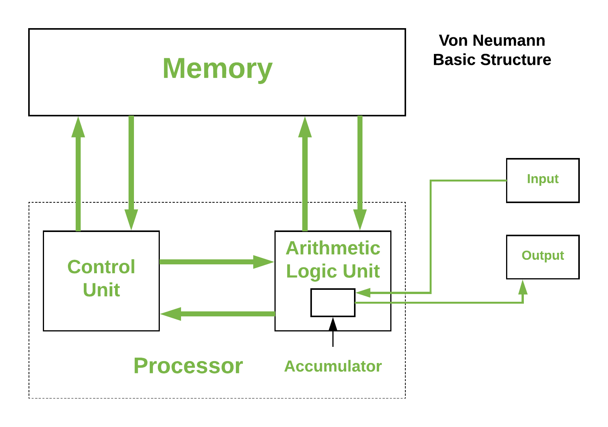

<style>
body {
text-align: justify;
font-size: 12pt}
</style>

```{r setup, include=FALSE}
knitr::opts_chunk$set(echo = TRUE)
```

## 1. What is R?

R is a programming language that has a specific purpose: to execute statistical calculations and data visualization. R has remarkable capabilities compared to other programming languages in the following areas:

- Matrix operations and handling multidimensional arrays
- Data visualization tools
- External libraries that implement the latest statistical and machine learning models in the R language

The latest version of R is [R 4.4.2](https://cran.r-project.org/) that can be downloaded and is free to use. R also has a free to use integrated development environment (IDE) called [R Studio](https://rstudio.com/products/rstudio/download/) that makes writing R program code easier. For example, it has automatic code completion. We'll use this environment in this course.

**R and R Studio are NOT the same thing! R Studio provides an integrated development environment for R as a programming language!**

## 2. Principles of Programming

Since R is a programming language, it is essential that some basic programming principles are discussed before we use R to solve statistical tasks. I'm sure that these principles have been discussed in more detail in the *Programming* and *Software Engineering* courses. I'll just cover the basics here that are absolutely essential for using R.

As I'm sure that the *Programming* courses have also mentioned that today's computers are operating on the **Neumann model**.

For us, this just means that during programming, the computer is used to execute *commands*. Like "calculate this" and "please draw that". What makes programming difficult is that the computer, or as I like to call it, the <a href="https://warhammer40k.fandom.com/wiki/Machine_Spirit" target="_blank">machine spirit</a> has an extremely hard and slow perception and understanding. Therefore, we need to be extremely specific when phrasing commands for the computer to execute. Programming languages like R help us to phrase our commands as explicitly as possible.

In the Neumann model the commands given in a programming language are executed by the computer's *processor* (Central Processing Unit, CPU). In the other hand, the machine spirit also needs to remember the associated data when executing commands (like when calculating a mean, the machine spirit must remember all the numbers that are involved in the calculation). This data is not surprisingly stored in the computer's *memory* (Random Access Memory, RAM).<br>
Otherwise, we just need some input tool (keyboard, mouse) to communicate our commands to the machine spirit and the machine spirit needs an output tool (monitor) to show us the results of the commands we've given.

And...that's it! Basically, these are all the relevant parts of a modern computer (the hard drive is irrelevant from a programming standpoint). All of these parts and their relationship is depiced on the following cute figure (the inside architecture of the processor is irrelevant for this course).

<center>
{width=50%}
</center>

When buying a computer it is also advisable to look at the performance of the CPU and RAM. Higher the clock rate (GHz) and number of cores means the CPU can execute more commands in a given time. Higher RAM size (GB) means the machine spirit can remember more and more data at the same time.<br>
Maybe it's not surprising that *statistical computation are more RAM intensive than CPU intensive* since in statistics, we work with loads of data. We need a computer with 16-31 GB of RAM to run more complex statistical models in reasonable time on a real corporate dataset that usually has more than one million records (or observations) and at least 30-40 columns (or variables).

## 3. Interface of R Studio

Once base R and R Studio is installed on our computer, we should launch R Studio.<br>
After launch, usually a similar picture unfolds before us like the one below here:

<center>
{width=100%}
</center>

R codes in R Studio are written in a script file with an extension of *.R*.<br>
A file like this can be created in the following way:

<center>
<iframe width="560" height="315" src="https://www.youtube.com/embed/nQCdg5RrO6Y" frameborder="0" allow="accelerometer; autoplay; clipboard-write; encrypted-media; gyroscope; picture-in-picture" data-external= "1" allowfullscreen></iframe>
</center>

In the newly created script, we can type our commands for the machine spirit to execute in the R language. We can order the machine to execute out commands by pressing the **Run** button located in the upper right corner of the script file. The machine spirit tells the result of our command at the bottom of the screen in the *Console* area. By default, the computer always executes the command where we the cursor is blinking in the script when pressing the **Run** button.<br>
In the following example, we get R to calculate us the result of $3+2$:

<center>
<iframe width="560" height="315" src="https://www.youtube.com/embed/_H6THore3Ms" frameborder="0" allow="accelerometer; autoplay; clipboard-write; encrypted-media; gyroscope; picture-in-picture" data-external= "1" allowfullscreen></iframe>
</center>

We can execute multiple commands at once. We just need to highlight the commands to execute in the script and then press the **Run** button (after highlighting).<br>
A command can be broken into multiple lines, but a new command always has to start in a new line! It's advisable to leave an empty line between commands to better separate the code.

Now, let's make R calcuate the results of two operations: $3+2$ and $3 \times 2$:

<center>
<iframe width="560" height="315" src="https://www.youtube.com/embed/G0jXgZ0MYmE" frameborder="0" allow="accelerometer; autoplay; clipboard-write; encrypted-media; gyroscope; picture-in-picture" data-external= "1" allowfullscreen></iframe>
</center>

From this point on, I'll mark the R code snippets and their results in the following way:

```{r}
3+2

3*2
```

## 4. Working Directory

Before we start exploring the deeper mysteries of R, we should address the question of *Working Directory*.<br>
The *Working Directory* is the folder where R wants to save all of our script files with *.R* extension. Furthermore, we can load files into R's memory that are located in this folder by default.<br>
We can select the folder that serves as *Working Directory* in the pane at the right bottom corner of R Studio.<br>
Once this folder is set, all of our files will be saved here and we should copy every datasets to this folder that we will want to work with in R.<br>
To set the *Working Directory*, we should click on the tiny **...** button located in the right bottom corner of R Studio. By clicking on this button, we can select a folder. Once the folder is selected, we should find the **More** button (also in the right bottom corner of R Studio) left click on it, and then select the **Set As Working Directory** option.<br>
This chain of events generates the following R code (naturally, everyone will have a different folder paths between the quotations):

```{r}
setwd("~/Github Repok/Statistical-Modelling-Lecture-Notes")
```

This command above should be copied to the start of our R scripts and always run this command once R Studio is launched. This way, R will look for our files in the appropriate folder.<br>
Of course, you can also set the *Working Directory* by rewriting the command above between the quotations marks and running the new command.

In the right bottom corner of R Studio, we can automatically navigate to the current *Working Directory* by clicking **More --> Go To Working Directory**.

This whole setting the *Working Directory* business can be watched together on the following video:

<center>
<iframe width="560" height="315" src="https://www.youtube.com/embed/kyyMY1RpQXY" frameborder="0" allow="accelerometer; autoplay; clipboard-write; encrypted-media; gyroscope; picture-in-picture" data-external= "1" allowfullscreen></iframe>
</center>

If during the saving of our *.R* scripts, the machine spirit asks us which *character encoding* we would like to use, then we should select the **UTF-8** standard since it is the most common character encoding for English language files:

<center>
{width=50%}
</center>

## 5. Data Types and Data Structures in R

So far, we have only executed commands in R, but we haven't really stored anything in the memory (RAM). <br>
Now's the time! Results of commands can be saved to memory and can be given a sympathetic name with the `<-` symbol.

### 5.1. Simple Data Types

Let's save the result of $3+2$ into an R memory object called `calc_result`: `calc_result <- 3+2`. After executing this command, the  `calc_result` object will appear in the *upper right corner* of R Studio. On this side of R Studio, we can always see all the R objects that are currently "alive" inside the RAM:

<center>
{width=60%}
</center>

R memory objects have multiple types. The most simple ones only store one value (like `calc_result` from before). These simple objects are sometimes called as *variable*s. I don't really like this appellation since it can be confused with a variable in a statistical sense. Statistical variables always refer to some property of a statistical observation (e.g. monthly income of an employee).

R objects always have a data type as well. It describes whether the current object contains numerical, textual, date or some other kind of data. This is extremely important since the **data type determines how much space is needed in the RAM to store the object**. I think that it can be sensed immediately that we need more memory space to store a text of arbitrary length than we need to store an arbitrary integer number.

Data types can be queried by the R *functions* `str` and `typeof`.

It should be noted at this point that R has built-in commands that work like mathematical **functions*. So, these R functions are commands that follow the form of a classical $f(x)$ function in mathematics.<br>
Name of the function gives the name of the operation this function will execute on the computer and inside the brackets we give the input parameters (input data) on which this operation needs to be executed. For example, the `setwd` command is also a function.

So, let's see in practice, how these R function work through the examples of `str` and `typeof`:

```{r}
calc_result <- 3+2

str(calc_result)

typeof(calc_result)
```

We can see from the results that `str` only tells us that the object in question is a numerical one, but `typeof` reveals that this object is a `double` type number. The `double` type numbers are numerical data types that can store fractions as well not just integers.

The function `str` also shows the current value stored in the object (which is `5` in the exmaple above) next to its data type.

There exist a data type called `integer` that can only store whole numbers, or in other name integers. To create an object with this data type you need to put the letter `L` next to the number:

```{r}
whole_number <- 3L

str(whole_number)

typeof(whole_number)
```

In our course, it won't have any significance, but if you need to handle true **big data**, then in order to save RAM storage, even the difference between integers and doubles matter! So, you don't want to use up the space needed for dubles to store something that can only be an integer number!

Some other important data types and their definitons:

```{r}
textual <- "HelloThere" # Text in code should be put between quotation marks! Like in Excel! :)

str(textual)
typeof(textual)

true_or_false <- TRUE

str(true_or_false)
typeof(true_or_false) # a logical data types can store only 2 values: TRUE or FALSE
```

In the code snippet above, the **#** mark is the mark for comments in R. Things written behind a **#** are not executed by the machine spirit. This way, we can write useful comments and notes for ourselves in the R script.

We can convert between data types if it makes sense. We can use functions for data type conversions that all start with the keyword `as` and finish with the data type name in R (as given by `str`) we're converting *to*.

Like we can convert numbers to texts:

```{r}
number <- 1992

typeof(number)

textual <- as.character(number)

typeof(textual)
```

We can convert text to numeric type if the text truly contains a valid number:

```{r}
textual <- "1992"

typeof(textual)

number <- as.numeric(textual)

typeof(number)
```

Be careful with decimals! **R always assumes decimal points!** So, if you use a decimal comma for example, then the machine spirit becomes angry and throws you a hysterical error message. :( Value of the object called `nogood` will be empty which is `NA` in the language of R:

```{r}
nogood <- as.numeric("3,14")

nogood

typeof(nogood)

good <- as.numeric("3.14")

good

typeof(good)
```

### 5.2. Data Structures

#### Vectors

We can create R objects containing multiple values with the dunction `c`. The name of this kind of objects containing multiple values in a sequence is **vector**.


```{r}
many_numbers <- c(3.14, 2.67, 88, 1234)

str(many_numbers)
typeof(many_numbers)
```

Let's discover that `str` and `typeof` functions both tell us that the data type of out new object is numeric. This is because **vector objects can only store values of the same data type**!

If we want to store values of different data types in a vector, then R converts ecerything to the most general data type. Which is in the example below is `character`:

```{r}
many_numbers_texts <- c(88, 42, "Hello", 1992, 9, "There", "Friend", 11)

str(many_numbers_texts)
typeof(many_numbers_texts)
```

After all of this, let's see how can we execute different tasks and operations with vectors!

Lets query the number of elements in a vector:

```{r}
many_numbers <- c(3.14, 2.67, 88, 1234, 42.5)

length(many_numbers)
```

Select the $3$rd element:

```{r}
many_numbers[3]
```

Select every element from 2 to 4:

```{r}
many_numbers[2:4]
```

Select the $2$nd and $4$th elements only! Note that the seleted elements are also given as a *vector* here:

```{r}
many_numbers[c(2,4)]
```

Select all elements but the $3$rd:

```{r}
many_numbers[-3]
```

To annoy the machine spirit, let's select an element that does not exists:

```{r}
many_numbers[6]
```

This time we get an empty value (`NA`)!

Let's order the elements of the vector that contains numerical data only:

```{r}
order(many_numbers)
many_numbers[order(many_numbers)]
```

Let's order the elements of the same vector but now do it decreasingly:

```{r}
ordered_numbers <- many_numbers[order(many_numbers, decreasing = TRUE)]
ordered_numbers
```

Note that the `order` function has a second parameter that gives the direction of the ordering. The parameters, or in other words *arguments* of a function can be found in the [online documentation for the R language](https://www.rdocumentation.org/). You should just type in the function that you're looking for in the search bar.

Elegantly you can say that the documentation gives the *callable parameters* of an R function.

When using the documentation and R in general be careful for the fact that R is a **case-semsitive** language! This means that the difference between small and large letters matter! Like the `order` function is **not** the same as the `Order` function!!

#### Lists

If you want to store objects of different data types in a new object, than you can use `list`s:

```{r}
many_numbers_texts <- c(88, 42, "Hello", 1992, 9, "There", "Friend", 11)
many_numbers <- c(3.14, 2.67, 88, 1234, 42.5)
yesno <- TRUE
welcome <- "Hi-Hi"


blacklist <- list(many_numbers_texts, many_numbers, yesno, welcome)

str(blacklist) # the function shows elements of the list separated with $ signs
typeof(blacklist) # this just returns that out object is a list
```

Number of elements in a list can be queried with the `length` function as well.

On the other hand, if you need to select an element from the list, then you'll need use some triks since the method applied in the case of vectors does not work here:

```{r}
blacklist[2]

typeof(blacklist[2])
```

The `blacklist[2]` is still a list, **not a vector of numbers as it should be**!

If you really want to select the `many_numbers` object from the list, you need to do this:

```{r}
blacklist[[2]]

typeof(blacklist[[2]]) # now, we get back a numerical vector as we should
```

If this method seems quite uncomfortable, then we can create the list by naming each element:

```{r}
many_numbers_texts <- c(88, 42, "Hello", 1992, 9, "There", "Friend", 11)
many_numbers <- c(3.14, 2.67, 88, 1234, 42.5)
yesno <- TRUE
welcome <- "Hi-Hi"


blacklist <- list(first = many_numbers_texts, second = many_numbers,
                    third = yesno, fourth = welcome)

str(blacklist)
```

Now, by naming elements in the list, we can refer to elements in a list by using their names rather their number. As the result of the `str` function suggests, you can refer the names by the `$` sign.

Let's select the $2$nd element of `blacklist` by its name. The name is quite unimaginatively also `second`.

```{r}
blacklist$second

typeof(blacklist$second)
```

As we  have expected, the result is a numerical (specifically `double`) vector with $5$ elements.

Before we continue, let's erase all the R objects we've created so far from the RAM. This can be done by forcefully pressing the **broom** button in the upper right corner of R Studio.

<center>
{width=60%}
</center>


## 6. Handling Datasets in R

The easiest way to load a dataset into R's memory is to use **files in csv formats** and apply the `read.csv` function. Files with **csv** extensions are essentially **txt** files that contain a table where the columns are separated by **commas**. Hence the name: *comma separated values = csv*

**WARNING!** The `read.csv` expects the following structur from the table stored in the **csv** file:

- columns are separated by commas
- decimal places are marked by points
- textual data is between quotation marks

If we download *csv* datasets from English websites like [Kaggle](https://www.kaggle.com/), then they probably satisfy all three conditions given above, but it's better to be safe.

R expects the following logical structure from the dataset to be loaded: rows of the table must contain the statistical observations or records (people, countries, houses, cars, etc.) and columns must contain the properties describing the observations (people's age, GDP of countries, brands of cars, prices of houses, etc.). These properties are called *variables* in statistics.

The <a href="https://github.com/KoLa992/Statistical-Modelling-Lecture-Notes/blob/main/COVID_0326.csv" target="_blank">COVID_0326.csv</a> file satisfies every technical and logical requirements. It contains $100$ countries as observations and we have $9$ variables descriving these countries:

- Country: name of the country
- Pop: population of the country (people)
- PopDens: population density (people/km2)
- Prop_UrbanPop: proportion of urban population in 2019 (%)
- PressLiberty: press liberty index in 2019 (lower = press is more free)
- PerCapita_HealthExp_2016: per capita helth expenditures based on purchasing power parity (2016)
- COVID19_CasesPerMillion: registered COVID-19 infections per million people on 26th March 2020.
- ConstitutionalForm: constitutional form of the country
- HeadOfState: head of state's rights (has executive powers or just representational)

Let's read this table to the R memory via the `read.csv` functions. Let's name the object containing the table as `COVID`:

```{r}
COVID <- read.csv("COVID_0326.csv")
# this only works if the csv file is in the Working Directory which was set before!!
```

If, we're all right that we have a table called `COVID` in the memory with $100$ observations and $9$ variables:

<center>
{width=60%}
</center>

The `read.csv` function can also read *csv* files from website links as well. Like the following code could also work.

```{r eval=FALSE}
COVID <- read.csv("https://raw.githubusercontent.com/KoLa992/Statistical-Modelling-Lecture-Notes/main/COVID_0326.csv")
```

Let's see what is the structure and type of this `COVID` object in the RAM:

```{r}
typeof(COVID)
str(COVID)
```

Well, according to `typeof`, we have a `list`, but `str` says its a `data frame`. Altohough, the `$` signs in the result of the `str` do suggest that what we see here is a `list`.

The answer is that R stores datasets in a special object type called data frame, which is actually **a list of vectors with the same length**! So, an element of the list is actually a column (variable) of the data table. This is what we can see from the names after the  `$` signs in the result of `str`.

So, you can select a column of the data frame via the `$` sign like in a list:

```{r}
COVID$COVID19_CasesPerMillion
str(COVID$COVID19_CasesPerMillion)
```

### 6.1. Basic Operations in Data Frames

Let's see the basic operations in a `data frame` object!

We can look into the first few rows with the `head` function (by default the first 6):

```{r}
head(COVID) # shwos first 6 rows by default

head(COVID, n=3) # now we can only see the first 3 rows
```

We can query the number of rows (observations) and the number of columns (variables):

```{r}
ncol(COVID)

nrow(COVID)
```

We can rename columns by using the `colnames` function that extracts the column names to a vector:

```{r}
colnames(COVID) # look at the column names

# rename the Country column (that is the 1st column) to CountryName
colnames(COVID)[1] <- "CountryName"

# look at the results
colnames(COVID)
```

We can calculate new columns to our table from existing columns. For example, let's calculate the area of each country in acres (1 km2 = 100 ac)

```{r}
COVID$Area <- (COVID$Pop / COVID$PopDens) * 100 # remember: population density is in people/km2!

head(COVID$Area)
```

These tricks can be played on every *vector*: they can be mathematically transformed by normal mathematical operators and by R functions.

Let's define two numerical vectors:

```{r}
this <- c(1,2,3,4)

that <- c(6,7,8,9)
```

We can add and multiply the corresponding elements of the two vectors:

```{r}
this + that

this * that
```

Get the squared elements of `that`:

```{r}
that^2
```

We can calculate the sumproduct of the two vectors by applying multiplication sign (`*`) and the `sum` function:

```{r}
sum(this * that)
```

We can also get the mean of the elements in `this` by applying the `mean` function on it:

```{r}
mean(this)
```

### 6.2. Selecting Rows and Column in a Dataframe

Ki tudjuk választani 42. sor 7. oszlopát igen sokféleképpen:

```{r}
COVID[42,7] # ez kicsit mátrixműveletes logika: [sor,oszlop] hivatkozás

COVID[42,"COVID19_CasesPerMillion"] # az oszlopot szám helyett a nevével is lehet hivatkozni

COVID$COVID19_CasesPerMillion[42] # itt eleve azt mondom, hogy kiszedjük a COVID19_CasesPerMillion nevű oszlopot (vagyis listaelemet) a listából a $ jellel, és annak nézzük meg a 42. elemét 
```

Ki tudjuk választani az egész 42. sort:

```{r}
COVID[42,] # ilyenkor az oszlop hivatkozást hagyjuk simán üresen, de a vesszőt még írjuk be!
```

Vagy az egész 7. oszlopot:

```{r}
COVID[,7] # ilyenkor a sor hivatkozást hagyjuk simán üresen, de a vesszőt még írjuk be!

COVID[,"COVID19_CasesPerMillion"]

COVID$COVID19_CasesPerMillion
```

Több sort és oszlopot is ki tudunk választani, ha a [] közti hivatkozásokba vektorokat rakunk:

```{r}
COVID[c(1,50,60,80),c(1,4,7)]

COVID[c(1,50,60,80),c("CountryName","Prop_UrbanPop","COVID19_CasesPerMillion")]

COVID[20:30,c("CountryName","Prop_UrbanPop","COVID19_CasesPerMillion")] # Ha a kiválasztandó sorok követik egymást, akkor így is lehet

COVID[20:30,1:4] # Ha a kiválasztandó oszlopok követik egymást, akkor így is lehet

```

Ami a legszebb ebben az egészben, hogy a **kiválasztandó sorokat logikai feltételekkel is ki tudjuk jelölni**. Magyarul tudjuk **szűrni** az adattáblát!

### 6.3. Examples for Logical Filtering in Dataframes

Adjuk meg azon országok neveit, ahol 100 felett volt 2020.03.26-án az egymillió főre jutó COVID esetszám:

```{r}
COVID[COVID$COVID19_CasesPerMillion > 100, c("CountryName", "COVID19_CasesPerMillion")]
```

Adjuk meg azon országok neveit, ahol 100 felett volt 2020.03.26-án az egymillió főre jutó COVID esetszám, **és** a városi népesség aránya legfeljebb 60%:

```{r}
COVID[COVID$COVID19_CasesPerMillion > 100 & COVID$Prop_UrbanPop <= 60,
      c("CountryName", "Prop_UrbanPop", "COVID19_CasesPerMillion")]
```

Adjuk meg azon országok neveit, ahol az államforma abszolút monarchia, **vagy** a városi népesség aránya 35% alatti:

```{r}
# először megnézzük, hogy milyen lehetséges értékei vannak a ConstitutionalForm változónak a unique függvénnyel

unique(COVID$ConstitutionalForm)

# a unique függvény eredményéből látjuk, hogy az abszolút monarchiák "Absolute monarchy" néven futnak a táblában

COVID[COVID$ConstitutionalForm == "Absolute monarchy" | COVID$Prop_UrbanPop < 35,
      c("CountryName", "Prop_UrbanPop", "ConstitutionalForm")]
```

Adjuk meg Belgium, Magyarország és Horvátország népsűrűségét és 2020.03.26-i COVID esetszámait:

```{r}
COVID[COVID$Country %in% c("Belgium", "Hungary", "Croatia"),
      c("CountryName", "PopDens", "COVID19_CasesPerMillion")]
```

Adjuk meg azon országok nevét, államformáját és 2020.03.26-i COVID esetszámait, amik **nem** köztársaságok! Az eredményt mentsük el egy új, `NemKozt` nevű `data frame`-be, és az eredménynek csak az első 6 sorát jelenítsük meg:

```{r}
NemKozt <- COVID[COVID$ConstitutionalForm != "Republic",
      c("CountryName", "ConstitutionalForm", "COVID19_CasesPerMillion")]
# Figyeljük meg, hogy a "!=" a "nem egyenlő" jele

head(NemKozt)
```

Adjuk meg azon országok nevét, amiknek az államformája **nem** köztársaság és **nem** is abszolút monarchia:

```{r}
COVID[!(COVID$ConstitutionalForm %in% c("Absolute monarchy", "Republic")),
      c("CountryName", "ConstitutionalForm")]
# Figyeljük meg, hogy a "!" általánosan a "tagadás" jele
```

Persze, hogy ha bevetjük a `unique` függvényt, akkor gyorsan rájövünk, hogy ezek egyszerűen az alkotmányos monarchiák, de most a *tagadás* jelét (szép szóval opratátorát) akartam megmutatni. :)

```{r}
unique(COVID$ConstitutionalForm)

KeresettAllamforma <- unique(COVID$ConstitutionalForm)[2]

COVID[COVID$ConstitutionalForm == KeresettAllamforma,
      c("CountryName", "ConstitutionalForm")] # csak, hogy lássuk: így is lehet :)
```

A fenti szűrések R kódja alapján remélhetőleg érződik már, hogy milyen kódokkal lehet logikai műveleteket kijelölni az R utasításokban:

```{r, echo=FALSE}

x <- data.frame("Kód" = c("<", ">", "==", "!=","<=", ">=", "&", "|", "%in%", "!"),
                "Jelentés" = c("Kisebb","Nagyobb", "Egyenlő", "Nem Egyenlő","Legfeljebb", "Legalább",
                               "ÉS", "VAGY", "TARTALMAZ", "TAGADÁS"))

knitr::kable(
  x, align = "cc"
)
```

## 7. Installing and Importing External Packages

As I wrote in the introduction, one of the most attractive features of R is that its functionality can be extended by using extrenal libraries called *packages*. These packages add extra functions to the command set of R that are not included in the 'base' version.

During the course, we'll use the following packages rather frequently:

- readr
- psych
- ggplot2
- readxl

Let's install these! If you get a pop-up window where you need to choose a country, then bravely click *Hungary*! :) If for some reason the machine spirit has a problem with that, then *Austria* is a good alternative.

```{r eval=FALSE}
install.packages("readr")
install.packages("psych")
install.packages("ggplot2")
install.packages("readxl")
```

If during package install, R writes WARNINGs on the console with red colour, then these messages can be ignored. Th red can be terrifying, but until the message in red doesn't start with *Error*, we're fine! :)

In order to use functions from the installed packages, they need to be referenced by the `library` function. **This step needs to be done every time you launch R!** Let's include the package `psych` with this `library` function:

```{r}
library(psych)
```

Any red messages can be ignored again, if they don't start with *Error*. :)

Packages can also be installed with the buttons located in the down right corner of R Studio [sorry, i'm a bit clumsy in the video when typing in *psych* :)]:

<center>
<iframe width="560" height="315" src="https://www.youtube.com/embed/vZ7x5ogDA-8" frameborder="0" allow="accelerometer; autoplay; clipboard-write; encrypted-media; gyroscope; picture-in-picture" data-external= "1" allowfullscreen></iframe>
</center>

## 8. Writing Your Own Functions in R

Sokszor meg tudja könnyíteni az éltünk, hogy ha gyakran ismétlődő utasítás-sorozatainknak írunk egy saját R függvényt, és így nem kell mindig ugyan azt a 4-5 sort folyamatosan újra és újra lemásolni, hanem csak használjuk a függvényt!

Nézzünk egy egyszerű példát! Mondjuk írjuk meg a saját, buta **atlag** névre hallgató függvényünket, ami *két szám átlagát adja meg*.<br>
A logika hasonló, mint ahogy egy mezei objektumot létrehozunk R-ben: megadjuk az objektum nevét és egy ebbe a névbe mutató nyíllal megmondjuk, hogy ez az objektum biza egy *függvény* lesz, aminek két bemeneti paramétere van egy $x$ és egy $y$ szám. Utána pedig *kapcsos zárójelek* között leírjuk, hogy mit csinál a függvény, és a végén egy `return` paranccsal megadjuk, hogy mi legyen a függvény eredménye, azaz szakszóval **visszatérési értéke**.

```{r}
avg <- function(x, y){
  our_result <- (x + y)/2
  return(our_result)
}
```

Ha a fenti kódot lefuttatjuk, akkor azt látjuk, hogy az R Studio jobb felső részébben megjelenik a **Functions** részlegben az `avg` névre hallgató saját függvényünk.

<center>
{width=60%}
</center>

Ezek után pedig simán tudjuk már használni is.

```{r}
testresult <- avg(3, 5)

testresult
```

Tök jó, kiszámolta, hogy 3 és 5 átlaga 4. :)

A függvényt egyébként megírhatjuk úgy is, hogy azt mondjuk, hogy csak egy darab $x$ névre hallgató bemeneti paramétere van, de arról azt gondoljuk, hogy `vector` adattípusú, és az átlagolás során az $x$ 1. és 2. elemeire hivatkozunk a `[]` jelek használatával.

```{r}
avg <- function(x){
  our_result <- (x[1] + x[2])/2
  return(our_result)
}
```

Próbáljuk is ki a függvényt.

```{r}
input_data <- c(3, 5)

testresult <- avg(input_data)

testresult
```

Ez is 4, hát ez elképesztőő! :)
