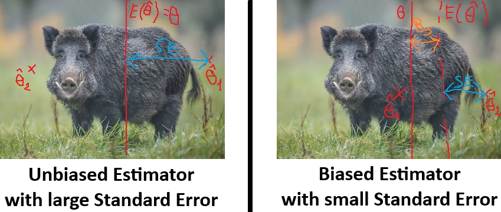

<style>
body {
text-align: justify}
</style>


```{r setup, include=FALSE}
knitr::opts_chunk$set(echo = TRUE)
```

## 1. Revision: Time Results of the Balaton Swimmers and their IID Samples

Let’s continue where we left off in Chapter 04. Load the data from the <a href="https://github.com/KoLa992/Statistical-Modelling-Lecture-Notes/blob/main/LIDLBalaton2022.xlsx" target="_blank">LIDLBalaton2022.xlsx</a> file into a data frame. This Excel file contains the **name, gender, and time result in minutes** of the participants of the **2022 LIDL Balaton swim**. This dataset will now serve as our **population**.

```{r}
library(readxl)
swimming = read_excel("LIDLBalaton2022.xlsx")
str(swimming)
```

Okay, we are all set! The population consists of $N=9751$ elements, meaning this many competitors swam across Lake Balaton in 2022. We will **focus on** one variable of the population, **the time result** (`TIME` column), and **examine** three statistical measures, or more precisely, **three statistical parameters**:

- The **mean** time, denoted as $\bar{Y}$ or $\mu$
- The **standard deviation** of individual times, denoted as $\sigma$
- The **proportion of swimmers who completed the swim in more than 3 hours (180 minutes)**, denoted as $P$

As we clarified in <a href="Chapter04.html" target="_blank">Chapter 04</a>, a **complete statistical** dataset's, i.e., a **population’s statistical measures/parameters, are collectively denoted as $\theta$**.

So, let’s **calculate these $\theta$ values**! However, we need to be careful! When calculating the sample variance and standard deviation, **the built-in R functions, `var` and `sd` DO NOT calculate the variance** (and standard deviation) **that we know from the Fundamentals of Statistics course!!** So, we'll write our own R function called `classic_var` that calculates the variance of our variable as we've learnt: $\frac{\sum_{i=1}^{N}{(Y_i - \bar{Y})^2}}{N}$. The standard deviation is simply `sqrt(classic_var)`. What the built in `var` and `sd` functions calculate, will be discussed in *Section 3*.

```{r}
classic_var <- function(x){
  return(mean((x-mean(x))^2))
}

PopMean <- mean(swimming$TIME)
PopVar <- classic_var(swimming$TIME)
PopStd <- sqrt(PopVar)
PopProp <- sum(swimming$TIME > 180)/nrow(swimming)

PopMean
PopStd
PopProp
```

Done! Now, in the **next step, let’s take an $n=100$-element IID** (i.e., random sampling with replacement) **sample from this population**, using a random seed of $1992$. Then, we will **calculate the same three statistical parameters for this sample**.

```{r}
set.seed(1992)
selected_into_sample <- sample(rownames(swimming), size = 100, replace = TRUE)
swimming_sample <- swimming[selected_into_sample,]
str(swimming_sample)

SampleMean = mean(swimming_sample$TIME)
SampleStd = sqrt(classic_var(swimming_sample$TIME))
SampleProp = sum(swimming_sample$TIME > 180)/nrow(swimming_sample)

SampleMean
SampleStd
SampleProp
```

Summarizing the **sample-based estimates of our statistical parameters**:

- $\bar{y} = 160.8$ minutes
- $s^ = 36.7$ minutes
- $p = 0.27 = 27\%$

As mentioned in <a href="Chapter04.html" target="_blank">Chapter 04</a>, the **sample-based estimates of statistical parameters are collectively denoted as $\hat{\theta}$**. The $\hat{\theta}$ values have a special name: **ESTIMATORS** for the true population $\theta$. Thus, the sample mean ($\bar{y}$) is the *estimator* of the population mean $\bar{Y} = \mu$, the sample standard deviation ($s^*$) is the *estimator* of the true population standard deviation ($\sigma$), and the sample proportion of swimmers exceeding 3 hours ($p$) is the *estimator* of the population proportion ($P$).

Our task now is to figure out: **How can we infer the true $\theta$ parameter values of the full $N$-element population from a single $n$-element sample’s $\hat{\theta}$ estimates?** This is the **fundamental problem of statistical estimation theory**. We also discussed in <a href="Chapter04.html" target="_blank">Chapter 04</a> that if our sampling method is truly an IID sample, the only thing standing between $\hat{\theta}$ and the true $\theta$ is the **sampling error**. Thus, our specific goal is to **calculate (or at least approximate) the sampling error**.

To begin our journey into sampling error calculation, we will **use a trick that takes advantage of the fact that we currently know the entire population of Balaton swimmers**. Of course, in real-world applications, estimation theory and sampling error calculations are necessary because we don’t have access to the entire population. :) But since we have the population data, we can **draw a very large number of samples—say, $10000$ samples of size $n=100$—from the population’s time results**.<br>
We already did this at the <a href="Chapter04.html" target="_blank">end of Chapter 04</a>. Now, let’s simply **reload the Excel table containing the results into a data frame**. The Excel file used in this note can be accessed <a href="https://github.com/KoLa992/Statistical-Modelling-Lecture-Notes/blob/main/SwimmingSamples.xlsx" target="_blank">here</a>.

```{r}
samples_100 <- as.data.frame(read_excel("SwimmingSamples.xlsx"))
rownames(samples_100) <- paste0("Sample",1:10000) # indicate in the rownames that each row is one sample
head(samples_100)
```

Okay, looking at the results, we can see that the data frame is structured so that **each row contains a single 100-element sample**, and the **sample elements** (i.e., the competitors’ time results in minutes) **are stored in the columns**.

This storage format is convenient because by *slicing* the data frame, we can easily create samples of size $n<100$ as well. Since the sampling was completely random (thanks to R), if we **select only the first $20$ columns of the table, it’s as if we have $10000$ samples of size $n=20$ as well**!<br>
Let’s go ahead and do that now!

```{r}
samples_20 <- samples_100[,1:20]
str(samples_20)
```

Great, it looks like we’re all set! :)

## 2. The Concept of Bias

Well, let’s first examine the $10000$ samples of size $n=100$ in more detail to understand: **How the estimators $\hat{\theta}$ behave compared to the true population parameters $\theta$.**

First, **let’s calculate the values of our three** statistical measures, that is, the **estimators** in **each of the $100$-element samples**: mean, variance (squared standard deviation), and the proportion of those who completed the swim in more than 180 minutes. When dealing with standard deviation, it will be more convenient to analyze the squared value, so we will consider variance.<br>
Fortunately, by using the base R statistical functions within an `apply` function with the 2nd input parameter of $1$, we compute the mean, variance, and proportions row-wise instead of column-wise. This way, we can **calculate the values of the estimators for each sample in separate new columns**. **Be careful** that since the data frame columns are continuously expanding, we must **manually restrict the application of statistical functions to the first 100 columns**!

```{r}
samples_100$sample_mean <- apply(samples_100[,1:100], 1, mean)
samples_100$sample_var <- apply(samples_100[,1:100], 1, classic_var)
samples_100$sample_prop <- apply(samples_100[,1:100], 1, function(x) mean(x>180))

head(samples_100[,97:103])
```

Okay, it seems that for all $10000$ samples, the three estimators are stored in the last three columns of the `samples_100` data frame.

As the next step, let’s **take the mean of the sample means and sample proportions and compare these results to the true population mean and proportion!**

```{r}
mean_of_means <- mean(samples_100$sample_mean)
mean_of_props <- mean(samples_100$sample_prop)

c(mean_of_means, PopMean)
c(mean_of_props, PopProp)
```

Wow, the two types of values are **quite close to each other!** In fact, **with some rounding, the average of the estimators exactly matches the true population parameter value!!**

```{r}
c(round(mean_of_means,1), round(PopMean,1))
c(round(mean_of_props*100, 1), round(PopProp*100, 1))
```

What we observe here is the **phenomenon of UNBIASEDNESS**. According to this, **if the mean (or expected value) of the $\hat{\theta}$ estimators computed from all possible samples matches the true population parameter $\theta$, then the estimator $\hat{\theta}$ is unbiased**. The **reason unbiasedness only holds approximately in our case (with some rounding) is that we only examined $10000$ samples rather than all possible samples**, because our RAM would probably not have handled that for a population of $N=9751$ elements. :)

The **above concept in mathematical formalism** takes the following form. In the equation, the function $E()$ represents averaging, meaning *expected value*. $$E(\hat{\theta})=\theta$$

If the **above equality holds for all possible arbitrary $n$-element samples, then $\hat{\theta}$ is an unbiased estimator of $\theta$.**

From this, we can define the **degree of bias (abbreviated as $Bs$)**, which is simply the difference between the expected value of the estimators ($\hat{\theta}$) and the true population parameter $\theta$:$$Bs=E(\hat{\theta})-\theta$$ 

Looking at the $10000$ samples, the bias ($Bs$) for the **mean and proportion** is quite small. In both cases, **when rounded to one decimal place, the bias is $0$.**

```{r}
# Bs(Mean)
round(mean_of_means - PopMean, 1)
# Bs(Proportion)
round(mean_of_props - PopProp, 1)
```

Okay, based on our small experiment with $10000$ samples of size $n=100$, we can say that **the sample mean and sample proportion are unbiased estimators of the true population mean and proportion**.

But what about standard deviation? Specifically, **let’s first examine whether the sample variances are unbiased estimators of the population variance!**

```{r}
mean_of_vars <- mean(samples_100$sample_var)

c(mean_of_vars, PopVar)

# Bs(Variance)
round(mean_of_vars - PopVar, 1)
```

Oh no! It seems that the **answer is NO**! The **mean of the sample variances ${(s^*)}^2$ is $23$ units lower than the true population variance!** This means that **the sample variance, as an estimator function, systematically underestimates the true population variance!** That’s unfortunate because it implies that the variance calculated from a sample is likely to be smaller than the true population variance. This is problematic because it means that **when we estimate the variability (dispersion) of a variable from a sample, we typically see a smaller value than the reality**.<br>
For example, when estimating the volatility (risk) of a stock price from a sample of price data, we will generally perceive it to be lower than its true value. **Underestimating "risk" is a problem that needs to be addressed!**

The **phenomenon** can be **mathematically** expressed as follows: $$E\left({(s^*)}^2 \right) < \sigma^2$$

That is: $$Bs\left({(s^*)}^2\right) < 0$$

### 2.1. The Concept of Asimptotically Unbiased Estimators

What somewhat mitigates the situation is the fact that **although the population variance is inherently biased when estimated using sample variances**, the estimation is, however, **asymptotically unbiased**. This means that **as the sample size increases, the magnitude of the bias ($|Bs|$) decreases** and specifically approaches $0$. That is: $$\lim_{n \rightarrow \infty}{Bs\left({(s^*)}^2\right)}=0$$

Let’s **illustrate this phenomenon!** Using the **column selection method presented at the end of Section 1**, we calculate the bias $Bs({(s^*)}^2)$ of the sample variances for $10000$ samples of sizes $n={10,20,30,...,90,100}$ relative to the true population variance ($\sigma^2$).<br>
Technically, this can be accomplished using a `for` loop:

- In each iteration of the loop, we select the appropriate sample sizes from the `samples_100` data frame.
- For each sample size, we compute ${(s^*)}^2$ for all $10000$ samples.
- We compute and store in a vector the bias $Bs({(s^)}^2)$ as the difference between $E({(s^)}^2)$ and the true population variance $\sigma^2$.

```{r}
# Create an empty vector to store the Bs values
list_of_Bs = c()
# Create the sequence of the examined sample sizes
# Enumerate the integers between 10 and 100 with the 'seq' function with a step size of 10
sample_sizes <- seq(10, 100, 10)

for (current_sample_size in sample_sizes) {
  current_samples <- samples_100[,1:current_sample_size]
  current_samples$sample_var <- apply(current_samples, 1, classic_var)
  current_mean_of_vars <- mean(current_samples$sample_var)
  current_Bs <- current_mean_of_vars - PopVar
  list_of_Bs <- c(list_of_Bs, current_Bs)
}

# Look at the results
list_of_Bs
```

We can clearly see that the **absolute values of $Bs$** start from a rather large $200.5$ and **gradually decrease, reaching the previously measured $23$** at $n=100$. The results become even more striking when visualized in a line chart.

```{r}
# Create a data frame from the sample sizes and the corresponding Bs values
BsData <- data.frame(sample_size = sample_sizes,
                     value_of_Bs = abs(list_of_Bs))

# Show the results on a line chart with 'ggplot'
library(ggplot2)
ggplot(BsData, aes(x=sample_size, y=value_of_Bs)) + geom_line()
```

The absolute value of $Bs$ decreases at an almost exponential rate, although **the reduction from $n=90$ to $n=100$ is not particularly large**! This indicates that **for variances, the degree of bias depends on the sample size $n$!** The larger the sample size, the smaller the degree of bias - meaning $|Bs|$ - decreases.

## 3. The Corrected Sample Variance

The fact observed in Section 2.1, namely that the sample variance $(s^*)^2$ is an **asymptotically unbiased estimator** of the true population variance $\sigma^2$, can be used to **solve the variance bias problem**.

From asymptotic unbiasedness, we know that the larger the sample size, the smaller the bias. Moreover, we can also state that the **expected value of the sample variances, $E\left((s^*)^2\right)$, deviates proportionally by $\frac{n-1}{n}$ from the population variance**, $\sigma^2$. That is, the following equality holds: $$\frac{E\left((s^*)^2\right)}{\sigma^2}=\frac{n-1}{n}$$

By reusing our `for` loop solution for determining $Bs$, we can **verify the correctness of this relationship for sample sizes $n={10,20,30,...,90,100}$.**

```{r}
# Empty vector to store the (expected value) / (population variance) ratios
quotients_sample_population <- c()
# Empty vector to store the (n-1)/n ratios
quotients_sample_size <- c()
# Vector of sample sizes examined
sample_sizes <- seq(10, 100, 10)

# Starting 'for' loop
for (current_sample_size in sample_sizes) {
  current_samples <- samples_100[,1:current_sample_size]
  current_samples$sample_var <- apply(current_samples, 1, classic_var)
  current_mean_of_vars <- mean(current_samples$sample_var)
  quotients_sample_population <- c(quotients_sample_population,
                                   round(current_mean_of_vars / PopVar,3))
  quotients_sample_size <- c(quotients_sample_size,
                             round((current_sample_size-1) / current_sample_size,3))
}

# Put the results into a data frame 
quotients_df <- data.frame("quotients_sample_size" = quotients_sample_size,
                           "quotients_sample_vs_population" = quotients_sample_population)
quotients_df
```

Awesome, the **agreement between the two ratios is quite evident**! :) Of course, there is **some deviation, since we are only examining $10000$ samples instead of all possible ones**, but even so, the match is quite striking! This also explains **why the absolute value of $Bs$ did not significantly decrease from $n=90$ to $n=100$: the ratio $\frac{n-1}{n}$ was already quite small in both cases, so the bias was as well!**

However, if the equality $\frac{E\left((s^*)^2\right)}{\sigma^2}=\frac{n-1}{n}$ holds, then by rearranging it, we obtain the following formula: $$\sigma^2=\frac{n}{n-1} \times E\left((s^*)^2\right)$$

Applying a constant multiplier to the result of an expectation ($E(...)$) is the same as multiplying each element being averaged by that multiplier. Therefore, the factor $\frac{n}{n-1}$ can be moved inside the expected value function: $$\sigma^2= E\left(\frac{n}{n-1} \times (s^*)^2\right)$$

Based on all this, we can conclude that the **corrected sample variance, calculated as $s^2=\frac{n}{n-1} \times (s^*)^2$, is an UNBIASED estimator of the true population variance $\sigma^2$!** Since $\sigma^2= E\left(s^2\right)$.

Wow, this sounds really nice! :) Let's try it out! **Let's compute the corrected sample variances for $10000$ samples of size $n=100$, and examine their mean (expected value)!**

```{r}
# sample size in a separate R object
n <- 100

# Corrected variances
samples_100$corr_sample_var = (n/(n-1)) * samples_100$sample_var

# Check Unbiasedness
mean_of_corr_vars <- mean(samples_100$corr_sample_var)

c(mean_of_corr_vars, PopVar)
round(mean_of_corr_vars - PopVar, 1)
```

Victory! :) Even if the **bias has not completely disappeared, its magnitude $Bs$ has become visibly very low, almost negligible**! If we had **more samples, the correction would completely eliminate $Bs$.**

So, it would be great if **we had a built-in function** in for this. Truth is that we have: **the built-in `var` and `sd` functions automatically calculates the CORRECTED variance and standard deviation**, using the formula $s = \sqrt{s^2}=\sqrt{\frac{n}{n-1} \times (s^*)^2}$!

To sum up then: by default, the sample standard deviation $s^*$ is computed using the following formula: $$s^*=\sqrt{\frac{\sum_{i=1}^n{(y_i-\bar{y})^2}}{n}}$$

That is, we check how much each sample element $y_i$ deviates from the sample mean $\bar{y}$, then square these deviations, sum them up, divide the sum by the sample size $n$, and finally take the square root of the entire fraction.<br>
The square of this value is the plain, *uncorrected* variance: $$(s^*)^2=\frac{\sum_{i=1}^n{(y_i-\bar{y})^2}}{n}$$

If we multiply the variance formula above by $\frac{n}{n-1}$, we can simplify as follows: $$s^2=\frac{n}{n-1} \times \frac{\sum_{i=1}^n{(y_i-\bar{y})^2}}{n} = \frac{\sum_{i=1}^n{(y_i-\bar{y})^2}}{n-1}$$

Thus, the **corrected sample standard deviation is computed just like the uncorrected one, except that in the denominator we divide by $n-1$ instead of $n$:** $$s=\sqrt{\frac{\sum_{i=1}^n{(y_i-\bar{y})^2}}{n-1}}$$

Let’s see it in action with the built-in `var` function!

```{r}
# Corrected variances with 'sd'
samples_100$corr_sample_var_function <- apply(samples_100[,1:100], 1, var)

# Check bias
mean_of_corr_vars_fun <- mean(samples_100$corr_sample_var_function)

c(mean_of_corr_vars_fun, PopVar)
round(mean_of_corr_vars_fun - PopVar, 1)
```

Awesome! We end up exactly where we were earlier with the manual calculation! :)

In summary, **using proper statistical terminology**:

1. The **plain, uncorrected sample variance ($(s^*)^2$) is a BIASED estimator** of the population variance $\sigma^2$
2. The **corrected sample variance ($s^2$) is an UNBIASED estimator** of the population variance $\sigma^2$

## 4. Bias of the Median

In the **Fundamentals of Statistics course, the median was a very important measure**, as it represents the midpoint of the observed variable and is not sensitive to outlier values in the dataset, unlike the mean. **Let’s examine whether this statistical parameter can be estimated without bias**, using the example of the 100-element samples from the Balaton swim dataset!

```{r}
# Population median swimming time
PopMedian <- median(swimming$TIME)

# Get the sample medians
samples_100$sample_median <- apply(samples_100[,1:100], 1, median)

# Mean of the sample medians
mean_of_medians <- mean(samples_100$sample_median)

# Check Bias
c(mean_of_medians, PopMedian)
round(mean_of_medians - PopMedian, 1)
```

It appears that the median can be **estimated in an unbiased way** using the sample medians. The deviation $Bs(me) = E(me) - Me$ is so minimal that it is entirely plausible that it would disappear if we examined all possible $n=100$ element samples instead of just $10000$.

## 5. The Concept of Standard Error (*SE*)

It’s nice and all that we established that the sample mean, sample proportion, corrected sample variance, and sample median are **unbiased estimators** of their corresponding population parameters, $\theta$, but **what good is this to us in practice when we only have a single sample?**

As we experienced in Chapters 3-4, unbiasedness only means that if **we have a very, very large number of samples**, then the values of our statistical metric/parameter calculated from the sample (the estimators) **on average hit the true population value**. However, unfortunately, **this definition allows for a lot of variation**, and in reality, it **tells us nothing about the sampling error**!<br>
This problem is well illustrated by the following *bad joke*.

> "An engineer, a physicist, and a statistician go hunting for wild boars together. After taking just a few steps into the forest, they spot a massive boar 150 meters away.<br>
>  The engineer raises his rifle, aims, and shoots, but misses by three meters to the right. The physicist thinks:<br>
>  "A slight wind is blowing from the left, so if I aim a little to the left, I’ll hit it."<br>
>  He takes aim at the boar, fires, and misses by three meters to the left. The statistician jumps up and starts celebrating:<br>
>  "We got it! We got it! We hit it!"
>
> `r tufte::quote_footer('-- Rightfully Unknown Author')`

Our beloved statistician in the joke is celebrating because the two shots that missed by three meters to the right and left, on average, hit the poor boar dead center!<br>
Well, this is what **unbiasedness** is all about:

- We want to hunt down a statistical parameter (i.e., a population value, $\theta$) using *shots*, that is, *samples*.
- The first shot is the estimate $\hat{\theta}_1$ from the first sample
- The second shot is the estimate $\hat{\theta}_2$ from the second sample.
- On average, that is, in expected value, these estimates hit the true value $\theta$: $E(\hat{\theta})=\theta$.
- Voilà! This is the definition of an *unbiased estimate* :)

The **analogy** between statistical "$\hat{\theta}$"-hunting and wild boar hunting can be **illustrated in the following diagram**. **IMPORTANT** :)

<center>
{width=50%}
</center>

<br>In the above diagram, I have marked in **blue** the **distance between an arbitrary $\hat{\theta}_i$ and the true population parameter $\theta$.** In reality, **this is the distance we are interested in: the difference between an estimator from a given IID sample and the true population parameter**! Because in practice, **we only have a single sample, and we need to compute the distance between the one observed $\hat{\theta}$ and the true $\theta$!** This is what we are looking for: the sampling error)!<br>

Now, **thanks to unbiasedness**, we have a method to **calculate this distance**! Since, due to unbiasedness, $E(\hat{\theta})=\theta$, this means that the **standard deviation of the estimators $\hat{\theta}_i$ across many samples is precisely the blue distance we are seeking**. After all, what is the **general interpretation of standard deviation**? It tells us **how much a randomly selected value from a dataset is expected to deviate from the mean**. How does this translate to the set of $\hat{\theta}$ values? If we **randomly select one of the many possible samples, the estimator $\hat{\theta}$ from that sample is expected to deviate from the mean of the $\hat{\theta}$s by the standard deviation**. And the **mean of the $\hat{\theta}$s, due to unbiasedness, is precisely the true population value $\theta$.**<br>
From this reasoning, the **standard deviation of the $\hat{\theta}$ values is called the standard error of estimation**, or simply **standard error** (**SE**).

So, let's take advantage of this and have R **calculate the standard errors of the mean and proportion**, which correspond to the **sample means' and sample proportions' standard deviation**! Here, we simply compute the standard deviation, without any correction, using our `classic_var` function defined in Section 1.

```{r}
SE_mean <- sqrt(classic_var(samples_100$sample_mean))
SE_prop <- sqrt(classic_var(samples_100$sample_prop))

SE_mean
SE_prop
```

Since the **sample mean and sample proportion are unbiased estimators**, the **computed standard error can be interpreted as follows**:

- For 100-element samples, **a specific sample mean is expected to deviate by $4.4$ minutes from the mean of means, that is, from the true population mean swim time**.
- **In a specific 100-element sample, the proportion of people who swam across Lake Balaton in over 3 hours is expected to deviate by $4.72$ percentage points from the proportion in the full population**.

This same principle applies to variances and medians as well. Homework: Compute and interpret the results. :)

However, it **seems that we are not much further ahead**. While the standard error tells us how much a sample-based estimate is expected to deviate from reality, the **standard error (SE) calculation requires many samples because we determine it as the standard deviation of $\hat{\theta}$ values across samples**!<br>
What we need is a way to **compute SE from just a single sample**!

For **the mean and proportion, we do have a solution**. In these two cases, **SE can be expressed in a closed formula**:

- $SE(\bar{y})=\frac{\sigma}{\sqrt{n}}$
- $SE(p)=\sqrt{\frac{P(1-P)}{n}}$

Both formulas follow from the fact that if I have an IID sample, then the sample observations $y_i$ are considered as random variables with a standard deviation of $\sigma$, then their sum, $\sum_{i=1}^n{y_i}$ has a variance of $$Var(\sum_{i=1}^n{y_i})=\sum_{i=1}^n{Var(y_i)}=n \times \sigma^2$$

**Because the $y_i$ random variables are independent due to the random sampling**. Since the sample means are defined as $\bar{y}=\frac{\sum_{i=1}^n{y_i}}{n}$, their variance follows from the result obtained above: $$Var(\bar{y})=\frac{Var(\sum_{i=1}^n{y_i})}{n^2}=\frac{n\sigma^2}{n^2} = \frac{\sigma^2}{n}$$

And of course the **square root of the sample mean's variance is** the standard deviation of the sample means, so the **standard error of the mean**: $$\sqrt{Var(\bar{y})}=SE(\bar{y})=\frac{\sigma}{\sqrt{n}}$$

And the **standard error of the proportion is just a special case for the formula just above**. As when we calculate a proportion of some observations, then we code the $y_i$ observations that are favorable for the proportion as $1$s and the rest of the $y_i$ observations as $0$s. So, in this case $y_i \sim Bernoulli(P)$ ($P$ is the expected value of the distribution, so the proportion of the $y_i=1$ cases), and the standard deviation of a Bernoulli distribution is $\sigma = \sqrt{P(1-P)}$

Thus, **both standard errors can be determined if we know the population standard deviation ($\sigma$) and the true population proportion ($P$) along with the sample size ($n$).** Let's test this out!

```{r}
n <- 100

SE_mean_formula <- PopStd / sqrt(n)
SE_prop_formula <- sqrt((PopProp * (1-PopProp))/n)

c(SE_mean, SE_mean_formula)
c(SE_prop, SE_prop_formula)
```

It appears that the **two values match quite closely**. :) The slight discrepancy is again due to the fact that we did not examine all possible samples, only 10,000 when calculating the $SE$ as the standard deviation of $\hat{\theta}$ values.

However, we have the **same problem again: to compute SE, we need to know values that we do not have in a single sample**. Namely, the population standard deviation ($\sigma$) and the population proportion ($P$).<br>
**BUT!** At least we can substitute these unknowns with their unbiased estimates from the single sample: We replace $P$ with $p$ and $\sigma$ with the corrected sample standard deviation, $s$ (since it provides an unbiased estimate).

With this knowledge, we can **approximate SE** using the following formulas for a single sample:

- $SE(\bar{y}) \approx \frac{s}{\sqrt{n}}$
- $SE(p) \approx \sqrt{\frac{p(1-p)}{n}}$

Let's try thes things out for the $5$-th sample of $n=100$ observations.

```{r}
n <- 100

SE_mean_fifth <- sqrt(samples_100$corr_sample_var[5] / n)
SE_prop_fifth <- sqrt((samples_100$sample_prop[5] * (1-samples_100$sample_prop[5]))/n)

SE_mean_fifth
SE_prop_fifth
```

The approximation isn't perfect, but it's **clear that we are on the right track with just a single sample!** :)

Unfortunately, **we do NOT have similar approximation formulas for variances and medians**. We will try other tricks to estimate $SE$ for those later in the course. :)

One last important **naming convention: The squared SE value ($SE^2$) is often called the variance of the estimator**. I don’t personally like this term, as it’s easy to confuse it with the variance of the sample or population observations. However, it is widely used, so it's important to know! If you **see something like "the variance of sample means is X" or "the variance of sample proportions is Y," the author is referring to $SE^2$.**
This is typically denoted as follows: $SE^2(\hat{\theta})=Var(\hat{\theta})$

To summarize, here are the **different types of standard deviations and variances we have encountered in estimation theory**:

- **Population Standard Deviation**: Expected difference of an observation in the population from the population mean. Denoted as: $\sigma$.
  * Squared: population variance, $\sigma^2$
- **Uncorrected Sample Standard Deviation**: Expected difference of an observation in the sample from the sample mean. Denoted as: $s^*$
  * Squared: uncorrected sample variance, $(s^*)^2$
- **Corrected Sample Standard Deviation**: Same thing as the Uncorrected Sample Standard Deviation, it just provides an *unbiased* estimate for teh true population standard deviation. Denoted as: $s$
  * Squared: corrected sample variance, $s^2$
- **Standard error**: The standard deviation of an estimator, i.e., $\hat{\theta}$, calculated from many-many samples. *In the case of unbiasedness*, the difference of an estimator computed from a single sample from the true population value of the $\theta$ parameter. Denoted as: $SE(\hat{\theta})$
  * Squared: variance of the estimator, $Var(\hat{\theta})$

### 5.1. The Concept of Consistent Estimators

The standard errors' formulas also imply that, the **sample mean and sample proportion** estimators are **consistent estimators for the true population mean and proportion**.

In general, an **estimator $\hat{\theta}$ is consistent if its standard error ($SE$) approaches $0$ as the sample size ($n$) increases**:$$\lim_{n \rightarrow \infty}{SH(\hat{\theta})} = 0$$

That is, as the sample size grows, the value of the examined statistical measure computed from a single sample ($\hat{\theta}$) gets closer and closer to the true population value of the measure ($\theta$).

It is easy to see that, **as a function of the sample size ($n$), both the standard errors of the sample means and sample proportions follow a hyperbolic function of the form $f(n) \sim \frac{1}{n}$, which approaches $0$ as $n$ tends to infinity**:$$\lim_{n \rightarrow \infty}{SH(\bar{y})} = \lim_{n \rightarrow \infty}{\frac{\sigma}{\sqrt{n}}} = 0$$

and $$lim_{n \rightarrow \infty}{SH(p)} = \lim_{n \rightarrow \infty}{\sqrt{\frac{P(1-P)}{n}}} = 0$$

Let’s **plot the standard error function for $SE(\bar{y})$**, in case of sample sizes $n={10,20,...,200}$, and we will see the **hyperbolic shape**. Although the concept is not entirely straightforward, since the rate of convergence to $0$ follows a "*square root*" pattern according to the formula. :) Logic of the R code used for visualization is entirely consistent with what was used in *Section 2.1.*

```{r}
# Empty vector to store the SE values coming from different sample sizes
list_SE <- c()
# Vector of the sample sizes tested
sample_sizes <- seq(10, 100, 10)

# Starting loop
for (current_sample_size in sample_sizes) {
  list_SE <- c(list_SE, PopStd/sqrt(current_sample_size))
}

# Put results into a single data frame
SE_df <- data.frame("sample_size" = sample_sizes,
                    "Standard.Error" = list_SE)

# Draw a ggplot :)
ggplot(SE_df, aes(x=sample_size, y=Standard.Error)) + geom_line()
```

## 6. The Concept of Mean Squared Error (*MSE*)

So, we have concluded that the standard deviation of an estimator, so the **standard error of the estimator, only gives the expected deviation of a specific sample-based $\hat{\theta}$ from the true population $\theta$ if the estimator is unbiased**, because in this case, $\theta$ matches the mean of the $\hat{\theta}$ values calculated from many samples, i.e., $E(\hat{\theta})$.

If we are dealing with a biased estimator, then we can **manually calculate the expected deviation of the $\hat{\theta}$ values from many samples from the true population $\theta$. This measure is called the Mean Squared Error (MSE)**. To calculate it, we simply apply the classical variance formula as follows: $$MSE(\hat{\theta})=\frac{\sum_{i=1}^K{(\hat{\theta}_i-\theta)^2}}{K}$$

In this formula, $K$ represents the number of samples (which in our case is $10000$), and $\hat{\theta}_i$ is simply the $\hat{\theta}$ value computed from the $i$-th sample.

Now, **let's compute the $MSE$ for the only biased estimator we know of: the uncorrected sample variance!** In R, we must use the `mean` function and *manually* implement the formula, because using the built-in `sd` function or even our `classic_var` function (from Section 1) would compare to $E(\hat{\theta})$ instead of $\theta$, and due to bias, these two values do not coincide!

```{r}
MSE_Var <- mean((samples_100$sample_var - PopVar)^2)

MSE_Var
```

Awesome! Now, **this $MSE$ value** is actually the **sum of the squared errors of two types of estimation errors**. Specifically: $$MSE=SE^2+Bs^2$$

Here, the **deviation of an estimator $\hat{\theta}$ from the true $\theta$ can be obtained in two steps**:

1. $SE$: How much does a specific sample’s $\hat{\theta}$ differ from the mean of the estimates, $E(\hat{\theta})$.
2. $Bs$: How much does the mean of the estimates differ from the true $\theta$: $Bs = E(\hat{\theta}) - \theta$

And if we calculate this in practice, we can see that the $MSE$ really is the **sum of these two types of errors**.

```{r}
Bs_Var <- mean(samples_100$sample_var) - PopVar
SE_Var <- sqrt(classic_var(samples_100$sample_var))

MSE_Var_Sum <- Bs_Var^2 + SE_Var^2

c(MSE_Var, MSE_Var_Sum)
```

Wow, our summation logic actually works! :)

Of course, **when the estimation is unbiased, then $Bs=0$, so the identity $MSE = SH^2$ holds**. Let's take the **case of sample proportions, for example**.

```{r}
MSE_Prop <- mean((samples_100$sample_prop - PopProp)^2)
SE_Prop <- sqrt(classic_var(samples_100$sample_prop))

c(MSE_Prop, SE_Prop^2)
```

ExcellenT! :)

### 6.1. Comparing Different Estimators of the Same Parameter- Efficiency

The $MSE$ is an excellent metric that can be used as a **measure to choose between multiple possible $\hat{\theta}$ estimator alternatives for a population parameter $\theta$.** A great **example of this is $(s^*)^2$ and $s^2$, as two alternative estimators for estimating the population variance**, $\sigma^2$.

One might instinctively respond to this question by saying, **"but the unbiased estimator must be better"**. Well, not necessarily. Because **what if a biased estimator’s standard error is so much smaller than that of the unbiased estimator that it compensates for the bias**, and in the end, a single "shot" (i.e., an estimate $\hat{\theta}$) from the biased estimator is actually closer to the true $\theta$ than a "shot" from the unbiased estimator?

This can be well illustrated using another perspective on the wild boar hunting example from Section 5: **what if the unbiased estimator has such a large standard error that a specific "shot" (i.e., an estimate $\hat{\theta}$) is much farther from the true $\theta$ than an estimate from a biased estimator?**

<center>
{width=90%}
</center>

<br>The figure shows that **estimates $\hat{\theta}_i$ from a slightly "left-biased" estimator with a small standard error still hit the wild boar, while the unbiased estimator, despite working very well on average over many samples, have such a large standard error for a single estimate $\hat{\theta}_i$ that they completely miss the wild boar!**

Thus, due to the above phenomenon, if **we need to choose between multiple estimators for a given $\theta$, we should base our decision on $MSE$**, as it simultaneously accounts for both the bias and the standard error.

The technical term for this is **efficiency**. If for two estimator functions, $\theta_1$ and $\theta_2$, it holds that $MSE(\theta_1)<MSE(\theta_2)$, then the estimator function $\theta_1$ is **more efficient** than $\theta_2$!!

Let's see this in practice: **What is the better estimator for the population variance? The corrected or the uncorrected sample variance?**

```{r}
# Biased Estimator = Uncorrected Sample Variance
Bs_Var <-mean(samples_100$sample_var) - PopVar
SE_Var <- sqrt(classic_var(samples_100$sample_var))

MSE_Var <- Bs_Var^2 + SE_Var^2

# Unbiased Estimator = Corrected Sample Variance
SE_CorrVar = sqrt(classic_var(samples_100$corr_sample_var))

MSE_CorrVar = 0 + SE_CorrVar^2

c(MSE_Var, MSE_CorrVar)
```

Oops, it seems that $MSE((s^)^2) < MSE(s^2)$, meaning that **in an "average" sample, the uncorrected sample variance is actually closer to the true population variance $\sigma^2$ than the corrected version**. In other words, **the uncorrected sample variance is more efficient than the corrected one!!**<br>
However, **systematic underestimation of a variable's dispersion and uncertainty is usually a bigger problem than a slightly higher standard error**. Therefore, **although overall, in terms of $MSE$, the sampling error of $(s^)^2$ is smaller than that of $s^2$, the direction of the smaller error is "downward" due to bias**, and this is undesirable in this case. Instead, **we prefer to accept a somewhat larger but "symmetric" error**.<br>
As a result, **in the case of variance**, many practical applications "*override*" the $MSE$ decision, and the **corrected sample variance is used in most cases**. Or in other words, we can say that in the case of variance, we place more weight on $Bs^2$ than on $SE^2$ in the $MSE$, and we do not equally prefer their reduction.<br>
For example, this is **also justified when approximating the standard error of the mean using $\frac{s}{\sqrt{n}}$, because if we were to use the uncorrected sample standard deviation, we would underestimate the expected distance of a sample mean from the true population mean in an "average sample", which is problematic**.

On the other hand, **if we need to choose between two unbiased estimators, we can simply choose the one with the smaller standard error, since in this case, it also means that its $MSE$ is smaller**, as $Bs^2=0$. **Only in this case** can we say that the efficiency criterion means that among two estimator functions, the one with the smaller $SE$ is the more efficient one.