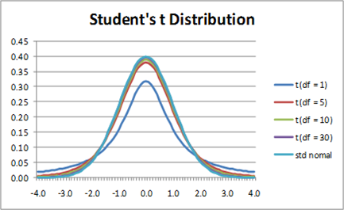

<style>
body {
text-align: justify}
</style>


```{r setup, include=FALSE}
knitr::opts_chunk$set(echo = TRUE)
```

## 1. Revision: Standard Error of the Mean in the Time Results of the Balaton Swimmers

As you may recall, in <a href="Chapter05.html" target="_blank">Chapter 5</a>, we thoroughly examined the time results of the participants in the 2022 Balaton Swim event from a sampling and estimation theory perspective. Let's load the data from the <a href="https://github.com/KoLa992/Statistical-Modelling-Lecture-Notes/blob/main/LIDLBalaton2022.xlsx\" target="_blank">LIDLBalaton2022.xlsx</a> file into a data frame again. This Excel file contains the time results of all participants in the `TIME` column. This dataset will now serve as our **population**.

```{r}
library(readxl)
swimming = read_excel("LIDLBalaton2022.xlsx")
str(swimming)
```

So, we have all $N=9751$ participants in the swim. In this chapter, we will **focus exclusively on estimating the mean of the time results**.<br>
So let's **calculate the mean of the time results** ($\mu=\bar{Y}$) **for** the entire **population** of swimmers. Additionally, it will be useful to have the population **standard deviation** ($\sigma$) as a reference. We must be careful because calculating the population standard deviation requires a custom function (we call it `classic_sd` now) to use the classical, uncorrected formula, which divides by $N$ instead of $N-1$.

```{r}
classic_sd <- function(x){
  return(sqrt(mean((x-mean(x))^2)))
}

PopMean <- mean(swimming$TIME)
PopStd <- classic_sd(swimming$TIME)

c(PopMean, PopStd)
```

Based on this, we know that an average Balaton swimmer completed the distance in $\mu=165.5$ minutes, with an an individual swimmer’s own time result deviating by $\sigma=44.1$ minutes on average.

**When estimating the mean**, our task is to **"guess" this $\mu=165.5$ minute mean based on a** random **sample** drawn with replacement (IID) from the population.

So, let’s **take a sample of $n=100$ elements from the population of Balaton swimmers**, using our favorite random seed $1992$, and **check the sample mean**, i.e., the value of $\bar{y}$.

```{r}
set.seed(1992)
selected_into_sample <- sample(rownames(swimming), size = 100, replace = TRUE)
swimming_sample <- swimming[selected_into_sample,]

SampleMean <- mean(swimming_sample$TIME)

SampleMean
```

In this $n=100$ **sample, the average crossing time is $160.8$ minutes**. Based on our reasoning in <a href="Chapter05.html" target="_blank">Chapter 5</a>, we can **bound the population mean ($\mu$) by adding and subtracting $\pm$ the standard error from the sample mean**. Since the standard error tells us how much a randomly selected sample mean is expected to deviate from the true population mean (since the sample mean $\bar{y}$ is inherently an unbiased estimator of the population mean $\mu$).<br>
Following this reasoning, we can say that the **population mean is expected to lie within the interval defined by the sample mean $\pm$ the standard error**.

Good news! The **standard error of the mean is calculated as the population standard deviation divided by the square root of the sample size**, i.e., using the formula $\frac{\sigma}{\sqrt{n}}$. This value can also be approximated from a single sample if we replace the population standard deviation with its unbiased estimate, the **corrected sample standard deviation**. Thus, **from a single $n=100$ sample, the standard error can be approximated using the formula $\frac{s}{\sqrt{n}}$.**

Based on this, we can perform the following calculation on our sample.

```{r}
n <- nrow(swimming_sample)
s <- sd(swimming_sample$TIME) # corrected st. deviation!
SE <- s/sqrt(n)

c(SampleMean - SE, SampleMean + SE)
```

Our results indicate that the true population mean ($\mu$) is expected to be between $160.6$ and $168.3$ minutes, meaning it lies within the $[160.6,168.3]$ interval. Well, **our interval estimation is correct, as the true population mean is $\mu=167.5$ minutes, which is indeed within this interval defined by our sample**.

## 2. Distribution of Sample Means

Alright, alright, with a single sample, we might have just been lucky. **How well does this standard error method actually work with many $n=100$ samples?** Let’s load into a data frame the table that contains the data of $10000$ independent IID samples of size $n=100$! The Excel file I generated in <a href="Chapter04.html" target="_blank">Chapter 4</a>, which contains the $10000$ IID samples, can be accessed <a href="https://github.com/KoLa992/Statistical-Modelling-Lecture-Notes/blob/main/SwimmingSamples.xlsx\" target="_blank">here</a>.

```{r}
samples_100 <- as.data.frame(read_excel("SwimmingSamples.xlsx"))
rownames(samples_100) <- paste0("Sample",1:10000) # indicate in the rownames that each row is one sample
head(samples_100)
```

Okay, from the results, we can see that the data frame is structured so that **each row contains one 100-element sample, and the sample elements** (i.e., the time results of the selected swimmers in minutes) **are stored in the columns**.

Now, let’s **calculate the $\bar{y} \pm SE$ interval for each sample**, and check whether the **true population mean** ($\mu$) **falls within the interval**! Let’s **give ourselves a little advantage by calculating the standard error using the known population standard deviation**, $\sigma$. That is, we apply the formula $SE = \frac{\sigma}{\sqrt{n}}$. This is an advantage because, in practice, we do NOT know $\sigma$ from just one 100-element sample!<br>
During the calculation, make sure to use the `apply` function with the parameter `MARGIN = 1` (2nd parameter of the function), since the elements of a single sample are in rows. Also, always restrict the calculation to the first $100$ columns of the data frame, as we will be continuously adding new columns to it!

```{r}
SE <- PopStd / sqrt(n)

samples_100$MeanLower <- apply(samples_100[,1:100], 1, mean) - SE
samples_100$MeanUpper <- apply(samples_100[,1:100], 1, mean) + SE
head(samples_100[,101:102])
```

Okay, now we have the **lower and upper bounds of** the mean interval **estimate**. Now, let’s **calculate the hit rate**!<br>
For this calculation, we use the trick we employed in <a href="Chapter05.html" target="_blank">Chapter 5</a>: a R command like `x > 180` returns a `logical` vector, and by averaging this vector, we get the proportion of "*favorable cases*", meaning the proportion of intervals that correctly include $\mu$.

```{r}
mean((samples_100$MeanLower <= PopMean) & (samples_100$MeanUpper >= PopMean))
```

Well, it seems that the $\bar{y} \pm SE$ method **correctly captures the true population mean $\mu$ in only about $68%$ of the samples**! That’s not great! We’d like a much higher accuracy, say around $90%$.

To understand why this method’s hit rate is so poor, let’s **take a look at the histogram of the $\bar{y}$ sample means!** I won’t optimize the number of bins (like based on Sturge's Rule) for the histogram this time, I’ll just accept the default settings of `hist`.

```{r}
samples_100$SampleMeans = apply(samples_100[,1:100], 1, mean)

hist(samples_100$SampleMeans)
```

Whoa! This is the **most beautiful normal distribution ever!**

On second thought, this is **completely logical, since the Central Limit Theorem (CLT) is at work here**. If you don’t remember the CLT, go back to <a href="Chapter04.html" target="_blank">Section 3 in Chapter 4</a>! :)

According to the **CLT**, if a **variable arises as the sum of random effects**, then the **variable follows a normal distribution**. The **variable of $\bar{y}$ sample means perfectly fits the CLT conditions**! After all, the sample mean is obtained by summing the sample elements and dividing by the sample size. **Since the sampling method is IID, I can be sure that each sample element is a random draw, so a result of a random effect. Then, I sum them up.** Finally, I divide by $n$, but since $n$ is always the same (a constant), it doesn’t change the fundamental logic.

If the **variable of sample means from many samples follows a normal distribution, then we also know its mean and standard deviation!**

- Due to **unbiasedness**, we know that the mean of the sample means is the population mean, i.e. $\mu$.
- The standard deviation of the sample means is simply the **standard error**, i.e. $\frac{\sigma}{\sqrt{n}}$

This is exactly the result we would get if we divided the original CLT equation by $n$.

The original formulation of the CLT states that for independent, identically distributed (IID) random variables $X_1,X_2,\dots,X_n$ where $\forall i$: $E(X_i) = \mu$ and $Var(X_i) = \sigma^2$, and as $n \rightarrow \infty$:$$\sum_{i=1}^n{X_i} \sim N(n \mu, \sqrt{n}\sigma)$$

Dividing this by $n$ gives the following result (applying the rule that a constant factor can be factored out linearly from expected value and squared from variance): $$\frac{1}{n} \times \sum_{i=1}^n{X_i} \sim N\left(\mu, \frac{\sigma}{\sqrt{n}}\right)$$

In summary, the **variable of sample means $\bar{y}$ from many samples follows the distribution**: $$\bar{y} \sim N\left(\mu,\frac{\sigma}{\sqrt{n}}\right)$$

We can easily test this fit graphically using the method shown in <a href="Chapter03.html" target="_blank">Section 1.3 of Chapter 3</a>.<br>
Notice that in the `stat_function` of the `ggplot2` package, I specify the mean using the previously computed `PopMean` and the standard deviation using the previously computed `SE` objects! The `linewidth=1` setting slightly increases the thickness of the red density function line.

```{r}
library(ggplot2)

ggplot(samples_100, aes(x=SampleMeans)) +
  geom_histogram(aes(y = after_stat(density))) +
  stat_function(
                fun = dnorm, 
                args = list(mean = PopMean, sd = SE),
                col = 'red', linewidth=1)
```

Very nice! The fit looks great: the **CLT is working once again**! :)

## 3. Confidence Interval for the Mean

Let's now examine the **probability that a randomly selected value from an $N(\mu, SE)$ distribution falls within the $\mu \pm SE$ interval**!

```{r}
pnorm(PopMean+SE, mean=PopMean, sd=SE) - pnorm(PopMean-SE, mean=PopMean, sd=SE)
```

Whoa! This is also approximately $68%$! So, the **fact that a $\bar{y} \pm SH$ estimate is only accurate in $68%$ of the samples is essentially a necessity dictated by probability theory**.

The question is, what can we do about this? **What should we do if we want to provide a better interval estimate for the population mean (or expected value in other words), say with $95%$ reliability instead of $68%$?**

For reasoning, we will rely on <a href="Chapter03.html" target="_blank">Section 1.6 of Chapter 3</a>.

We know that if the **distribution of sample means** is given by: $$\bar{y} \sim N\left(\mu,\frac{\sigma}{\sqrt{n}}\right)$$

Then the **distribution of standardized/normalized sample means will be a standard normal distribution**: $$\frac{\bar{y}-\mu}{\frac{\sigma}{\sqrt{n}}} = z \sim N(0,1)$$

For a **standard normal distribution, it is always true** that $P(-2<z<+2) \approx 95%$. As a reminder, here is the density function of the $N(0,1)$ standard normal distribution from Section 1.6 of Chapter 3.

<center>
{width=50%}
</center>

<br>Now, for simplicity, let’s take $\approx$ as $=$: $$P(-2<z<+2) = 95\%$$

We **substitute the formula for $z$** into this relationship: $$P\left(-2< \frac{\bar{y}-\mu}{\frac{\sigma}{\sqrt{n}}} <+2\right) = 95\%$$

For now, we assume that we know $\sigma$, i.e., the population standard deviation, for example, from some prior comprehensive data collection. Our goal is to confine the true population mean ($\mu$) within certain limits based on a single sample mean ($\bar{y}$), since we don’t want to extract all possible samples every time. So, we solve for the population mean $\mu$ from the original inequality: $$P\left(\bar{y}-2 \times \frac{\sigma}{\sqrt{n}}< \mu <+2 \times \frac{\sigma}{\sqrt{n}}\right) = 95\%$$

Thus, this equation means that the **population mean is within the single sample mean’s $\pm 2SE$ interval with approximately $95%$ probability**. This is called the **95% confidence interval for the mean**. The number $2$ is the **confidence multiplier** $k$ corresponding to the $95%$ confidence level. All of this can be computed from a single $n$-element sample by replacing $\sigma$ with $s$! However, it is **crucial that our sample is randomly selected, because only then will we obtain the normal distribution for the sample means that we derived**! As we know, the CLT requires randomly selected sample elements to ensure the "*summation of random effects*" condition.

### 3.1. General Formula for the Confidence Interval of the Mean

If we want to **write this confidence interval in a general form**, we usually say that we construct a $1-\alpha$ confidence interval, where $\alpha$ is the **probability of error**, meaning the probability that the population mean is *not* within the confidence interval: $$P\left(\bar{y}-z_{1-\frac{\alpha}{2}} \times \frac{\sigma}{\sqrt{n}}< \mu <+z_{1-\frac{\alpha}{2}} \times \frac{\sigma}{\sqrt{n}}\right) = 1- \alpha$$

Here, the $z$ value is meant to represent **the $z$ value that must be found such that the probability of "falling below it" in the standard normal distribution is exactly** $1-\frac{\alpha}{2}$.<br>
This concept is illustrated in the following figure.

<center>
{width=60%}
</center>

<br>The goal is to find the value of $k$ in the $z \sim N(0,1)$ distribution where $P(-k < z < +k) = 1-\alpha$. This is the same reasoning from which we obtained the value of $2$ for the $95%$ case.
**From the figure above**, we determine this as follows: if we know that the probability of falling between $\pm k$ is $1-\alpha$, then the **probability of falling outside** this range is $\alpha$, which represents our allowed error probability. Due to the **symmetry of the normal distribution density function**, this probability is **evenly split** below $-k$ and above $+k$. Thus, the probability of exceeding $+k$ is $\alpha / 2$. However, since R's `qnorm` function **only works with "cumulative probabilities below a value"**, we need to determine the probability of being below $+k$, which is simply the complement of the exceedance probability: $1-\frac{\alpha}{2}$. This **corresponds to the orange-shaded area in the density function graph**.

We can see that this logic works perfectly for the $95%$ confidence level, i.e., $\alpha=5%$.

```{r}
alpha <- 0.05
qnorm(1-(alpha/2))
```

The result is not exactly $2$ but approximately $1.96$. **In the derivation, I rounded the value**, but I believe the core idea of computing the confidence multiplier has been conveyed. :)

In summary. The **confidence interval for the mean at any given confidence level can be computed in the general form**: $$\bar{y} \pm k \times SE$$

That is, we **take the sample mean ($\bar{y}$) and add/subtract $k$ times the standard error ($SE$), where $k$, as the confidence multiplier, determines the desired confidence level**.<br>
This general formula is **crucial because, in later estimation procedures for the mean, the only things that will change are the specific formulas behind $SE$ and $k$, but this fundamental logic will always remain the same!!**

### 3.2. Check the Hit Rate for the Confidence Interval

As a final step, let’s verify the correctness of our confidence interval formula and **see whether, by using $SE$ calculated with $\sigma$, we can construct a $98%$ confidence interval estimate** for the average completion time of swimmers crossing Lake Balaton using our solution $k = z_{1-\frac{\alpha}{2}}$.

Thus, for our $10000$ samples, in this case, the sample mean requires a distance of $$\triangle = k \times SE = z_{1-\frac{\alpha}{2}} \times \frac{\sigma}{\sqrt{n}}$$

to be measured in the $\pm$ direction. This distance $\triangle$ is called the **length of the confidence interval, or in other words, the total margin of error of the estimate**.

Now, let’s check whether such an estimate really results in an **approximately $98%$ hit rate**.

```{r}
n <- 100
alpha <- 1 - 0.98
k <- qnorm(1-alpha/2)
SE <- PopStd / sqrt(n)
delta <- SE * k

samples_100$MeanLower <- samples_100$SampleMeans - delta
samples_100$MeanUpper <- samples_100$SampleMeans + delta
head(samples_100[,101:103])
```

Okay, now we have our **new confidence interval estimates** for all $10000$ samples. Let’s examine their accuracy!

```{r}
mean((samples_100$MeanLower <= PopMean) & (samples_100$MeanUpper >= PopMean))
```

And indeed, the **hit rate is around $98%$**, so victory! :)

### 3.3. Two Important Properties of Confidence Intervals

One must **be careful with the confidence level** of the confidence interval. If we look at our previous calculations, we can see that

- for $95%$ confidence, $k=1.96$
- for $98%$ confidence, however, $k=2.3$

is the corresponding confidence multiplier.

Due to the relationship $\triangle = k \times SE$, it is easy to see that **increasing the confidence level increases the margin of error, meaning that the confidence interval widens**. This makes complete sense: if I **want a higher probability of capturing the true population mean, I need to "widen the net," increasing the chances of catching it**.<br>
A $100%$ confidence level is only possible if the confidence interval spans $\pm \infty$, which, of course, is not a very useful estimate... :)

It is worth testing this further on the sample of size $100$ created bac in *Section 1*, using a `for` loop with error probabilities $\alpha = {0.2,0.1,0.05,0.01,0.001}$.<br>
For the calculations, I will use the previously computed `SampleMean` and `SE` R objects.

```{r}
alpha_vector = c(0.2, 0.1, 0.05, 0.01, 0.001)

for (current_alpha in alpha_vector) {
  lower <- SampleMean - SE*qnorm(1-current_alpha/2)
  upper <- SampleMean + SE*qnorm(1-current_alpha/2)
  print(paste0("Confidence: ",(1-current_alpha)*100,"% - Conf. Int.: [",
               round(lower,2), ", ",round(upper,2),"]"))
}
```

This phenomenon is clearly observable: as **confidence increases, the confidence interval expands, meaning the margin of error continues to grow**.

- at $90%$ confidence, the estimated average completion time falls somewhere between $153$ and $168$ minutes
- at $99%$ confidence, however, it already extends between $146$ and $175$ minutes!!

The way to mitigate this effect is by **increasing the sample size**! **Let’s rerun the previous `for` loop on a sample of size $n=20$ instead of $n=100$!** We compute the sample mean $\bar{y}$ using the first $20$ columns. Since the sample selection was IID, it behaves as if we had only chosen $20$ elements during sampling, rather than $100$. The standard error formula $SE=\frac{\sigma}{\sqrt{n}}$ can also be easily recalculated for $n=20$.

```{r}
SampleMean_Size20 <- mean(swimming_sample$TIME[1:20])
n <- 20
SE_Size20 <- PopStd / sqrt(n)

alpha_vector = c(0.2, 0.1, 0.05, 0.01, 0.001)

for (current_alpha in alpha_vector) {
  lower <- SampleMean_Size20 - SE_Size20*qnorm(1-current_alpha/2)
  upper <- SampleMean_Size20 + SE_Size20*qnorm(1-current_alpha/2)
  print(paste0("Confidence: ",(1-current_alpha)*100,"% - Conf. Int.: [",
               round(lower,2), ", ",round(upper,2),"]"))
}
```

Clearly, **at $99%$ confidence level, the estimated mean crossing times are**

- between $132$ and $197$ minutes for $n=20$
- and ranging from $146$ to $175$ minutes for $n=100$
  * as we saw earlier, this estimate is more precise (with a smaller $\triangle$ margin of error), 

This result is unsurprising. Since the **standard error formula** $\frac{\sigma}{\sqrt{n}}$ has the **sample size $n$ in the denominator, increasing $n$ reduces the standard error, thereby decreasing the total $\triangle$ margin of error**. As we established in  <a href="Chapter05.html" target="_blank">Chapter 5</a>, the **sample mean is a consistent estimator**: as sample size increases, its standard error ($SE$) decreases and approaches $0$.

Thus, the **chosen $1-\alpha$ confidence level depends on the sample size**:

- With a larger $n$, a $99\%$ confidence level can still provide a precise interval estimate,
- With a smaller sample size, one may need to settle for a more moderate confidence level (e.g., $90\%-95\%$)

## 4. Confidence Intervals in Practice

At this point, let’s **leave behind the Balaton swimmers** and **try calculating the confidence interval for the mean in a case where we do not know the entire population from which the sample was taken**.

### Task 1: Efficiency of Sleeping Pills

A sztorink a következő.

Egy gyógyszergyár egy új altató készítmény hatását vizsgálja $10$ véletlenszerűen kiválasztott inszomniában szenvedő páciensen. Mind a tíz páciens esetében feljegyezték, hogy hány órát növekedett az alvásidejük a készítmény használatát követően. Korábbi klinikai vizsgálatok alapján ismeretes, hogy az altató készítmények által kiváltott alvásidő-változás normális eloszlású, $2$ óra szórással.												

$Data = \{1.9, 0.8, 1.1, 0.1, -0.1, 4.4, 5.5, 1.6, 4.6, 3.4\}$

Készítsünk $95\%$-os megbízhatósággal intervallumbecslést a várható átlagos alvásidő-változásra:

a) a megadott feltételek alapján;
b) feltételezve, hogy az eloszlás normális, de a szórás ismeretlen!
c) Mekkora mintára van szükség, ha ugyan ekkora megbízhatóság (95%) mellett a b) pontban kapott hibahatárt a felére kívánjuk csökkenteni?

### Task 1/a Solution

Ebben az a) feladatban nagyon el vagyunk kényeztetve. Az altató hatékonyságához van egy $n=10$ elemű mintánk, aminek az adatait tételesen ismerjük. Első páciens alvásideje $1.9$ órával nőtt az altató használata után, másodiké $0.8$ órával, stb. Van egy páciens, akinek csökkent az alvásideje a gyóygszerhasználat után: az 5. delikvensé, $0.1$ órával.<br>
Ha ezeket az adatokat elrakjuk egy `vector`-ba, akkor simán kiszámolható a megfigyelt 10 páciens esetében az átlagos alvásidő növekedés, azaz $\bar{y}$

```{r}
SampleData = c(1.9, 0.8, 1.1, 0.1, -0.1, 4.4, 5.5, 1.6, 4.6, 3.4)
SampleMean = mean(SampleData)
SampleMean
```

Tehát a megfigyelt páciensek esetében az átlagos alvásidő növekedés kb. $\bar{y}=2.3$ óra. Ami szép és jó, de mennyi lehet az **átlagos alvásidő növekedés az inszomniás páciensek összességére, a teljes sokaságra nézve? Ehhez kell a konfidencia-intervallum! Hogy olyan betegekre is tudjunk mondani valamit, akiket a mintában NEM figyeltünk meg!**

Itt az a) esetben minden **feltételezést elfogadhatunk, amit a feladat tesz**. Ebben van egy olyan rész, ami szerint "*korábbi kutatásokból*" ismerjük, hogy az alvásidő-változások szórása $2$. Ha ezt így elhisszük, akkor azt mondhatjuk, hogy az alvásidő-változások teljes sokaságra vonatkozó szórását vehetjük $2$-nek. Azaz, $\sigma=2$-t "*hazudunk*" a számolások során.<br>
**FIGYELEM!** Ha a feladat szövege azt akarja közölni velünk, hogy van egy sokasági szórás, egy $\sigma$, amit ismerünk és használhatunk a számolásaink során, akkor azt mindig ilyen "*korábbi kutatásokból ismeretes...*" szövegrészbe fogja becsomagolni!

Ha **elfogadjuk a feltételezéseinket, akkor minden adott a konfidencia-intervallum 3. fejezetben megismert képletének alkalmazásához**. Hiszen, ha $95\%$ a megbízhatóság, akkor $\alpha=5\%$. Tegyük is ezt: alkalmazzuk a képleteket az adatainkra!

```{r}
n <- 10
alpha <- 1-0.95
assumed_pop_sd <- 2

k <- qnorm(1-alpha/2)
SE <- assumed_pop_sd/sqrt(n)
delta <- k*SE

lower <- SampleMean - delta
upper <- SampleMean + delta

c(lower, upper)
```

Az eredmény alapján ez az **új alatató készítmény az inszomniás páciensek teljes sokaságában a 10 elemű mintánk alapján legalább $1.09$ óra és legfeljebb $3.6$ óra alvásidő növekedést okoz $95\%$-os valószínűséggel!**

Ennek a cég vezetése nagyon örül, mert lehet olyan reklámszlogeneket elsütni az eredményünk alapján, hogy "*vizsgálatok igazolják, hogy altatónk $95\%$-os valószínűséggel legalább $1$ órával növeli a várható alvásidőt*". Egy ilyen mondat pedig minden marketinges álma *úgymond*. :)

De **minden ilyen szép marad-e ha az alvásidők szórását nem a feltételezett** $\sigma=2$-vel, hanem a **mintából számolt korrigált szórással ($s$) számítjuk?**

### Task 1/b Solution

Itt a feladat azt mondja, hogy ne higyjünk mindenféle kétes "*korábbi kutatásnak*", ne fogadjuk el az általuk megadott $\sigma$-t, hanem **számoljunk magunknak egy korrigált mintaszórást**, azaz $s$-t (a korrigált mintaszórás ad torzítatlan becsést a valós, sokasági $\sigma$-ra), és számoljuk végig azzal a stanadard hibát $SH=\frac{s}{\sqrt{n}}$ módon.

Viszont, ha **feloldjuk azt a feltevésünk, hogy ismerjük a sokasági szórást az $SH$ számoláshoz** , akkor a **mintaátlagok normális helyett egy $n-1$ szabadságfokú t-eloszlást követnek**.

A **t-eloszlás sűrűségfüggvénye az alábbi alakot ölti**. Az szabadságfokokat az angol *degrees of freedom* kifejezésből $df$-el jelöljük.

<center>
{width=60%}
</center>

<br>Ahogy a fenti sűrűségfüggvényből is létszik Student-féle t-eloszlás valójában egy **ellapított standard normális eloszlás** (lásd fenti ábra). A lapítás azt akarja kifejezni, hogy az eloszlás szórása nagyobb. Hiszen nagyobb szórás esetén az eloszlás szélein lévő számértékek is nagyobb valószínűséggel következhetnek be (mivel a lapítás miatt a sűrűségfüggvény magasabban fut ezeken a helyeken), így változatosabbá, jobban szóródóvá teszik az adatsorunk.

Viszont, ahogy növeljük az eloszlás szabadságfokát ($df$), egyre jobban "*visszacsúcsosítjuk*" az eloszlást a standard normális eloszlásba. Logikus, hogy ilyenkor ezt az eloszlást használjuk, mivel a standard hiba értékébe (ami a mintaátlagok normális eloszlásának szórás paramétere) egy biztosan ismert sokasági szórás érték helyett, annak egy mintából számított becslését rakjuk, így **nagyobb bizonytalanságot, nagyobb szórást viszünk az eloszlásba**.

Ebben a helyzetben a konfidencia-intervallum úgy módosul, hogy $\sigma$ helyére $s$ kerül a $SH$-ban, és a $k$ megbízhatósági szorzót $t$-eloszlásból számoljuk $N(0,1)$ eloszlás helyett: $$P\left(\bar{y}-t_{1-\frac{\alpha}{2}}^{n-1} \times \frac{s}{\sqrt{n}}< \mu <+t_{1-\frac{\alpha}{2}}^{n-1} \times \frac{s}{\sqrt{n}}\right) = 1- \alpha$$

Az $n-1$ szabadságfokú $t$ érték számításához a `qt` függvényt vesszük elő. Teljesen hasonló logikával működik, mint a `qnorm` függvény (vagy mint az R bármelyik eloszlás inverz értékét számoló függvénye). A $t$-eloszlás is szimmetrikus, tehát most is azt az értéket keressük az $n-1$ szabadságfokú $t$-eloszlásunkban, ahol az "*alá esési*" valószínűség $1-\frac{\alpha}{2}$. A `qt` függvény `df` paraméterével állítható a szabadságfok.<br>
Ezt a mi $n=10$ elemű mintánkra, $95\%$-os megbízhatósági szint mellett az alábbi módon számoljuk

```{r}
n <- 10
alpha <- 1-0.95

k_z <- qnorm(1-alpha/2)
k_t <- qt(1-alpha/2, df = (n-1))

c(k_z, k_t)
```

Láthatjuk, hogy **a $t$-eloszlású $k$ szorzó értéke érdemben nagyobb, mint a standard normális eloszlású $k$ szorzóé ugyan arra a megengedett hibavalószínűségre**! Mivel a $t$-eloszlás nagyobb valószínűséget tulajdonít az extrém magas+alacsony értékek bekövetkezésének, így ha ezt alkalmazzuk, akkor ugyan ahhoz a megbízhatósági szinthez egy magasabb $k$ megbízhatósági szorzót kapunk a $SH$-hoz!

Ezek után igazából csak annyi a feladatunk, hogy a teljes becslési hibahatárt kiszámítsuk $\triangle = t_{1-\frac{\alpha}{2}}^{n-1} \times \frac{s}{\sqrt{n}}$ módon, és ezt rámérjük $\pm$ a mintaátlagra, $\bar{y}$-ra. Ez már mehet ugyan úgy, mint az a) feladatban.

```{r}
corr_std <- sd(SampleData)

k_t <- qt(1-alpha/2, df = (n-1))
SE <- corr_std/sqrt(n)
delta <- k_t * SE

lower <- SampleMean - delta
upper <- SampleMean + delta

c(lower, upper)
```

Nem meglepő módon, a **t-eloszlású megbízhatósági szorzó miatt a $95\%$-os kinfidencia-intervallum kitágult**. Annak ellenére is, hogy az $SH$-ban gyakorlatilag nincs változás, mivel $s=2.0022$. Az altató átlagos alvásidő növekedése a betegek teljes sokaságban, már $0.9$ és $3.76$ óra közé tehető $95\%$-os valószínűséggel. Szóval, ebben a reálisabb helyzetben, amikor már a szórást magunknak számoljuk a mintaadatokból, és nem pedig "*elhisszük*" valakinek, akkor a bizonytalanság megnövekedése miatt alkalmazott t-eloszlásnak köszönhetően, a becslési hibahatár, a $\triangle$ kitágul. A marketingesek pedig már nem mondhatnak olyan szépeket, hogy "95%-os valószínűséggel legalább átlag $1$ órát növeli az alvásidőt az altató". RIP! :(

Viszont, amíg a **mintánk elemszámi kicsi**, $n \leq 30$, addig a **t-eloszlású konfidencia intervallum számításának van egy előfeltétele: az adatsor, amiből a mintát vesszük normális eloszlású kell, hogy legyen!!**<br>
Esetünkben ez annyit tesz, hogy az inszomniás páciensek sokaságában az *alvásidő normális eloszlású* hisztogramot mutat.

Na, most itt ezt kemény $n=10$ esetben marha nehéz értelmesen megvizsgálni a minta alapján, de lessünk egy hisztogramot a megfigyelt $10$ db alvásidőre! A hisztogram osztályközeinek számát most nem optimalizáljuk, elfogadjuk az alapbeállításokat.

```{r}
hist(SampleData)
```

Hát, a fene se tudja ennyiből eldönteni, de tényleg. Akár normális eloszlásúak lehetnek az alvásidők. :) Bízzunk a *CHT*-ben: az egyéni alvásidők valószínűleg véletlen hatások összegeként állnak elő, így azok adatsora a sokaságban, a nem megfigyelt $10$ elemű mintán *kívüli* világban, lehet normális eloszlású is akár. :)

Maga a *t-eloszlás* egyébként egy *William Gosset* nevű angol statisztikus kreatúrája. Mr. Gosset a *Guiness* sörgyárak minőségbitosítási vezetője volt, és azt a feladatot kapta, hogy oldja meg, hogy az üveges sörök minőségbiztosítása kis mintákból is megoldható legyen. Mivel a minőségbiztosításhoz ki kell bontani az üveget és megmérni benne az összetevőket, aztán utána ezek átlagára néznek konfidencia-intervallumokat. A minőségbiztosításra kinyitott sör pedig már nem elfogyasztható. *Kellemetlen*.<br>
Így érhető, hogy minél kevesebb üvegből akarják az egész minőségbiztit megúszni. Erre adta megoldásként Gosset a t-eloszlást. Mivel a sörökben a különböző alapanyagok értéke normális eloszlást követ.

Azonban emberünk el akart büszkélkedni a saját kis elszlásával a nagy világban, ezért *Student álnéven* publikálta is az eredményeit...innen lett az eloszlás neve *Student-féle t-eloszlás*. :) Viszont nagyon nem volt előrelátó az úriemberünk, hiszen akkoriban nyilván csak a Guiness sörgyár tudott elég kevés üvegből ugyan olyan "jó" megbízhatósággal minőségbiztosítani, mintha több elemű mintát vizsgáltak volna, így *Mr. Gosset* gyorsan lebukott.

Tehát, ahogy az alábbi ábra is mutatja, szegény emberünk csak a sörtermelést szerette volna hatékonyabbá tenni, de végül mindenki életét tönkretette, aki statisztikai becsléselméletet tanul. :)

<center>
{width=30%}
</center>

### Task 1/c Solution

Node, térjünk vissza az altató készítményünk hatékonyságára. Ugyebár a t-eloszlással készített konfidencia-intervallum eléggé elkeserítő eredményt hozott: nem tudjuk azt mondani $95\%$-os megbízhatósággal, hogy készítményünk legalább $1$ órával növeli az alvásidőt!

Mi ennek az oka? Hát a **magas becslési hiba, az átlagra épített konfidencia-intervallum hossza**, tehát a $\triangle$. Ez most ugye nekünk $\pm 1.43$ óra.

```{r}
delta
```
Mondjuk ezt a becslési **hibahatárt szeretnénk levinni a felére**, $1.43/2$, azaz kb. $\triangle'= \pm 0.7$ órára. Ezt kétféleképpen lehet elérni. Hiszen "*magasról nézve*", a becslési hibahatár egy kéttényezős szorzat $$\triangle=k \times SH$$

1. Addig állítgatom a megbízhatósági-szintet, azaz valójában $\alpha$-t, amíg a t-eloszlásból származó $k$ megbízhatósági szorzó olyan alacsony nem lesz, hogy az eddigi $SE$-val szorozgatva ki nem adja a $0.7$-es értéket $\triangle$-re. Ez az **illetlen megoldás**! Hiszen lehet, hogy ehhez az $\alpha$-t nagyon fel kell engedni, és a becslésnek nagyon alacsony lesz a megbízhatósága...az "$55\%$-os megbízhatósággal állítható az, hogy..." nem hangzik olyan jól marketing szempontból sem.

2. Az **intelligens megoldás** a mintaelemszám, azaz $n$ növelése. Az $\alpha$-t adottnak vesszük, és így $k$-t nem bántjuk. Persze a t-eloszlás szabadságfoka miatt az elemszám $k$-ra is hat, de ahogy az eloszlás sűrűségfüggvényéből is látszik, kellően nagy $n$ esetén a t-eloszlás igazából a standard normálissal lesz ekvivalens, tovább tehát nem tudjuk csökkenteni $k$-t adott $\alpha$ mellett. Tehát ekkor a $k$ lényegében fix. Ellenben $n$ növekedése miatt az $SE$ része a szorzatnak biztosan csökkeni fog, hiszen az átlagra konzisztens becslést adunk, tehát $SE$ a $0$-ba tart $n$ növelése esetén. Ez ugye a $SE=\frac{s}{\sqrt{n}}$ összefüggésből adódik egyértelműen. Szóval az $s$-t (vagy éppen $\sigma$-t, ha azt ismerjük) adottnak vesszük, akkor kiszámolhatjuk, hogy mekkora $n$ szükséges a $\triangle'= \pm 0.7$ óra eléréséhez hibahatár fronton.

Szóval, a 2. megoldást, az elemszám növelését választva a következő összefüggésből ki kell fejezni $n$-t: $$\triangle=k \times SE = z_{1-\frac{\alpha}{2}} \times \frac{s}{\sqrt{n}}$$

Hiszen $\triangle$ helyére beírhatjuk nemes egyszerűséggel az elérni kívánt $\triangle$-t. A $k$ helyére azért írtam $z_{1-\frac{\alpha}{2}}$-t és nem a t-eloszlású szprzót, mert a standard normális eloszlású megbízhatóságú szorzó értéke alá úgysem tudunk menni a t-eloszlással adott $\alpha$ mellett, hiszen a t-elsozlású sűrűségfüggvényt végtelen szabadságfok mellett is csak a standard normális eloszlásba lehet maximum "*visszacsúcsosítani*", ahogy a b) feladat megoldásában szereplő ábrán láthattuk is.

Ha pedig a fent formulából kifejeztük az elemszámot, akkor ehhez az összefüggéshez jutunk: $$n=\frac{z_{1-\frac{\alpha}{2}}^2 \times s^2}{\triangle^2}$$

Ebbe pedig gond nélkül be tudunk helyettesíteni mindent.

```{r}
delta_new <- 0.7

n_new <- k_z^2 * corr_std^2 / delta_new^2
n_new
```

Tehát a becslési ha felezéséhez $n=31.4$ elemű minta kéne... mivel egyik betegből sem vágnánk ki $0.4$ részt a vizsgálatra, így logikus módon az eredményt kerekítsük fel $n=32$-re. **Azaz, $32-10=22$ páciensen kéne még  extrában megvizsgálni az altató hatását ahhoz, hogy az átlagos alvásidő növekedést $95\%$-os megbízhatósággal és $\pm0.7$ órás becslési hibával meg lehessen adni**.<br>
Persze, ha a mintaátlag vagy éppen a korrigált mintaszórás úgy módosul az új mintaelemek hatására, hogy a konfidencia-intervallum alsó határa továbbra sem éri el a vágyott $1$ órát, akkor tervünk dugába dőlt. Viszont, akkor ez inkább a gyógyszert fejlesztő vegyészek sara, mint a hatékonyságvizsgálatot végző statisztikusé, aki rávilágít a problémákra. :)

### Task 2

Az <a href="https://github.com/KoLa992/Statistical-Modelling-Lecture-Notes/blob/main/ESS2020.xlsx" target="_blank">ESS2020.xlsx</a> fájlban található adatbázis a 2020-ban végzett európai szociális felmérés (European Social Survey 2020 = ESS2020) 1849 magyar kitöltöjének válaszait tartalmazza 14 kérdésre (plusz van egy *id* oszlop).

Ha valamelyik oszlopban üres értéket találunk, akkor az adott sorban lévő kitöltő nem válaszolt a kérdésre. Az adatbázisban szereplő kitöltők a teljes 18 év feletti magyar népességből vett véletlen mintaként kezelhetők. Most feltesszük, hogy ez a véletlen minta visszatevéses, azaz $IID$ is. A 6. heti tananyagban látni fogjuk, hogy ez nem is valóságtól elrugaszkodott feltevés.

Az adatbázis nyers formában <a href="https://ess-search.nsd.no/en/study/172ac431-2a06-41df-9dab-c1fd8f3877e7" target="_blank">eről a linkről</a> elérhető egy ingyenes regisztráció után.

**Feladatunk** a mintavétel alapján megbecsülni, hogy hogy egy átlagos magyar polgár $97\%$-os megbízhatósággal várhatóan legalább és legfeljebb hány percet internetezik naponta!

### Task 2 Solution

Először is töltsök be az adatbázist data frame-be és nézzük meg az elemszámot a feladat szempontjából releváns `NetUsePerDay_Minutes` oszlopban!

```{r}
ESS <- read_excel("ESS2020.xlsx")
str(ESS)

n <- sum(!is.na(ESS$NetUsePerDay_Minutes)) # this way, we do not consider the non-respondents
n
```

Szóval, az üres értékeket nem számolva, a releváns oszlop `count` metódusával megtudhattuk, hogy az internetezési idő esetében $n=1099$ elemű mintából főzhetünk. **Ez bőven nagy minta**, mivel ebből a tárgyból közmegegyezéssel **az $n > 30$ eseteket nagy mintának tekintjük**, ahogy az 1/b) feladat megoldásában megadtuk. Emiatt **nem kell az intrenetezési idők normális eloszlását sem vizsgálni az intervallumbecslés elvégzéséhez $s$-t és t-eloszlást használva**!

Mehetünk simán előre a $\triangle = t_{1-\frac{\alpha}{2}}^{n-1} \times \frac{s}{\sqrt{n}}$ képletet használva.

```{r}
sample_mean <- mean(ESS$NetUsePerDay_Minutes, na.rm = TRUE) # this way, we do not consider the non-respondents
corr_std <- sd(ESS$NetUsePerDay_Minutes, na.rm = TRUE) # this way, we do not consider the non-respondents

SE <- corr_std / sqrt(n)

alpha <- 1-0.97
k_t <- qt(1-alpha/2, df = (n-1))

delta <- k_t * SE

lower <- sample_mean - delta
upper <- sample_mean + delta

c(lower, upper)
```

Tehát, az $n=1099$ elemű mintánk alapján azt mondhatjuk, hogy az átlagos magyar $97\%$-os megbízhatósággal legalább napi $171.8$ percet és legfeljebb napi $190.8$ percet tölt internetezéssel.

Az eredményünk nem nagyon változik, ha a $k$ megbízhatósági szorzót standard normális eloszlásból számoljuk t-eloszlás helyett, hiszen az $n$ olyan nagy, hogy az $n-1$ szbadságfokú t-eloszlás sűrűségfüggvénye lényegében semmiben nem fog különbözni a standard normális eloszlás sűrűségfüggvényétől.

```{r}
k_z <- qnorm(1-alpha/2)

delta <- k_z * SE

lower <- sample_mean - delta
upper <- sample_mean + delta

c(lower, upper)
```

Láthatjuk, hogy csak a tizedesjegyekben vannak nagyon minimális eltérések. Szóval **nagy mintaelemszám esetén a megbízhatósági szorzó nyugodtan számolható standard normális eloszlásból is a t-eloszlás helyett**.

Szerencsénkre, R-ben az átlag konfidencia-intervallumának számítására t-eloszlású $k$ szorzók esetében **van függvény egy külön csomagban**.

We can apply the `groupwiseMean` function from the `rcompanion` to calculate the **confidence interval for the mean with t-distribution**.

Let's install and include the package:

```{r eval=FALSE}
install.packages("rcompanion")
library(rcompanion)
```

```{r echo=FALSE}
library(rcompanion)
```

Ok, now we can use the function. In the first parameter, we define the numerical variable on which we want to see a confidence interval for the mean, then add a `~1` code. We'll see the reason for this in just a bit. The second parameter defines the data frame where the variable selected in the first parameter is located:

```{r}
groupwiseMean(NetUsePerDay_Minutes ~ 1, data = ESS, conf = 0.97,
              na.rm = TRUE, digits = 4)
```

Egyezünk a korábbi eredményeinkkel: az átlagos magyar $97\%$-os megbízhatósággal legalább napi $171.8$ percet és legfeljebb napi $190.8$ percet tölt internetezéssel. Szuperek vagyunk! :)


## 5. Summary on the Different Confidence Interval Formulas for the Mean

Ezen a ponton érdemes összefoglalni, hogy az átlag intervallumbecslése milyen feltételek mellett milyen konkrét formulák vannak.

Az **alapképlet a konfidencia-intervallum hosszára, azaz a becslési hibahatárra**: $$\triangle = k \times SE$$

1. A sokasági szórás, alias $\sigma$ ismert.
  * $k=z_{1-\frac{\alpha}{2}}$<br>
  * $SE=\frac{\sigma}{\sqrt{n}}$
2. Az adatsor, amiből a mintát vettük *normális eloszlás*ú
  * $k=t_{1-\frac{\alpha}{2}}^{n-1}$<br>
  * $SE=\frac{s}{\sqrt{n}}$
3. A mintánk elemszáma nagy: $n > 30$
  * $k=t_{1-\frac{\alpha}{2}}^{n-1}$ vagy $k=z_{1-\frac{\alpha}{2}}$<br>
  * $SE=\frac{s}{\sqrt{n}}$

És ennyi, igazából, ha végiggondoljuk a 4. fejezet feladatait, ezt a $3$ esetet tudjuk elkülöníteni a $\triangle$ számítása során.

## 6. Case Study

Vizsgáljuk meg $99\%$-os megbízhatósággal hogyan alakul az átlagos internetezéssel töltött idő a teljes magyar népességben pártpreferencia szerint!

Érdekes megnézni, hogy egy $n=1099$ elemű mintában mért átlagos különbségek az egyes pártok intenetezési idejében mennyire általánosíthatók ki a pártokat támogató népesség egészére, tehát azokra az emberekre, akiket a mintában még NEM figyeltünk meg, azaz a **mintaelemeken kívüli világra**.

The `groupwiseMean` function can get confidence intervals for the population mean by separate categories of a `factor` or `character` variable. So, for example we can **see the confidence interval of the mean net usage time by party preferences**. We just need to switch the `~1` code to `~PoliticalPartyPref` in the first parameter. This indicates that we want confidence levels separately, not as a whole:

```{r}
groupwiseMean(NetUsePerDay_Minutes ~ PoliticalPartyPref, data = ESS, conf = 0.99,
              na.rm = TRUE, digits = 4)
```

Remek! :) Ezek alapján azt mondhatjuk, hogy az egyesült ellenzék esetén egy átlagos kérdőívkitöltő $228.8$ percet netezik naponta, míg egy átlag Fidesz kitöltő csak napi $158.7$ percet.<br>
Azonban, a teljes ellenzéki népességben az átlag netezési idő $196$ és $261$ perc között van $99\%$-os valószínűséggel. A teljes fideszes táborban pedig az átlagos neten töltött idő csak $137$ és $180$ perc között mozog, szintén $99\%$-os valószínűséggel.<br>
Tehát, $99\%$-os valószínűséggel az átlag netezési idő az Ellenzék esetében magasabb, mint a Fidesz esetében a teljes népességben is, hiszen a "legrosszabb" ellenzéki átlagérték is már $196$ perc, míg a Fidesz esetén a "legjobb" átlagidő is csak $180$ perc.<br>
Mindez persze a különböző felületeken (tv, rádió, internet) működő médiumok irányultságát figyelembe véve egyáltalán nem meglepő. :)

Az eredméynekből tudunk egy szép kis vizualizációt is készíteni a `ggplot` csomaggal. Először is elmentjük a `groupwiseMean` függvény eredményét egy külön data frame-be. Majd csinálunk egy olyan oszlopdiagramot belőle `ggplot`-ban, ahol az `x` tengelyen a pártpreferencia szerepel, míg az `y` tengelyen a mintában mért átlagos netezési idő. A `fill` paraméterben beállítjuk, hogy minden oszlop különböző színű legyen a pártpreferencia függvényében (ez csak egy optikai tuning :)). A `geom_bar` rétegben alkalmazott `stat = "identity"` paraméterbeállítás kényszeríti ki, hogy az ábra `y` tengelyén tényleg a mintaátlagok szerepeljenek, mert alapból a pártpreferenciák gyakoriságait rakná rá a gépállat.<br>
Végül pedig a `geom_errorbar` rétegben felvisszük az ábrára a konfidencia-intervallumok alsó és felső határait a rétegen belül alkalmazott `aes` függvény  `ymin` és `ymax` paraméterein keresztül. A két paraméternek megadott érték azért `Trad.lower` illetve `Trad.upper`, mert a `conf_int_df`-ben ilyen nevű oszlopokban lettek letárolva a konfidencia-intervallumok határai, ha emlékszünk még az előző kód eredményére.

```{r}
conf_int_df <- groupwiseMean(NetUsePerDay_Minutes ~ PoliticalPartyPref, data = ESS, conf = 0.99,
                             na.rm = TRUE, digits = 4)

ggplot(conf_int_df, aes(x = PoliticalPartyPref, y=Mean, fill = PoliticalPartyPref)) +
  geom_bar(stat = "identity") +
  geom_errorbar(aes(ymin=Trad.lower, ymax=Trad.upper))
```

Mint láthatjuk, igazából az Ellenzék átlagos netezési ideje az, ami konfidencia-intervallumokkal együtt is magasabb, mint a többi párt szavazóinak átlagos netezési ideje a teljes népességben. Sőt, a **többi párt esetében azt mondhatjuk, hogy egyáltalán nem biztos, hogy a teljes népességben ezek az átlag netezési idők különböznek** $99\%$-os megbízhatósággal, **mivel a konfidencia-intervallumok metszik egymást**. Szóval, hiába van a megfigyelt adatok körében a Fidesznek magasabb átlag netideje, mint az Egyéb pártoknak, de kevesebb, mint a Nem ismert eseteknek, a nem megfigyelt, mintán kívüli adatok körében, azaz a teljes népességben simán lehet ($99\%$-os megbízhatósággal), hogy a Fideszes szavazók neteznek átlag a legkevesebbet egy napon. Ehhez csak annyi kell, hogy az a Fidesz valós, sokasági átlaga a konfidencia-intervallum alsó határa körül legyen a teljes népességben, míg a többi párt (nem ismert és egyéb) átlagideje pedig a konfidencia-intervallumuk tetejénél "kössön ki" a teljes népesség körében.

Érdemes még megfigyelni, hogy az Egyéb pártoknak a legszélesebb a konfidencia-intervalluma. Ez ugye azért van, mert mint láttuk a fejezet elején ide csak $n=13$ kitöltő tartozik. Így az $SE=\frac{s}{\sqrt{n}}$ összefüggés miatt érthető, hogy nagyon bizonytalanok vagyunk ennél a csoportnál az átlagos netezési idő becslésében. Ráadásul ez nem is egy teljesen pontos becslés, amit itt a konfidencia-intervallum hosszára látunk! Hiszen a kis elemszám miatt a $k$ megbízhatósági szorzót itt $13-1$ szabadságfokú t-eloszlásból számoltuk ki, de ehhez kellene az, hogy maguk a netezési idők normális eloszlást kövessenek. Viszont, az a helyzet, ahogy az alábbi hisztogram is szemlélteti, a napi netezési idők nem normális, hanem jobbra elnyúló eloszlásúak.

```{r}
hist(ESS$NetUsePerDay_Minutes)
```