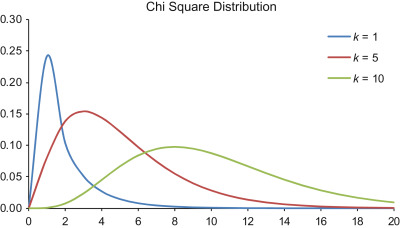

<style>
body {
text-align: justify}
</style>


```{r setup, include=FALSE}
knitr::opts_chunk$set(echo = TRUE)
```

## 1. Two General Properties of Confidence Intervals

During the calculations related to confidence intervals for the mean, we established **two general properties regarding the length of confidence intervals, that is, the total margin of estimation error** $\triangle$, which will **also hold true for all other statistical measures examined in this course when constructing confidence intervals**:

1. As reliability increases, the confidence interval expands, meaning the margin of estimation error continuously grows. Thus, a **higher-confidence estimate can only be obtained at the cost of a less precise confidence interval**.
2. Since we will continue working with consistently behaving estimators ($\hat{\theta}$), we can state that **as the sample size ($n$) increases**, the standard error ($SE$) decreases. Due to the decreasing $SE$, the entire **confidence interval becomes more precise**. **In other words**, as the sample size increases, the length of the confidence interval —also known as the **margin of estimation error** ($\triangle$)— **decreases**..

In the next two sections, let’s observe **how every new statistical measure’s confidence interval will behave according to these two properties**!

## 2. Confidence Interval for Proportions

Let's revisit the database found in the <a href="https://github.com/KoLa992/Statistical-Modelling-Lecture-Notes/blob/main/ESS2020.xlsx" target="_blank">ESS2020.xlsx</a> file! As a reminder, this database contains the responses of 1849 Hungarian participants from the 2020 European Social Survey (ESS2020) to 14 questions (plus an *id* column).

In <a href="Chapter07.html" target="_blank">Section 4 of Chapter 7</a>, we stated that if an empty value is found in any column of the database, it means that the respondent in that row did not answer the question. The respondents in the database can be considered a random sample drawn from the entire Hungarian population aged 18 and over. We now assume that this random sample was drawn with replacement, meaning it follows the $IID$ assumption. In the next chapter, we will see that this is not an unrealistic assumption.

First, let's load the database again from Excel into a data frame and check its columns (i.e., variables) using the `str` function!

```{r}
library(readxl)

ESS <- read_excel("ESS2020.xlsx")
str(ESS)
```

We can see that all 14+1 columns are present with the appropriate data types. Hooray! :)

**Our task** this time is to construct a **99% confidence interval for the proportion of the governing party Fidesz supporters**!

Fortunately, this is relatively easy to accomplish since the **proportion of individuals possessing a given characteristic is essentially a mean**! Specifically, it is **the mean of a variable where individuals with the characteristic receive a value of $1$, while those without it receive a value of $0$.**

This is easy to demonstrate in R. Let’s determine the **relative frequencies** of the `PoliticalPartyPref` variable using the `table` and `prop.table` functions.

```{r}
prop.table(table(ESS$PoliticalPartyPref))
```

Based on this, the proportion of Fidesz supporters in the observed sample of 1849 respondents is $19.7\%$. This result can also be obtained by creating a new column named `Fidesz` in the `ESS` data frame, where Fidesz supporters receive a value of $1$, while others receive $0$, and then computing the mean of this new column.<br>
To create the new column, we use the `ifelse` function. This function works similarly to the `IF` function in Excel: after specifying a logical condition, we assign a value to the new column for the *true branch* of the condition, followed by a value for the *false branch*.

```{R}
# Create the new column called 'Fidesz'
ESS$Fidesz <- ifelse(ESS$PoliticalPartyPref=='Fidesz-KDNP', 1, 0)

# And take the mean of this new column
mean(ESS$Fidesz)
```

We obtained the $19.7\%$ support rate again. Based on this, we can easily construct a 99% confidence interval for it using the `groupwiseMean` function from the `rcompanion` package. Due to the large sample size, there is no significant difference whether the necessary $k$ multiplier is calculated from the t-distribution or the standard normal distribution, so the function’s default t-distribution is perfectly adequate.

```{r}
library(rcompanion)

groupwiseMean(Fidesz~1, data = ESS, na.rm = TRUE, digits = 4, conf = 0.99)
```

Thus, based on our sample, we can say that for the **entire Hungarian population, with 99% probability, at least $17.4\%$ support Fidesz, while it can also be stated with 99% probability that their support rate does not exceed $22.1\%$.**

Moreover, considering that the total Hungarian population was 9 772 756 as of January 1, 2020, we can estimate the **specific number of Fidesz supporters in Hungary** with 99% confidence. We simply **multiply the two boundaries of the confidence interval by the total population size** of $N=9772756$.

```{r}
c(as.integer(0.174 * 9772756), as.integer(0.221 * 9772756))
```

Thus, in Hungary, the number of Fidesz supporters is estimated to be between $170$ and $216$ thoudósand peopl with 99% confidence. Hooray! :)

The examination of Fidesz support across the entire population can also be conducted on a **regional level**, now with a **95% confidence level**.

```{r}
groupwiseMean(Fidesz ~ Region, data = ESS, na.rm = TRUE, digits = 4, conf = 0.95)
```

From the results, it can be observed that in the sample, Fidesz support is only 15.4% in Southern Transdanubia, while it is 16.7% in Western Transdanubia. The question is whether these differences remain significant even when considering the sampling error and the 95% confidence interval!

The results table also shows that **within the sample, Fidesz support in the Southern Great Plain is only 12.6%, while in Southern Transdanubia, it is already 15.4%**. However, when **examining the entire population** using the confidence interval, **this difference is NOT statistically significant at the 95% confidence** level because the two **confidence intervals overlap**! This means that in the best possible case, Fidesz support in the Southern Great Plain could be as high as 17.7%, while in the worst-case scenario, it could be as low as 9.4% in Southern Transdanubia. Therefore, the higher Fidesz support observed in the Southern Transdanubia sample might only be due to sampling error at the 95% confidence level! On the other hand, **Fidesz support in Northern Hungary is significantly higher than in the Southern Great Plain at the 95% confidence** level, as the best-case scenario for the Southern Great Plain is only 17.7%, while in Northern Hungary, even the worst-case scenario is already 20.4%. Since the **two confidence intervals do NOT overlap, the differences observed in the sample remain significant in the population with 95% confidence**!

We can also create a `ggplot` visualization of these results, similar to the visualization of average internet usage times by party preference in <a href="Chapter07.html" target="_blank">Section 6 of Chapter 7</a>.

```{r}
conf_int_df <- groupwiseMean(Fidesz ~ Region, data = ESS, na.rm = TRUE, digits = 4, conf = 0.95)

library(ggplot2)

ggplot(conf_int_df, aes(x = reorder(Region,Mean), y=Mean, fill = Region)) +
  geom_bar(stat = "identity") +
  geom_errorbar(aes(ymin=Trad.lower, ymax=Trad.upper)) + coord_flip() + labs(x="")
```

The previously discussed 95% confidence level statistically significant difference between the Southern Great Plain and Northern Hungary is also visible in the visualization. Additionally, it is evident that a **similar significant difference can also be found between the Southern Great Plain and Budapest in terms of Fidesz support**.

### 2.1. Calculating Sample Size for Estimating Proportions

It is worth using the information during the calculation of the proportion confidence interval that the corrected sample standard deviation of a variable consisting only of 0s and 1s can be calculated as $s=\sqrt{p(1-p)}$, where $p$ is the proportion of $1$ values in the sample!<br>  
Let's check if this is true! The support rate of Fidesz in the full sample of 1849 elements is $p=19.7\%$. Based on this, the standard deviation of the variable named `Fidesz`, which consists of 0s and 1s, is calculated as $s=\sqrt{p(1-p)}=\sqrt{0.197 \times (1-0.197)}=0.3977323$.  

Let's verify the result using the `sd` function.

```{r}
sd(ESS$Fidesz)
```

Apart from some rounding error, the values calculated in two different ways match! :) But this is not surprising, as we mentioned in <a href=\"Chapter05.html\" target=\"_blank\">Section 5 of Chapter 5</a> that the standard sampling error of the sample proportions ($p$ values) is given by the formula $SE(p) \approx \sqrt{\frac{p(1-p)}{n}}$. :)  

This means that **the length of the proportion confidence interval** can be calculated using the formula $\triangle = SE \times k$ as $\sqrt{\frac{p(1-p)}{n}} \times k$, since the standard error of the mean was $\frac{s}{\sqrt{n}}$, and now we used the fact that for variables containing only 0s and 1s, $s=\sqrt{p(1-p)}$. The confidence multiplier $k$ is calculated from the $N(0,1)$ distribution *for large samples*, just as in the case of the mean confidence interval. For large $n$, the density function of the $t(n-1)$ distribution almost coincides with that of the $N(0,1)$ distribution, as we also saw in <a href=\"Chapter07.html\" target=\"_blank\">Section 4 of Chapter 7</a>.  

**With this information, we are able to determine, even BEFORE sampling, how large a sample is needed to estimate the proportion with a given accuracy and confidence level.**  

For instance, at a $99\%$ confidence level, the required confidence multiplier $k$ can be determined as the inverse value of the standard normal $N(0,1)$ distribution: $z_{1-\frac{\alpha}{2}}$.  

```{r}
alpha <- 1-0.99
qnorm(1-alpha/2)
```

Let's round this value to $k=2.6$!  

We already know that in our current sample of 1849 elements, the Fidesz support rate is $p=19.7\%$, **which means that the true population proportion** can differ from this by a margin of error of $\pm$ **2.4 percentage points with 99% probability**:  
$$\pm \triangle = SE \times k = \sqrt{\frac{p(1-p)}{n}} \times k = \sqrt{\frac{0.197 \times (1-0.197)}{1849}} \times 2.6=0.0240$$  

But what if we **want to reduce the margin of error to 1 percentage point while maintaining the 99% confidence level**? In this case, **we need to take a larger sample, but by how much**? Given that the desired $\triangle$ value is $0.01$ and we do not want to change $k=2.6$, we have: $$0.01 = \sqrt{\frac{p(1-p)}{n}} \times 2.6$$  

Solving for $n$:  $$n=\frac{2.6^2 \times p(1-p)}{0.01^2}$$  

At this point, it may be tempting to calculate $n$ using $p=19.7\%$. But **we should not do this**! Since we do not know what $p$ will be in the larger sample. Furthermore, if we want to **determine the required sample size BEFORE taking a sample to estimate $p$, we have absolutely no idea what the value of $p$ is**!  

Fortunately, **we can determine the maximum of the expression $p(1-p)$**, because the function $f(p)=p(1-p)=p-p^2$ is an inverted parabola with a maximum at $p=0.5$, where its value is $max(p(1-p))=0.25$.  

<center>
{width=50%}
</center>

So, in the formula $N=\frac{2.6^2 \times p(1-p)}{0.01^2}$, **we can always substitute $0.25$ as the worst-case scenario, ensuring that our estimate is accurate even under maximum standard error**. If we take a large enough sample to achieve $\triangle = 0.01$ under maximum $SE$, then we are covered for all other cases.  

Thus, **the sample size required to achieve a 1 percentage point margin of error with 99% confidence** is $N=\frac{2.6^2 \times 0.25}{0.01^2}=16900$ **individuals**.<br>  
In light of this, it is particularly interesting to check [this link](https://ig.ft.com/sites/brexit-polling/) to see how many people were surveyed in opinion polls predicting the results of the 2016 Brexit referendum. It was known that the competition between the remain and leave sides was very tight, meaning that an **accurate estimate of their support rates was crucial, and achieving a 1 percentage point margin of error with 99% confidence required a sample of 16 900 individuals**.

### 2.2. Minimal Sample Size Requirement for Estimating Proportions

In the case of **proportion interval estimation**, **there is** —in addition to what was discussed in Section 2.1— also a **minimum sample size requirement, below which interval estimation CANNOT be performed at all!!**  

This requirement arises from the fact that proportion estimation is essentially reduced to mean estimation.<br>  
In mean estimation, **for small samples, we assume that the population** (from which the sample was taken) **follows a normal distribution, even if we calculate the confidence multiplier from the t-distribution!** However, a dataset consisting only of **$0$ and $1$ values is unlikely to follow a normal distribution!** :)  

The **rule for determining what qualifies as a large sample in proportion estimation is as follows**:  

- The number of *favorable* cases for the proportion should be greater than 10 in the sample, meaning: $n \times p >10$  
- The number of *unfavorable* cases for the proportion should also be greater than 10 in the sample, meaning: $n \times (1-p) >10$  

Looking at this in the previous example of Fidesz supporters' proportion, our total sample size is $n=1849$ individuals.

```{r}
nrow(ESS) # number of rows in the data frame
```

The number of *favorable* cases for the proportion, i.e., Fidesz-KDNP supporters, is $365$ individuals.

```{r}
sum(ESS$Fidesz)
```

Thus, **the two conditions are met n our case as follows**:  

- The number of *favorable* cases is $365 > 10 \rightarrow$ **condition met**  
- The number of *unfavorable* cases is $(1849-365) = 1484 > 10 \rightarrow$ **condition met**  

Therefore, **both conditions are satisfied**, meaning that **interval estimation for the proportion of Fidesz supporters was possible** because **the minimum sample size requirement was met**. Yeah! :) 

## 3. General Concept of Bootstrap Estimation

So far, dealing with confidence intervals has been relatively easy so to speak, because in the case of **means and proportions**, we could calculate the length of the confidence interval ($\triangle$) using the standard error ($SE$) multiplied by the confidence multiplier ($k$) principle: $$\triangle=SE \times k$$  

This formula worked because we could **provide a simple formula for the standard error** ($\frac{s}{\sqrt{n}}$ or $\sqrt{\frac{p(1-p)}{n}}$) and **calculate $k$ from a specific distribution** (standard normal or t-distribution).  

BUT, **what happens when these tools are NOT available?** That is, what if:  

1. The standard error of a statistical measure (parameter, i.e., $\theta$) cannot be calculated using a simple formula.  
2. There is no specific distribution available for calculating $k$, or the available one can only be applied under impossible conditions (e.g., the studied population from which the sample was taken must have a normal distribution, regardless of sample size).  

In such cases, **Bootstrap Estimation helps us**! Let’s see **the general principle of this method through the standard error of the mean**.  

The standard error of the mean is obtained from a sample by taking the sample’s corrected standard deviation, $s$, and dividing it by the square root of the sample size ($n$): $$SE(\bar{y})=\frac{s}{\sqrt{n}}$$  

Let’s calculate the standard error of the mean daily internet usage time from the `ESS` dataset (`NetUsePerDay_Minutes` column)! Just remember that the `NetUsePerDay_Minutes` column contained some missing values, so we should not consider them when determining $n$!

```{r}
n <- sum(!is.na(ESS$NetUsePerDay_Minutes)) # this way we do not consider the empty rows

corr_std <- sd(ESS$NetUsePerDay_Minutes, na.rm = TRUE) # with na.rm = TRUE, we do not consider the empty rows

SE_Formula <- corr_std / sqrt(n)
SE_Formula
```

Great, the expected deviation of the sample mean from the true population mean daily internet usage time is $\pm4.38$ minutes!  

**How does this result come out using the Bootstrap method?**  

The **basic idea of Bootstrap estimation comes from the standard error definition**, which we discussed in <a href="Chapter05.html" target="_blank">Section 5 of Chapter 5</a>. We **take a very large number** (e.g., 1000 or 10,000) **of resampled samples** (i.e., with replacement, IID), **calculate the mean for each sample, and the standard deviation of these sample means is the standard error** due to the *unbiasedness* of mean estimation.<br>  
The problem with this approach is that **in practice, we only have one single sample and do not know the full population, so we cannot take many IID samples from it**.<br>  
Well, the **Bootstrap method says that we can SIMULATE this standard error-based calculation even from a single sample!**  

If **we have a sample of size $n$, we take a very large number (e.g., 1000) of resampled sub-samples of size $n$!** Due to the **IID (with replacement) principle, the composition of these $n$-sized sub-samples will change randomly, and these random variations precisely follow the tendencies of sampling error!!**<br>  
After that, all we need to do is **calculate the sample mean for each sub-sample, compute the simple uncorrected standard deviation of these means, and this gives us $SE$!!**  

Now let’s see this in practice! **Let’s compute the standard error of the mean using the Bootstrap method!**  

First, **we take 1000 IID samples from the `NetUsePerDay_Minutes` column and store them in a data frame, where the 1000 rows represent different samples, and the $n$ columns contain the $n$ sample elements for each sampling iteration**.<br>  
Essentially, we follow the same solutions in R as in <a href="Chapter04.html" target="_blank">Section 3.1 of Chapter 4</a>.  

First, we create a version of the `ESS` data frame **without missing values in the `NetUsePerDay_Minutes` column**. This results in a data frame with $n=1099$ rows.

```{r warning = FALSE, message = FALSE}
ESS_Filter <- ESS[!is.na(ESS$NetUsePerDay_Minutes),]
sum(is.na(ESS_Filter$NetUsePerDay_Minutes))
```

Great, now we are set!  

Now, **let’s generate 1000 sub-samples of size $n=1099$ using a `for` loop** and store them in the newly created data frame.

Again, **we should expect an increased runtime** here! :)

```{r warning = FALSE, message = FALSE, eval = FALSE}
# create the first subsample
set.seed(1992)
samples <- sample(ESS_Filter$NetUsePerDay_Minutes, size=nrow(ESS_Filter), replace = TRUE)

# add the remaining subsamples to new rows
for (index in 1:(10000-1)) {
  set.seed(1992+index)
  samples <- rbind(samples, sample(ESS_Filter$NetUsePerDay_Minutes, size=nrow(ESS_Filter), replace = TRUE))
}

samples <- as.data.frame(samples)

rownames(samples) <- paste0("Sample",1:10000)
colnames(samples) <- paste0("Element",1:nrow(ESS_Filter))

head(samples)
```

```{r warning = FALSE, message = FALSE, echo = FALSE}
samples <- as.data.frame(read_excel("BootstrapData.xlsx"))
rownames(samples) <- paste0("Sample",1:10000)
head(samples)
```

Now we have our sub-samples of size $1000$. Let’s compute **the sample mean for each sub-sample!**<br>  
**Be careful** to always restrict statistical calculations to the first $n=1099$ columns as new columns will be added dynamically!

```{r}
samples$means <- apply(samples[,1:1099], 1, mean)
head(samples[,1098:1100])
```

The **standard error is then simply the uncorrected standard deviation of these sub-sample means!**  

```{r}
class_sd <- function(x) {
  return(sqrt(mean((x-mean(x))^2)))
}

SE_Bootstrap <- class_sd(samples$means)

SE_Bootstrap
```

Et voilà! Apart from some rounding error, this is approximately the same as the version obtained using $\frac{s}{\sqrt{n}}$! :)  
Moreover, **everyone may get slightly different values here since we did not fix the random number generator seed during the sampling process**.

```{r}
c(SE_Formula, SE_Bootstrap)
```

Obviously, **if we take more sub-samples, the approximation becomes more accurate**. This is formally called **increasing the number of Bootstrap replications**. :) That is, the **number of replications refers to the number of sub-samples**.  

BUT, **what was the point of calculating this $SE$ in such a complicated way instead of using the formula?**  
Well, **in the case of the mean, ABSOLUTELY NOTHING!**<br>  
However, using this **Bootstrap principle, we can compute the standard error of the median daily internet usage time**, for which **there is NO simple formula like for the mean standard error!**<br>  
We can apply this Bootstrap $SE$ calculation, because we checked in <a href="Chapter05.html" target="_blank">Section 4 of Chapter 5</a> that the median is also an *unbiased* statistical estimator, just like the mean.  

```{r}
SampleMedian <- median(ESS_Filter$NetUsePerDay_Minutes)
SampleMedian

samples$medians <- apply(samples[,1:1099], 1, median)
SE_Median <- class_sd(samples$medians)

SE_Median
```

Thus, we know that in the observed sample of size $n=1099$, the median daily internet usage time is **120 minutes**, and from the **standard error, we can determine that this value is expected to differ from the true median daily internet usage time of the entire Hungarian population by $\pm11.69$ minutes**.  

From here, it is just one more step to construct a **confidence interval for the median** with a confidence level of $1-\alpha$ using the Bootstrap method!

## 4. Bootstrap Confidence Interval for the Median

To determine the confidence interval of the median with confidence level $1-\alpha$ based on the $1000$ bootstrap samples, we simply need to **take the $\alpha/2$ and $1-\alpha/2$ percentiles of the 1000 median values calculated from the samples**!<br>
After all, the $1-\alpha$ confidence interval should indicate the range within which the true population median falls with $1-\alpha$ probability. For example, in the **case of the mean, we determined this by taking the middle $1-\alpha$ percentage of the distribution of many sample means, specifically of the $N\left(\mu, \frac{\sigma}{\sqrt{n}}\right)$ distribution!!**<br>
With **Bootstrap** sampling, we aimed to **simulate the distribution of many sample medians**, so we should **take the middle $1-\alpha$ percentage of these simulated medians**! This is given by the $\alpha/2$ and $1-\alpha/2$ percentiles of the sample median values.

Let's examine the result for the $95\%$ confidence interval of the median internet usage time! In R, we can apply the `quantile` function on the `medians` column of our simulated data frame.<br> 
Since $1-\alpha=95\%=0.95$, we have $\alpha=0.05=5\%$ in this case.

```{r}
alpha <- 0.05
quantile(samples$medians, probs = c(alpha/2, 1-alpha/2))
```

Thus, the **median daily internet usage time in the entire Hungarian population is between $120$ and $150$ minutes** with $95\%$ probability.

From the result, we can see that the confidence interval for the median is **NOT symmetric around the sample median (which was also $120$ minutes, just like the lower bound here), unlike the confidence interval for the mean, which was symmetric around the sample mean**!

This is due to the fact that the **distribution of sample medians is not a nice, symmetric normal distribution like that of sample means**. This becomes immediately apparent when looking at the histograms of simulated sample means and medians.

```{r}
hist(samples$means)
hist(samples$medians)
```

And indeed: in the case of medians, the simulated sampling distribution is highly concentrated around $120$, whereas in the case of the mean, we obtain our well-known, beautifully normal distribution! :)<br>
For medians, the more skewed distribution is partly related to what we learned in Fundamentals of Statistics: for a variable with a small value set, the median is not a very informative statistic! In any case, this "skewness" is handled by the Bootstrap confidence interval method. :)

By the way, we can also check that **for the mean, the $95\%$ confidence interval calculated using the bootstrap method gives the same result (with minor rounding errors) as the confidence interval calculated using the standard normal confidence multiplier**. Since in this case $n=1099$ is a large sample, it doesn't matter whether we use the normal distribution multiplier or the t-distribution multiplier.

```{r}
# formula with confidence multiplier from t-distribution
groupwiseMean(NetUsePerDay_Minutes ~ 1, data = ESS, conf = 0.95,na.rm = TRUE, digits = 4)
  
# Boostrap version
quantile(samples$means, probs = c(alpha/2, 1-alpha/2))
```

Indeed, there is only a minimal difference between the two results, which can be further reduced by increasing the number of Bootstrap subsamples, i.e., increasing the replication count.

Fortunately, **Bootstrap confidence intervals** do not always have to be computed in such a laborious manner in R as we just did by generating a separate data frame with a `for` loop for the subsamples. Instead, **the `boot` package provides a built-in function named very creatively as `boot`.** An additional advantage of this function is that **its runtime performance is much better than our manually constructed solution**. This is because multiple developers have optimized the entire code behind it over several months.

Let's install and include the package to our R environment.

```{r eval=FALSE}
install.packages("boot")
library(boot)
```

```{r echo=FALSE}
library(boot)
```

The `boot` function within this package works with the following parameters:

1. We provide the **dataset in vector format, from which the bootstrap subsamples** should be **generated**.
2. We specify the **statistical parameter** (measure) **for which we want** to compute **the confidence interval** in R.
3. The **number of replications** can be adjusted via the `R` parameter, but since the function defaults to generating $10000$ samples, it is **generally not necessary to manually modify this parameter**. The $10000$ replications are usually sufficient. :)

Let's see the function in action for the $95\%$ confidence interval of the median daily internet usage time!

```{r}
bootMedian <- function(data, indices) median(data[indices])

set.seed(1992)
boot_result <- boot(ESS_Filter$NetUsePerDay_Minutes, bootMedian, R=10000)
boot_result
```

E voilá! We have the previously seen standard error of around $11.7$ minutes! :)

In the `type` parameter, we specify that the system should **determine the confidence interval using percentiles**, just as we manually did. And here we have the $120-150$ minute confidence interval.

```{r}
boot.ci(boot_result, conf = 0.95, type = "perc")
```


## 5. Bootstrap Confidence Interval for the Standard Deviation

A closed-form formula for the confidence interval of the standard deviation with confidence level $1-\alpha$ looks quite simple: $$P\left(\sqrt{\frac{(n-1)s^2}{\chi^2_{\alpha/2}(n-1)}}< \sigma <\sqrt{\frac{(n-1)s^2}{\chi^2_{1-\alpha/2}(n-1)}}\right) = 1 - \alpha$$

In this formula, the only unknown term is $\chi^2(n-1)$. This is present because the sample variance follows a $\chi^2$ distribution with $n-1$ degrees of freedom, just as the sample mean follows a $t$-distribution with $n-1$ degrees of freedom when the population standard deviation is not known in advance.<br>
The $\chi^2(df)$ distribution is a **distribution with a long right tail**. The **degree of this skewness is controlled by the degrees of freedom** ($df$): the **higher the degrees of freedom, the less skewed the distribution**.

<center>
{width=50%}
</center>

The values $\chi^2_{\alpha/2}(n-1)$ and $\chi^2_{1-\alpha/2}(n-1)$ are the **quantile functions corresponding to the probabilities $\alpha/2$ and $1-\alpha/2$** for a $\chi^2$ distribution with $n-1$ degrees of freedom (sample size minus one). Computing these values in R is very straightforward since there is a built-in function for this, logically named `qchisq`, following the naming conventions of functions for the normal, exponential, and $t$-distributions. The first parameter of this function is the known cumulative probability, and the second is the degrees of freedom, just like in `qt`.

The confidence interval is then computed by taking the sample size minus one times the corrected sample variance $(n-1)s^2$ and dividing it by $\chi^2_{1-\alpha/2}(n-1)$ for the lower bound and by $\chi^2_{\alpha/2}(n-1)$ for the upper bound, then taking the square root of the entire fraction.

Let’s apply this method to **determine the $97\%$ confidence interval for the standard deviation of daily internet usage times**!<br>
From a technical perspective, remember that $\chi^2_{\alpha/2}(n-1)$ gives the smaller inverse value, so it should be used in the denominator of the upper bound (to increase the result), while $\chi^2_{1-\alpha/2}(n-1)$ gives a higher inverse value, so it should be used in the denominator of the lower bound (to decrease the result).

```{r}
# Get corrected sample standard deviation
s <- sd(ESS_Filter$NetUsePerDay_Minutes)
s

# Get the confidence interval
n <- nrow(ESS_Filter)
alpha <- 1-0.97

chisq_low <- qchisq(alpha/2, df = (n-1))
chisq_upp <- qchisq(1-alpha/2, df = (n-1))

common_numerator = (n-1)*(s^2)

c(sqrt(common_numerator/chisq_upp), sqrt(common_numerator/chisq_low))
```

Thus, in the observed sample, the standard deviation of daily internet usage times is $145.2$ minutes, and **for the entire Hungarian population, it is likely between $138.8$ and $152.3$ minutes with $97\%$ probability**.

It is worth noting that the **confidence interval is NOT symmetric around the sample standard deviation $s$, like the confidence interval for the mean was symmetric around the sample mean**! The sample standard deviation ($s$) is somewhat closer to the lower bound of the confidence interval than to the upper bound! This occurs **because the $\chi^2$ distribution has a long right tail**, meaning that it assumes smaller values are more typical in the distribution of sample variances, so it **places the observed sample standard deviation ($s$) "towards the bottom" of the confidence interval**.

This is all well and good, but **this $\chi^2$-based confidence interval formula assumes that the variable from which the sample was taken** (i.e., daily internet usage times) **follows a normal distribution in the population!!!** However, **this assumption does NOT hold, as a quick histogram reveals!**

```{r}
hist(ESS_Filter$NetUsePerDay_Minutes)
```

This time distribution has a steep **long right tail**. Therefore, in **no scenario** will this variable becomes a **nicely symmetric normal distribution** in the population!

Thus, the **confidence interval formula for the standard deviation does not provide realistic results for the true population standard deviation because the underlying assumption of normality is NOT met!**<br>
What can be done? We should **apply the Bootstrap estimation method, as it does not require any strict assumptions**. The only requirement is that the original population sampling should be IID, but as we discussed in <a href="Chapter07.html" target="_blank">Section 4 of Chapter 7</a>, this assumption holds for the ESS2020 sample.

So, let’s perform Bootstrap estimation for the standard deviation of daily internet usage times with $97\%$ confidence level! With the built-in function from the `boot` package, we can easily accomplish this, just as we did for the median.

```{r}
boot_sd <- function(data, indices) sd(data[indices])

set.seed(1992)
boot_sd_result <- boot(ESS_Filter$NetUsePerDay_Minutes, boot_sd, R = 10000)
boot.ci(boot_sd_result, conf = 0.97, type = "perc")
```

Based on this, the **standard deviation of daily internet usage times in the entire Hungarian population is likely between $131.3$ and $159.7$ minutes with $97\%$ probability**. This is significantly different from the $\chi^2$-based confidence interval of $138.8$ to $152.3$ minutes, but the **Bootstrap version is more realistic because it does NOT assume that internet usage times follow a normal distribution in the population**!

So, Bootstrap estimation is quite powerful. For example, it **allows interval estimation for the mean even in cases of small samples** ($n\leq 30$), **when the sampled variable does NOT follow a normal distribution in the population and the true population standard deviation is UNKNOWN**."

<center>
{width=35%}
</center>