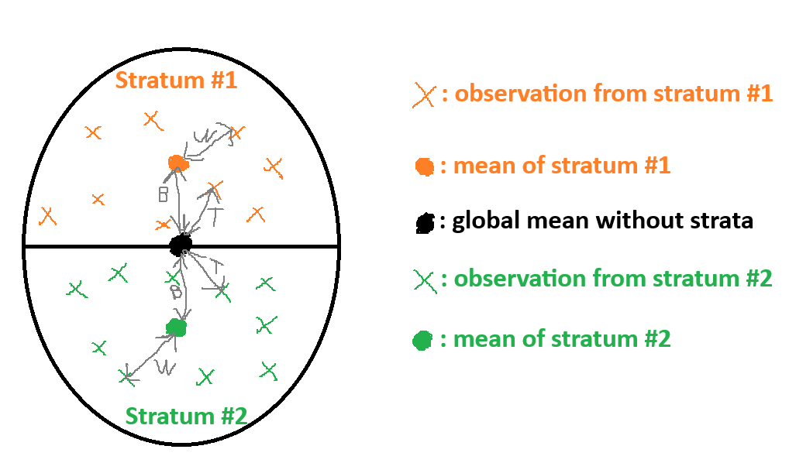
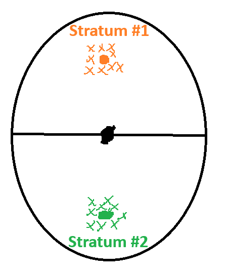

<style>
body {
text-align: justify}
</style>


```{r setup, include=FALSE}
knitr::opts_chunk$set(echo = TRUE)
```

## 1. Intervallumbecslés visszatevés nélküli egyszerű véletlen (EV) mintákból

Az eddigi hetek tananyagában végig FAE, azaz *visszatevéses* mintavételekkel dolgoztunk. Most nézzük meg, hogy mi a helyzet akko, ha a **mintavételünk visszatevés nélküli véletlen mintavétel**, azaz **EV** minta.

Az okoskodásunk onnan indul, hogy azt mondjuk, hogy ha a minta kiválasztási aránya kicsi, azaz **ha a teljes adatsokaságunknak csak egy nagyon kis százalékát választjuk ki, akkor a FAE és EV mintavétel lényegében ugyan az**. Hiszen ebben az esetben még FAE mintavétrel esetén is nagyon kicsi az esélye, hogy a visszatevés miatt ténylegesen ismétlődés legyen, azaz többször is kiválasszuk ugyan azt az egyedet a mintánkba.

A minta **kiválasztási arányát** korábbi jelöléseinkkel élve $\frac{n}{N}$-nek jelöljük. Tehát, ha $\frac{n}{N} \rightarrow 0$, akkor $FAE \approx EV$.

Ha viszont $\frac{n}{N}$ egy nagyobb érték, akkor viszont az **EV mintának pontosabbnak, azaz kisebb mintavételi hibájúnak kell lennie, minta FAE mintának**, hiszen minden mintaelem az EV mintában biztos, hogy új információt hoz be a mintába, míg FAE esetben lehet ismétlődés a visszatevés miatt.

Ezt a tényt pedig **úgy képezzük le a konfidencia-intervallum képleteinkben**, hogy FAE mintavételeknél tanult standard hiba képleteket egyszerűen beszorozzuk $\sqrt{1-\frac{n}{N}}$-nel. Tehát: $$SE_{SR}=SE_{IID} \times \sqrt{1-\frac{n}{N}}$$

Ez a képlet azért végzi azt, amit mi akarunk, mert **ha nagyon $0$ közeli a kiválasztási arány**, akkor az $SE_{IID}$-t gyakorlatilag $1$-gyel szorozzuk, azaz **nem változtatunk rajta semmit**. **Ha** pedig a **kiválasztási arány érdemben nagyobb, mint $0$,** akkor pedig egy $0$ és $1$ közti számmal szorozzuk $SE_{IID}$-t, így a **szorzat ekkor biztosan kisebb lesz, mint $SE_{IID}$ volt**.

Aki nem hiszi, nyugodtan **kirajzoltathatja Pythonban, az SR korrekciós tényező, azaz a $\sqrt{1-\frac{n}{N}}$ viselkedését** különböző $\frac{n}{N}$ kiválasztási arányok mellett:

```{r}
# Empty vector for SR correction factors
SR_Vec <- c()
# Vector for the examined selection ratios
# Ratios between 0% and 90% with a setp size of 10%-points 
SelectionRatios <- seq(0, 0.9, 0.1)

# Start loop
for (CurrentSelectionRatio in SelectionRatios) {
  SR_Vec <- c(SR_Vec, sqrt(1-CurrentSelectionRatio))
}

# Arrange selection ratios and correction factors into a unified data frame
SR_Data <- data.frame(SelectionRatio=SelectionRatios,
                      CorrectionFactor=SR_Vec)

# Plot on a line chart with 'ggplot2'
library(ggplot2)
ggplot(SR_Data, aes(x=SelectionRatio, y=CorrectionFactor)) + geom_line()
```

Látszik, hogy ahogy nő a kiválasztási arány, annál kisebb százalékát kell venni $SE_{IID}$-nek az $SE_{SR}$ számolása során. Éljen! :)

Nézzük meg ezt az egész rendszert a gyakorlatban az átlag intervallumbecslése során, nagy mintás esetben!

### 1.1. Átlag becslése EV mintákból

Töltsük be a <a href="https://github.com/KoLa992/Statistical-Modelling-Lecture-Notes/blob/main/Households_Income.xlsx" target="_blank">Households_Income.xlsx</a> című Excel fájl tartalmát egy data frame-be!<br>
A táblában $n=8306$ db magyar háztartás két ismérvét (oszlopát) látjuk:

1. Milyen típusú településen található a háztartás (Village, Town, City, Budapest)
2. A háztartás éves jövedelmét 2019-ben, ezer Ft-ban kifejezve

Az adatok a <a href="https://www.ksh.hu/eletmod" target="_blank">KSH Jövedelmi és Életkörülmény Adatfelvételéből</a> származnak. A KSH linkelt leírása szerint az **adatok a magyar háztartások sokaságából visszatevés nélkül véletlen, azaz EV mintaként kezelhetők**.<br>
Ez alapján egy nagyon fontos infó, hogy 2019-ben a magyar háztartások teljes száma 4 111 240 db volt. Tehát, a **sokaságunk teljes elemszáma $N=4111240$ db**.

Lássuk is a beolvasást egy data frame-be!

```{r}
library(readxl)
HH <- read_excel("Households_Income.xlsx")
str(HH)
```

Remek: megvan a két keresett oszlopunk mind az $n=8306$ db háztartásra, plusz egy *ID* oszlop az elején, amit nem fogunk semmire sem használni. :)

Ezek után simán bevethetjük az átlagos háztartási jövedelem $99\%$-os megbízhatóságú intervalumbecslésére a jól bevált *mintaátlag +- delta*, azaz $\bar{y}\pm\triangle$ című módszert. Hiszen a $\triangle=k \times SE$ képletben a nagy, $n=8306$-os elemszám miatt a megbízhatósági szorzó simán jöhet standard normális eloszlásból, azaz $k=z_{1-\frac{\alpha}{2}}$. Az $SE$ pedig akkor egy EV minta $SE$-je, ami az előző fejezet alapján $SE_{IID} \times \sqrt{1-\frac{n}{N}}$ módon meghadható.

```{r}
N <- 4111240
n <- nrow(HH)

sample_mean <- mean(HH$Income)
s <- sd(HH$Income)

alpha <- 1-0.99
k_z <- qnorm(1-alpha/2)

SE_SR <- s/sqrt(n)*sqrt(1-n/N)

# conf interval
c(sample_mean - k_z*SE_SR, sample_mean + k_z*SE_SR)
```

Tehát, viszzatevés nélküli véletlen mintavételként kezelve a HKF adatokat,azt kapjuk, hogy **egy átlagos magyar háztartás éves jövedeleme** $4568$ és $4730$ ezer Ft, azaz **$4.5$ és $4.7$ millió Ft között mozog $99\%$-os valószínűséggel**.

A kiválasztási arányunk ugyebármost nagyon kicsi: $\frac{n}{N}=\frac{8306}{4111240}=0.002$, szóval az eredmény lényegében nem különbözik attól, mintha az egészet az EV korrekciós szorzó nélkül csináltuk volna végig a műveletet:

```{r}
SE_IID <- s/sqrt(n)

# conf interval
c(sample_mean - k_z*SE_IID, sample_mean + k_z*SE_IID)
```

A várható éves jövedelem így is kb. $4.5$ és $4.7$ millió Ft között mozog $99\%$-os valószínűséggel.

### 1.2. Arány becslése EV mintákból

Ugyan ez a logika teljesen jól működik az arányok becslése esetén is. Ez nem véletlen, hiszen letisztáztuk az <a href="Gyak05.html" target="_blank">5. heti tananyagban</a>, hogy az arány, mint statisztikai mutató valójában egy olyan adatsor átlaga, hogy az arányban vizsgált tuljadonsággal bíró megfigyelések $1$-gyel vannak kódolva, a többiek pedig $0$-val.

Csináljuk is meg egy új oszlopban azt a $0-1$ adatsort, amivel mondjuk a budapesti háztartások aránya becsülhető lesz.

```{r}
HH$isBP <- ifelse(HH$Settlement=="Budapest", 1, 0)
mean(HH$isBP)
```

Szuper, meg is vagyunk, a megfigyelt mintában a budapesti háztartások aránya $18.55\%$.

Ezek után, ha ezen az új oszlopon alkalmazzuk a konfidencia-intervallum képletét az 1.1. fejezetben látott módon a $\sqrt{1-\frac{n}{N}}$ korrekciós tényezővel, akkor meg is van a **budapesti háztartások sokaságiarányának $99\%$-os megbízhatóságú intervallumbecslése**:

```{r}
sample_prop <- mean(HH$isBP)

SE_Prop_SR <- sqrt(sample_prop*(1-sample_prop)/n)*sqrt(1-n/N)

# conf interval
c(sample_prop - k_z*SE_Prop_SR, sample_prop + k_z*SE_Prop_SR)
```

Szóval az **összes magyar háztartásból kb. $17.5\% - 19.6\%$ lehet budapesti**, $99\%$ valószínűséggel.

## 2. Átlag becslése Arányosan Rétegzett (AR) mintákból

A KSH a HKF adatbázisáról nem csak simán azt állítja, hogy egyszerű véletlen (EV) minta a magyar háztartásokból, hanem, hogy **településtípus szerint arányosan rétegzett EV mita**. Ez azt jelenti, hogy **a $4$ db településtípusból** (Budapest, Nagyváros, Többi város, Község) **külön-külön vettek EV mintát, úgy, hogy a végső $n=8306$ elemű mintában az egyes településtípusok aránya annyi legyen, mint a teljes sokaságban** (összes magyar háztartás) **a településtípusok aránya**. Tehát a minta tökéletesen reprezentatívra lett beállítva a településtípusra.

Ennek a mintavételi technikának a lényege, hogy ha **meg akarom becsülni a magyar háztartások átlagos éves jövedelmét**, akkor a **standard hibában NEM KELL számolnom a településtípusok KÖZÖTTI jövedelem szórással**! Hiszen ezt a **külső szórást már kezelte a településtípusonkénti külön-különmintavétel!!**<br>
Magyarul, az $$SE_{SR} = \frac{s}{\sqrt{n}} \times \sqrt{1-\frac{n}{N}}$$

Képlet **helyett elég  a standard hibában csak a belső korrigált mintaszórással**, $s_w$-vel számolnom: $$SE_{PR} = \frac{s_w}{\sqrt{n}} \times \sqrt{1-\frac{n}{N}}$$

Amit a fenti formuláshoz tudni kell, hogy egy **számértékű változó teljes (korrigált) varianciája, felbontható a rétegek közötti külső és a rétegeken belüli belső varianciák összegére**.

A következő képletekben a $j$ index a $j$-edik réteget jelöli, és a rétegek számát pedig $M$-mel jelöljük, azaz $j=1,2,...,M$ és $n=\sum_{j=1}^M{n_j}$.

A belső szórást a **belső variancián, azaz belső szórásnégyzeten keresztül kapjuk meg**. Ez pedig nem más, mint a rétegenkénti **részszórások $s_j^2$ négyzeteinek elemszámok mínusz 1-gyel ($n_j-1$) súlyozott átlaga**. $$s_w^2=\frac{\sum_j{(n_j-1)s_j^2}}{n-1}$$

A belső szórás pedig egyszerűen a belső variancia gyöke. $s_w=\sqrt{s_w^2}$ Általánosságban $s_w$ azt jelenti, hogy **egy véletlenszerűen kiválasztott egyed konkrét mennyiségi változó értéke várhatóan mennyivel tér el saját csoportjának (rétegének) átlagától**.

A másik vége a dolognak a külső szórás, ami szintén a négyzetén, a külső variancián keresztül számítható. A külső variancia pedig a **rétegenkénti részátlagok $\bar{y}_j$ elemszámokkal ($n_j$) súlyozott korrigált szórása a mennyiségi változó főátlaga $\bar{y}$ körül**. $$s_b^2=\frac{\sum_j{n_j(\bar{y}_j-\bar{y})^2}}{n-1}$$

A külső szórás pedig egyszerűen a külső variancia gyöke. $s_b=\sqrt{s_b^2}$ Általánosságban $s_b$ azt jelenti, hogy **egy csoport (réteg) átlaga várhatóan mennyivel tér el a mennyiségi változó főátlagától**.

Ebből a két tényezőből pedig összeadható a **teljes korrigált mintavariancia: $s^2=s_w^2+s_b^2$.** A teljes szórás pedig ennek a mennyiségnek a gyöke: $s=\sqrt{s^2}=\sqrt{s_w^2+s_b^2}$. **Mivel tagonként nem vonhatunk gyököt, így ez az összefüggés ugyebár a szórásokra NEM lesz igaz!!**

A teljes szórás pedig **általánosan ugye azt mutatja meg, hogy egy véletlenszerűen kiválasztott egyed konkrét mennyiségi változó értéke várhatóan mennyivel tér el a mennyiségi változó csoportoktól, azaz rétegzéstől független, teljes főátlagától**.

**Képzeljük most el ezeket a különböző szórásokat vizuálisan, mint távolságokat**. Az alábbi ábra egy egyszerűbb rendszert mutat, ahol a rétegeket adó változó csak két csoportot alkot (*narancsok* és *zöldek*), nem pedig négyet, mint amennyit a mi négy településtípusunk generál.

<center>
{width=80%}
</center>

<br>Tehát vizuálisan a következőképp érdemes gondolni a különböző $s$-ekra:

- $s_w$: Megfigyelések távolsága saját csoportjuk átlagától
- $s_b$: Csoportátlag távolsága a főátlagtól
- $s$: Megfigyelések távolsága a főátlagától

Ezek alapján nekünk az a jó a csoportosítás, azaz a minőségi ismérv magyarázóereje szempontjából, ha **fix** $s$ mellett $s_b$ **nagy** és $s_w$ **kicsi**. Mert ekkor a **csoportátlagok messze vannak** a főátlagtól és így implicite **egymástól** is, míg a csoportátlagtól az egyes **megfigyelések nagyon kis mértékben térnek csak el saját csoportátlaguktól**:

<center>
{width=30%}
</center>

Ebben az esetben, ahogy az ábráról is látszik a csoportosításunk, azaz a rétegzésünk magyarázóereje nagy! Tehát az kell nekünk, hogy az $s$ minél nagyobb részét tegye ki $s_b$. Viszont, mivel csak a teljes **varianciára** igaz az, hogy **egyenlő a külső és belső VARIANCIA összegével**, így azt mondjuk, hogy **azt szeretnénk látni**, hogy **a $\frac{s_b^2}{s^2}$ hányados nagy legyen**!

Mivel a rétegzett mintavétel lényege éppen az, hogy **minden rétegből külön-külön veszünk EV mintát**. Emiatt pedig a **rétegek közötti** $s_b^2 $ külső **variancával NEM kel számolni a standard hibában**, csak a belsővel. Ezzel a cserével adódik tehát az arányosan rétegzett mintavétel átlagra vonatkozó standard hibájának képlete: $$SE_{PR} = \frac{s_w}{\sqrt{n}} \times \sqrt{1-\frac{n}{N}}$$

A rétegzés tehát akkor jó, ha **a rétegek közötti varianciája a vizsgált változónka nagy részét teszi ki a teljes varianciájának**, mert csak ekkor **kijelenthető, hogy az arányosan rétegzett mintavétel becslési hibája az átlagra kisebb, mint az EV** (vagy a FAE) **mintavételek esetén**: $SE_{PR} \leq SE_{SR}$

Nézzük is meg akkor a dolgot élesben!

Ugyebár tudjuk, hogy a háztartások átlagos éves jövedeleme a teljes magyar népességben $99\%$-os valószínűséggek $4.5$ és $4.7$ millió Ft körül mozog, ha a HKF adatokat EV mintavételként kezeljük. Most az SE-t rendesen a $SE_{SR}=\frac{s}{\sqrt{n}} \times \sqrt{1-\frac{n}{N}}$ képlettel számoljuk ki.

```{r}
N <- 4111240
n <- nrow(HH)

sample_mean <- mean(HH$Income)
s <- sd(HH$Income)

alpha <- 1-0.99
k_z <- qnorm(1-alpha/2)

SE_SR <- s/sqrt(n)*sqrt(1-n/N)

# conf interval
c(sample_mean - k_z*SE_SR, sample_mean + k_z*SE_SR)
```

Viszont, azt mondja az AR minta, hogy a standard hiba $\frac{s}{\sqrt{n}}$ részében **elég csak a településtípusok szerinti belső szórással, $s_w$-vel számolni**. Ehhez viszont kell egy **aggregált segédtábla településtípusonként** a

- **mintaelemszámokról** ($n_j$)
- **mintaátlagokról** ($\bar{y}_j$)
- **korrigált mintaszórásokról** ($s_j$)
- **sokasági elemszámokról** ($N_j$)

Láthatjuk, hogy a településtípusokat, azaz a rétegzett mintavétel **rétegeit $j$ indexszel jelöljük**.

```{r}
helper_table <- aggregate(Income ~ Settlement, data = HH, FUN = mean)
helper_table$sd <- aggregate(Income ~ Settlement, data = HH, FUN = sd)[,2]
helper_table$sample_size <- table(HH$Settlement)
helper_table
```

Viszont a rend kedvéért **egészítsük ki** az aggregált segédtáblát a **sokasági elemszámokkal**. Itt **kihasználjuk, hogy arányosan rétegzett mintavételről van szó**. Tehát, a rétegek sokasági elemszáma a teljes sokasági elemszámhoz úgy aránylik, mint a rétegek mintabeli elemszáma a teljes mintavétel elemszámához, azaz $$\frac{n_j}{n} = \frac{N_j}{N}, \forall j$$

Ebből gyorsan ki tudjuk számolni minden réteg sokasági elemszámát, hiszen tudjuk, hogy $N=4111240$ háztartást jelent. A végén természetesen egészre kerekítjuk az $N_j$-ket:

```{r}
helper_table$pop_size <- round(helper_table$sample_size/n * N, 0)
helper_table
```

Ezzel is megvagyunk. Akkor minden adott, hogy kiszámoljuk a belső szórást a következő képlettel. $$s_w=\sqrt{\frac{\sum_j{(n_j-1) \times s_j^2}}{n-1}}$$

Ezt gyorsan ki is tudjuk számolni R-ben standard vektor műveletek segítségével.

```{r}
within_sd <- sqrt(sum((helper_table$sample_size-1)*helper_table$sd^2)/(n-1))
within_sd
```

Tehát, egy konkrét **háztartás éves jövdeleme a megfigyelt mintában várhatóan kb. $s_w=\pm 2.849$ milió Ft-tal **(2849 ezer Ft-tal)** tér el saját településtípusának átlagos jövedelmétől**.

Ha van első szórásunk, akkor pedig gyorsan meg is van az **arányosan rétegzett standard hiba**, ami kb. $0.298$ ezer Ft-tal ($298$ Ft-tal) **kisebb, mint a sima EV módra számolt standard hiba**:

```{r}
SE_PS = within_sd/sqrt(n) * sqrt(1-n/N)
c(SE_SR, SE_PS)
SE_PS-SE_SR
```

Ez pedig érezteti magát a **némlileg szűkebb, azaz kisebb $\triangle=SE_{PS} \times z_{1-\frac{\alpha}{2}}$ becslési hibahatárral bíró $99\%$-os konfidencia-intervallumban**:

```{r}
c(sample_mean - k_z*SE_PS, sample_mean + k_z*SE_PS)
```

Arányos rétegzéssel a **változatlan megbízhatóságú konfidencia-intervallum** $4567 - 4730$ ezer Ft-ról $4568 - 4729$ ezer Ft-ra **szűkül**.

Na jó, ne áltassunk magunkat: **ez szinte nulla csökkenés mind a standard hibában, mind a $\triangle$-ben**! Tehát kb az $PS$ mintavétel nem ért semmit. **Miért van ez? Lássuk a magyarázatot!**

### 2.1. Az AR mintavételek hatékonysága

Az, hogy mennyire jó az $PS$ mintavétel az $SR$-hez képest attól függ, hogy **mekkora a külső szórás mértéke, amit el tudunk hagyni azzal, hogy csak a belső szórással számolunk a standard hibában a teljes szórás helyett**. Ezt pedig **az határozza meg, hogy a rétegzéshez használt minőségi ismérv hány százalékban határozza meg annak a mennyiségi ismérvnek az alakulását, aminek az átlagát becsülni szeretnénk**.<br>
Egy úgynevezett a **variancia-hányados** nevű mutatószám kell nekünk: $$\eta^2 = \frac{s_b^2}{s^2} = 1-\frac{s_w^2}{s^2}$$

És hát valóban a 2. képlettel kiszámolva azt láthatjuk, hogy a **településtípus alig határozza csak meg a háztartások éves jövdelemének alakulását**:

```{r}
round((1-within_sd^2/s^2) * 100, 2)
```

Mindössze $1.88\%$-ban magyarázza a jövdelemek alakulását a településtípus. Ez **megegyezik azzal hány SZÁZALÉKKAL csökkenti az PS mintavétel az SR standard hiba négyzetét**:

```{r}
round((SE_PS^2/SE_SR^2 - 1) * 100, 2)
```

Másképpen fogalmazva az **arányos rétegzés annyi SZÁZALÉKRA csökkenti a $SE^2$-et, amennyi az $1-\eta^2$ értéke**. Innentől kezdve ezt a csökkentés hívjuk **relatív hatásfoknak**, azaz: $$Rel=\frac{SE_{PS}^2}{SH_{SR}^2}=1-\eta^2=\frac{s_w^2}{s^2}$$

Ezek az összefüggések R-ben is szépen kiszámíthatók.

```{r}
(SE_PS^2/SE_SR^2)
within_sd^2/s^2
```

Tehát, az **arányos rétegzés miatt $98.2\%$-RA csökken csak a standard hiba négyzete**.

Természetesen az, hogy maga a **standard hiba hány százalékRA csökken**, azt a fenti összefüggés, zóval a **relatív hatásfok gyöke** adja meg.

```{r}
(SE_PS/SE_SR)
within_sd/s
```

Szóval, a **standard hiba az arányos rétegzés miatt csak $99.05\%$-RA, azaz $0.95\%$-KAL csökkent csak le, mivel a rétegzéshez használt településtípus csak $1.88\%$-ban magyarázza csak az éves jövedelmek alakulását, aminek az alakulását becsülni akartuk**.

Mindazonáltal az **átlagbecslés háromféle mintavételi mód** (IID, SR, PS) **szerinti standard hibája között** felállítható a következő **összefüggés**: $$SE_{IID} \geq SE_{SR} \geq SE_{PS}$$

Hiszen az SR standard hiba valamivel kisebb, mint az IID a $\sqrt{1-\frac{n}{N}}$ korrekciós tényező miatt, és az PS standard hiba valamivel kisebb, mint az SR amiatt, mert csak belső szórást használunk a képletben a teljes helyett: $$\frac{s}{\sqrt{n}} \geq \frac{s}{\sqrt{n}} \times \sqrt{1-\frac{n}{N}} \geq \frac{s_w}{\sqrt{n}} \times \sqrt{1-\frac{n}{N}}$$