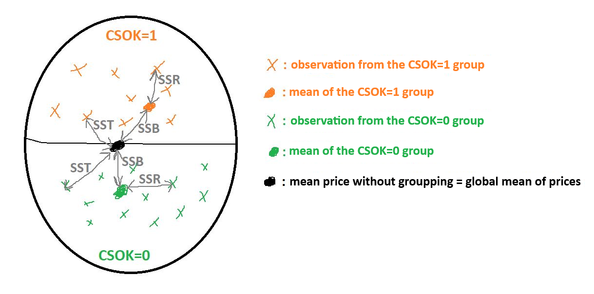
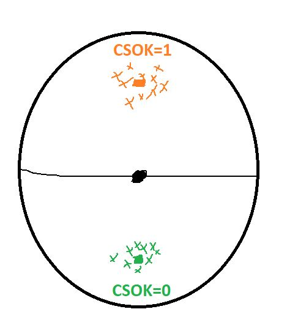
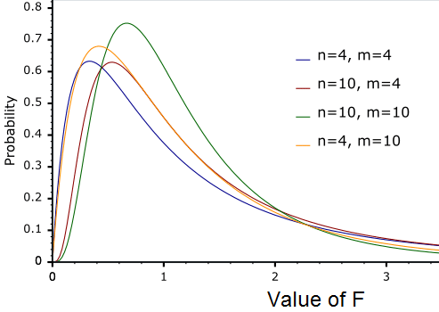

<style>
body {
text-align: justify}
</style>


```{r setup, include=FALSE}
knitr::opts_chunk$set(echo = TRUE)
```

## 1. The Basic Concepts of Bivariate Statistical Relationships

The <a href="https://github.com/KoLa992/Statistical-Modelling-Lecture-Notes/blob/main/CSOK.xlsx" target="\_blank">CSOK.xlsx</a> file is a data table that stores the data of 15796 randomly selected Hungarian properties (flats and houses with gardens) across 5 variables (columns):

- **price**: price in million HUF
- **area**: land area in squared meters
- **settlement**: type of settlement (Budapest, City, City with county rights, Municipality) 
- **CSOK3children**: is it possible to apply for the 10+15 million HUF support for families with three children? (1=yes, 0=no)
- **type**: type of real estate (flat, house)

The source of the data is [ingatlan.com](https://ingatlan.com/), and the variables were downloaded through web scraping during January-February 2021.

Let's read the data table into an R `data frame` using the `readxl` package.

```{r}
library(readxl)
CSOK <- read_excel("CSOK.xlsx")
str(CSOK)
```

We can see that some work is needed on the data: prices and areas are perfectly handled as `numeric` data types, but we should convert settlement type and housing type to `factor` data types, and the variable indicating CSOK eligibility to `logical` type. Since the `type` variable technically only has two values (flat or house), it could also be logical, but it might be more informative to retain the *flat/house* labels for better interpretability, so we will stick with the `factor` data type.

```{r}
CSOK$settlement <- as.factor(CSOK$settlement)
CSOK$type <- as.factor(CSOK$type)
CSOK$CSOK3children <- as.logical(CSOK$CSOK3children)
str(CSOK)
```

Ok, now it seems that we are fine regarding data types.

Now we can move on to our main task: analyzing **statistical relationships**! With this type of task, we step outside the realm of *univariate analyses* we've discussed so far and investigate **how two variables are related to each other**. We always examine this from **three perspectives**:

- What is the **nature of the relationship** between the two variables?
    * Typically answered with an appropriate **graph or visualization**.
- **How strong is the relationship** between the two variables?
    * Answered by a **statistical measure that takes values between 0 and 1**.
- Can the observed relationship be **generalized** beyond the observed data, that is, **to the population**?
    * This is answered using **hypothesis testing**.

The **specific calculation methods** and formulas for the above three aspects are determined by whether our variables involved in the relationship are **considered categorical (nominal+ordinal measurement scales) or numerical (interval+ratio measurement scales)**.<br>
The statistical methods we learned are summarized in the following table according to this categorical/numeric classification:

```{r, echo=FALSE}

x <- data.frame("Type of Relationship" = c("Mixed", "Association", "Correlation"),
                "Scales of Measurement" = c("categorical-numerical", "categorical-categorical", "numerical-numerical"),
                "Visualization" = c("Groupped Box Plot", "Stacked Column Chart", "Scatter Plot"),
                "Statistical Tools" = c("ANalysis Of VAriances (ANOVA)", "Cramer's V and Chi-squared Test", "Correlation and Simple Linear Regression"))

knitr::kable(
  x, align = "cc"
)
```

## 2. ANOVA

Let us now investigate the relationship between the housing price (a *categorical* variable) and whether a property is eligible for CSOK benefits after having 3 children (a *numeric* variable).

The nature of the relationship is best described with a **grouped boxplot**: that is, let's examine side-by-side the boxplots of the prices of properties eligible and not eligible for CSOK.

Let's see how to perform a grouping based on a `factor` or `logical` type variable at the boxplot level using `ggplot2`. It's a bit tricky, because here we must indicate our intention to group through the fill color parameter (`fill`) inside the first layer's `aes` function. In return, the plotting engine will color the boxplots of different groups separately. If we also specify our qualitative variable on the *x*-axis, its possible values will be displayed along the *x*-axis as well.

```{r}
library(ggplot2)
ggplot(data = CSOK, aes(y = price, x=CSOK3children, fill = CSOK3children)) +
  geom_boxplot()
```

Very nice! We can see that among the properties eligible for CSOK, the median price is practically the same as the upper quartile of the prices of non-CSOK properties! Plus, the highest, slightly outlier prices are also concentrated among the CSOK-eligible properties.<br>
This is perhaps not surprising: larger families planning for 3 children need space and well-equipped, expensive homes!

Thus, regarding the nature of the relationship, we can state that among CSOK-eligible properties, even the middle 50% represent a higher price level, and the outlier high prices are concentrated here as well.

But the question remains: how strong is this relationship? To **what extent does the CSOK eligibility explain the fluctuations in housing prices?** This question is answered by a statistical measure nicknamed the **variance ratio**.

### 2.1. The Variance Ratio ($\eta^2$)

The R function `aov` provides what is needed to calculate the variance ratio. You simply need to apply the function to the **numerical and categorical variables separated by tildes**: `numerical variable ~ categorical variable` → the order matters! The name of the numerical variable is always first, and the name of the categorical variable comes second! It is not necessary here to reference the variable names with a `$` sign through the `data frame`. You can specify the name of the `data frame` object containing the two variables in the function's data parameter.

```{r}
aov(price ~ CSOK3children, data = CSOK)
```

The results provide two important **Sum of Squares** indicators:

- **Sum of Squares Between** = $SSB$: The total squared **deviation of the group means of the numerical variable from the overall mean of the numerical variable**.
    * In our case now, $SSB=1956779$
- **Sum of Squares Residuals** = $SSR$: The total squared **deviation of each observation from its group's mean in terms of the numerical variable**. This is actually the same as **Sum of Squares Within = SSW** used in **proportionally stratified samples**.
    * In our case now, $SSR=13970044$
- The sum of the two values is the **Sum of Squares Total** = $SST=SSB+SSR$: This is essentially the "*top part*" of the variance of the numerical variable, the total squared **deviation of each observation from the overall mean**.
    * In our case now, $SST=1956779+13970044=15926823$

We can easily verify this relationship using the variance (square of standard deviation) of the numerical variable.

```{r}
sd(CSOK$price)^2 * (nrow(CSOK)-1)
```

Thinking visually about this phenomenon, we can say that each $SS$ indicator represents the sum of squares of **distances**. Squaring is necessary to *eliminate the sign differences* of the distances (as we saw in the standard deviation formula).

<center>
{width=75%}
</center>

Thus, visually, we should think about the different $SS$-s as follows:
- $SSR=SSW$: Distance of observations from their group mean
- $SSB$: Distance of group means from the overall mean
- $SST$: Distance of observations from the overall mean

Based on these, for grouping quality — that is, for the explanatory power of the categorical explanatory variable — it is desirable if with a fixed $SST$, $SSB$ is **large** and $SSR=SSW$ is **small**. Because then, **group means are far from** the overall mean and thus implicitly far from **each other**, while **individual observations deviate very little from their own group mean**.

<center>
{width=35%}
</center>

In this case, as also seen on the diagram, our grouping — that is, the explanatory power of our categorical variable — is strong! Thus, we want as much of the $SST$ as possible to be taken up by $SSB$, meaning that **the fraction $\frac{SSB}{SST}$ should be large**! This indicator is the **variance ratio** $\eta^2$, and the method we've just performed is called **Analysis of Variance, or ANOVA**.

Since $SST=SSB+SSR$, the variance ratio $\frac{SSB}{SST}$ is guaranteed to be between $0-1$, and it can also be interpreted as a **percentage**, because $SSB$ is a part of $SST$. Thus, now we have: $$\eta^2=\frac{SSB}{SST} = \frac{1956779}{1956779+13970044}=0.1228606=12.3\%$$

So, **CSOK eligibility explains 12.3% of the variation (variance) of property prices in the observed sample**! This represents a slightly **moderate explanatory power**, as the variance ratio is typically **categorized as follows**:

- **variance ratio < 10% → weak relationship**
- **10% <= variance ratio <= 50% → moderate relationship**
- **variance ratio > 50% → strong relationship**

It is customary to also interpret the strength of the relationship using the **square root** of the variance ratio, called the **coefficient of variation**, $\eta$. This also falls between $0-1$, but it is **not interpretable as a percentage**. After taking the square root, it is no longer true that $\sqrt{SSB}$ is a part of $\sqrt{SST}$ because square root operations don't distribute over addition: $$\sqrt{SSB+SSR}\neq\sqrt{SSB}+\sqrt{SSR}$$

Thus, the "*classification thresholds*" also go under square roots: $\sqrt{0.5}\approx0.7$ and $\sqrt{0.1}\approx0.3$.
We do not compute these roots more precisely to get "*nice*" numbers for the thresholds:

- **coefficient of variation < 0.3 → weak relationship**
- **0.3 <= coefficient of variation <= 0.7 → moderate relationship**
- **coefficient of variation > 0.7 → strong/close relationship**

We see that: $\sqrt{0.123}=0.3507$, so  the *CSOK - Price* relationship remains of moderate strength.

### 3.2. The F-test for ANOVA

**Variance ratio and coefficient of variation only describe the strength of the relationship within the observed sample!** A **hypothesis test is needed to determine whether the observed relationship can be generalized to the entire population** of properties — that is, to the world beyond the sample. This hypothesis test is the F-test as the p-value is calculated based on a <a href="https://en.wikipedia.org/wiki/F-distribution" target="_blank">F-distribution</a>.

The hypotheses of the test are:

- $H_0$: The relationship in the population is **not significant**, that is, variance ratio = 0 in the population
- $H_1$: The relationship in the population is **significant**, that is, variance ratio > 0 in the population

Thus, in this case, we root for $H_1$, because it claims that the explanatory power of the variance ratio is not merely due to sampling error, but exists in the entire Hungarian property population.

This $H_0$ can be formulated alternatively as that the between sum of squares ($SSB$) is zero. Meaning that all group means in the population (all the $\mu_j$s for every $j$ groups) are equal to the global mean ($\mu$). The denial of this statement (which is our $H_1$) is that there is at least one $j$ group where the mean in the population is NOT equal to the global population mean, so we have $SSB>0$ significantly. By introducing $M$ as the number of groups defined by the categorical variable (), we have the following alternative $H_0$ and $H_1$ pair for our F-test

- $H_0:\mu_1=\mu_2=...=\mu_M=\mu$
- $H_1: \exists j \rightarrow \mu_j \neq \mu$

We use the so-called **Welch-corrected version** of the test, whose only **assumption** is that the **sample size is large in every group of the nominal variable** (at least 100 observations in each group, according to most simulation studies).

```{r}
table(CSOK$CSOK3children)
```

We can see that we are fine with this condition now, as even in the smaller group (properties not eligible for CSOK), we have $4784$ observations.

If in **any group the sample size is small** (less than 100), then the test heavily **assumes normality of the numerical variable** within each group, which is rarely met in practice. For example, the distribution of apartment prices is right-skewed in both groups, as we have seen on the boxplots.

Since the large sample condition holds in both groups, we can move on to **calculating the p-value of the F-test**.

The key for the p-value of the F-test is to use the `oneway.test` function, similarly to how we used `aov`: `numerical variable ~ categorical variable` → the order matters! Also, the `data frame` containing the two examined variables must again be specified via the `data` parameter.<br>
Additionally, we must set a `var.equal = FALSE` parameter. This "switches on" the *Welch correction* in the test function, modifying the calculation appropriately. Without this correction, the test would assume equal variances across groups in the population, which we avoid by enabling *Welch correction*. :)

```{r}
oneway.test(price ~ CSOK3children, data = CSOK, var.equal = FALSE)
```

Based on the result, the **p-value is smaller than $2\times10^{-16}$**. This is smaller even than the smallest typical significance level, $\alpha=1%$, so we can safely and confidently accept $H_1$, meaning that CSOK eligibility significantly explains variation in property prices in the population, not just in the sample.<br>
Thus, the **explanatory power is NOT an artifact of sampling error**.

**Attention!** Such near-zero p-values can occur even with a variance ratio below 10%! This means that **even a weak explanatory power observed in the sample can generalize to the real world**. Thus, do **NOT judge strength based on p-value alone, because the p-value does NOT measure relationship strength!!!** It only tells us whether the **relationship observed in the sample (whose strength is shown by the variance ratio) is generalizable beyond the observed sample**.

In conclusion, we can say that **there is a moderately strong, significant (in the population) 12.3% price-raising effect for properties eligible for CSOK** on the Hungarian property market.

## 3. Association

Let us examine the relationship between the type of settlement where the apartment is located, `Settlement` (*categorical* variable), and whether the house is eligible for the CSOK benefit for 3 children (*categorical* variable).

The nature of the relationship is best described by a **stacked column chart**. This shows how the categories (values) of one categorical variable are distributed within the categories (values) of the other categorical variable.

```{r}
ggplot(data = CSOK, aes(x = settlement, fill = CSOK3children)) +
  geom_bar()
```

From the chart, we can see that most properties are offered for sale in small towns (*Town*), while the fewest are in the capital, Budapest. At first glance, we might say that properties eligible for CSOK are most commonly found in small towns (*Town*) and least commonly in Budapest, but comparing these proportions visually is difficult because the columns for the different types of settlements are of different sizes. For example, in the *Town* category, *there are so many CSOK-eligible properties partly because there are the most properties overall*.

Thus, it would be good to convert the above chart into a **100%-stacked column chart** to better see the **proportion** of CSOK-eligible properties by settlement type. This transformation can be achieved by setting the `position` parameter of the `geom_bar` function to `"fill"`:

```{r}
ggplot(data = CSOK, aes(x = settlement, fill = CSOK3children)) +
  geom_bar(position = "fill")
```

Now it becomes visible that the impressions from the previous chart were indeed correct. Here, it becomes even clearer that **Budapest has the lowest proportion of CSOK-eligible properties, while small towns (Town) have the highest proportion**. This, therefore, characterizes the **nature of the relationship** between the two variables.

We can also look at the actual frequency data of the **two-variable frequency table** (known also as a **cross table** or **contingency table**) behind the chart. To do this, we use a familiar function, `table` applied to the two nominal variables under examination:

```{r}
table(CSOK[,c("settlement", "CSOK3children")])
```

From the table, we see that there are *1685* CSOK-eligible properties in Budapest listed in the table.

By using `prop.table`, we can also query the proportions:

```{r}
round(prop.table(table(CSOK[,c("settlement", "CSOK3children")]))*100, 1)
```

The proportion of CSOK-eligible apartments located in small towns (*Town*) relative to the total number of observations in the table is 22.3%.

But we can also query so-called **marginal distributions**! For example, if we want to look specifically at the proportion of CSOK-eligible properties **within** Budapest:

```{r}
round(prop.table(table(CSOK[,c("settlement", "CSOK3children")]), 1)*100, 1)
```

In Budapest, the proportion of CSOK-eligible properties is 64.2%, while in small towns (*Town*) it is already 10 percentage points higher, at 74.2%.

The value of `1` as the **second parameter** of the `prop.table` function specifies that the **proportions are calculated relative to the subtotals of Settlement** that is the *first* variable selected from the CSOK data frame.

### 3.1. The Chi-Squared Test of Independence

The question is whether the relationship observed in the 100%-stacked column chart (that CSOK-eligible properties are least common in Budapest and most common in small towns) is just a result of sampling error, or whether it persists in the unseen population of all properties.

We need a **hypothesis test to decide whether the observed relationship can be generalized to the population of properties**, that is, to the world beyond the observed sample. This hypothesis test is the $\chi^2$-test of independence. The $\chi$ symbol is the Greek letter "*Chi*".

The hypotheses of the test are as follows:

- $H_0:$ There is **no significant relationship** in the population
- $H_1:$ There is a **significant relationship** in the population

Thus, in this case, we are rooting for $H_1$, because it claims that the explanatory power of the relationship is not merely due to sampling error but exists in the entire population of Hungarian properties.

The basic idea of the calculation is to generate a version of the two-variable **frequency table** (created earlier with the `table` function) as it **would look if there were a complete lack of relationship**, i.e., independence. For example, we calculate how many CSOK-eligible apartments there would be in Budapest if the two variables explained each other at 0%.

Our test statistic is the following: $$\sum_{i=1}^{r}\sum_{j=1}^{c}\frac{(f_{ij}-f^*_{ij})^2}{f^*_{ij}}\sim\chi^2((r-1)(c-1))$$

Under $H_0$, the distribution of this test statistic — based on many samples — follows the $\chi^2((r-1)(c-1))$ distribution, where $r$ is the number of rows, and $c$ is the number of columns in the contingency table (which is the two-variable frequency table calculated before with `table`).<br>
Here, $f^*_{ij}$ is the expected frequency — it tells us how many observations of Settlement Type $i$ we’d expect in CSOK eligbility group $j$ if the two variables were completely independent.

Thus, the expected frequencies can be computed using the multiplication rule for independent probabilities, which states in case of independent $i$ and $j$ the probabaility of the $ij$ pair occurring together is the multiplication of the probabilities that $i$ and $j$ occurs separately: $$f^*_{ij}=\frac{f_{i.}f_{.j}}{n}$$

Where $f_{i.}$ and $f_{.j}$ are the total counts of the values $i$ and $j$ in the sample respectively — also known as the **marginal frequencies**.

To perform the hypothesis test and obtain a p-value, we use the `chisq.test` function, which must be applied to the two-dimensional frequency table.

```{r}
test_of_indep <- chisq.test(table(CSOK[,c("settlement", "CSOK3children")]))
test_of_indep
```

Based on the result, the **p-value is smaller than $2\times10^{-16}$**. This is even smaller than the smallest commonly used significance level, $\alpha=1%$, so we can clearly and confidently accept $H_1$, which states that the explanatory power of the settlement type regarding CSOK eligibility is significantly greater than 0 in the population as well.<br>
Thus, the **explanatory power is NOT due to sampling error**.

Testing the large sample size assumptions of the $\chi^2$-test means checking that $f^*_{ij}\geq5, \forall i,j$. The $f^*_{ij}$ values are accessed through the `expected` element of the list obtained as the result of the `chisq.test` function.

```{r}
test_of_indep$expected
```

Even our worst-case scenario is larger than 795, so we are fine.

**Attention!** Just because the explanatory power has a significant effect in the population **does not mean that it is a strong explanatory power**. This must be measured separately, based on the observed data, using a specific statistical measure that operates on a normalized scale (e.g., ranging from 0 to 1). In the case of association, this measure is the Cramér's V coefficient.

### 3.2. Cramer's V

The formula for Cramér's V coefficient is as follows: $$V=\sqrt{\frac{\chi^2}{n \times \min(r-1,c-1)}}$$

In the formula, the minimum function means that we select the smaller value between the number of rows ($r$) minus 1 and the number of columns ($c$) minus 1 in the contingency table.

Thus, the indicator itself falls between $0$ and $1$, but it should **NOT be interpreted as a percentage**, because one of its operations involves a *square root*, making it a **measure comparable to the coefficient of variation**.

Accordingly, the **interpretation thresholds for the Cramér's V** coefficient are as follows:

- **Cramer < 0.3 --> weak relationship**
- **0.3 <= Cramer <= 0.7 --> moderate relationship**
- **Cramer > 0.7 --> strong/close relationship**

In R, the coefficient can be calculated by directly applying the formula. Since our contingency table is 2x2, the minimum part of the formula will definitely substitute $2-1$.

```{r}
sqrt(test_of_indep$statistic/(nrow(CSOK)*(2-1)))
```

The resulting value, which can be rounded to $0.0786$, indicates a **weak association** between our two categorical variables, *according to the thresholds given above*. Thus, the association we detected with the stacked column chart (namely, that CSOK-eligible properties are typically found in small towns) is not very strong among the observed properties.

Thus, combining the result of the $\chi^2$-test with the result of Cramér's V, we can conclude that this **weak association can be generalized to the population of apartments based on the sample, suggesting that CSOK-eligible apartments are most characteristic of small towns** and **least characteristic of Budapest**.

## 4. Correlation and Simple Linear Regression

The <a href="https://github.com/KoLa992/Statistical-Modelling-Lecture-Notes/blob/main/BP_Flats.xlsx\" target="_blank">BP_Flats.xlsx</a> file is a data table that stores data for 10 variables (columns) for 1406 apartments in Budapest:

- Price_MillionHUF: price of the flat in million HUF
- Area_m2: area of the flat in square meters
- Terrace: number of terraces in the flat
- Rooms: number of rooms in the flat
- HalfRooms: number of half-rooms in the flat
- Bathrooms: number of bathrooms in the flat
- Floor: the number of floor the flat is on
- IsSouth: is the flat looking at the South? (1 = yes; 0 = mo)
- IsBuda: is the flat in Buda? (1 = yes; 0 = no)
- District: district of Budapest the flat is in (1 - 22)

Read the data table from Excel into an R `data frame` the usual way!

```{r}
BP_Flats <- read_excel("BP_Flats.xlsx")
str(BP_Flats)
```

At first glance, everything looks good: we have 10 columns = variables with appropriate column names, and everywhere there are 1406 observations. We won’t bother with the datatypes, we can let everything stay numerical for now.

We've used this dataset already to examine the correlation coefficient in <a href="Chapter02.html" target="_blank">Section 5 of Chapter 2</a>. As a reminder, let’s look at the correlation matrix containing the actual numerical variables and the two binary variables (IsSouth, IsBuda). We thus inspect the correlation between the variables in the first 9 columns.

```{r}
library(corrplot)
CorrMatrix <- cor(BP_Flats[,1:9])
corrplot(CorrMatrix, method="number")
```

We pay special attention to the correlations between the prices of the flats and the other variables. We can see, that the prices correlate really well (above 0.7) with Area and Rooms.

From gathering this information, one might assume that a model containing the area of the flats as an explanatory variable could predict the prices of the flats (this variable’s correlation is the highest with **Price** in absolute value.) The model we will build is called the **bivariate (simple) linear regression**!

This regression model is the line that fits best on the dots in a $y = Price$ and $x = Area$ scatter plot.

```{r}
ggplot(data = BP_Flats, aes(x = Area_m2, y = Price_MillionHUF)) +
  geom_point() +
  stat_smooth(method=lm) # this chunk of code gives us the line best fitting the dots on the plot
```

The line has a noticeably positive slope (the connection is one-way) and the dots are close to it (the connection is significant). The blurred strip behind the line is the 95% confidence interval. This means that the actual line we try to predict from the sample is between these boundaries in the statistical population (in the world outside the 1406 flats inspected).

We can also check this by calculating the correlation:

```{r}
cor(BP_Flats$Price_MillionHUF, BP_Flats$Area_m2)
```

The correlation is positive and its absolute value is over 0.7, so there is a tight one-way connection between `Area` and `Price`.

Taking the square of the correlation ($r$) we obtain the coefficient of determination $R^2$ = $r^2$. Since correlation falls into the interval $[-1, +1]$, its square will fall into $[0,1]$, thus it can be interpreted as a percentage: it shows how well $x$ can explain the change/variance of $y$:

```{r}
cor(BP_Flats$Price_MillionHUF, BP_Flats$Area_m2)^2 * 100
```

In our case, **Area explains 73.889% of the change in Price**. Or put differently: knowing the Area of a certain flat, we can predict the Price of said flat with an accuracy of 73.889% using the best regression line (also known as trend line). This is a pretty good model, since we say that a model with an $R^2$ less than 10% has **weak** explanatory power, between 10%-50% is considered **moderate**, and over 50% is **strong**.

Let’s see how we can use this regression line for prediction, and take a look at how we can plot this line with the `ggplot` package on a scatter plot.

### 4.1. OLS Estimation and Prediction in Simple Linear Regression

In the previous section we introduced the basic notations, but as a reminder let’s recap:

- $y$ := Price (**Target** variable, which we want to predict)
- $x$ := Area (**Predcitor** variable, which we want to use to predict the target variable)

In high school we used the following equation to describe a line in the $x$, $y$ coordinate system:

$$y=mx+b$$

Here, $m$ is the slope of the line, while $b$ is some constant, or the intercept of the $y$ axis. $b$ gives us the place our line intercepts the $y$ axis, while $m$ gives the change in $y$ required to stay on the line when we step forward by one unit on the $x$ axis. In other words, the slope tells us how fast the line decreases/increases.

The equation above takes the following form in a linear regression:

$$\hat{y}=\beta_1x+\beta_0$$

Here $\hat{y}$ is the **predicted price**. This is the most important modification in the equation, since $\hat{y} \neq y$!! would be the actual value of $y$ (the real price of the flat), while $\hat{y}$ is the predicted value given by the known $Area$. $\hat{y} = y$ can only be true if $R^2=100\%$, but as we saw on the scatter plot, the **line does not fit the dots perfectly**! We can also see that we basically renamed the slope and intercept to: $\beta_1=m$ and $\beta_0=b$.

In the equation $x$ is known for each flat, so we only have to determine $\beta_0$ and $\beta_1$ to be able to predict $y$. This is exactly what ggplot does when it creates the line on the scatter plot.

Determining the $\beta_i$ is very logical, given ($y$) we strive for obtaining coefficients to get the **smallest prediction error**. We measure prediction error with the so called Sum of Squared Errors or $SSE$ : $$SSE = \sum_{i=1}^n(y_i-\hat{y_i})^2$$
In $SSE$, our error function, we take the squares of $y_i - \hat{y_i}$ for two reasons:

- We have to penalize the predictions below and above the actual value …
- …BUT the absolute value function is not differentiable, which is necessary to minimize a function.

Let’s see how $SSE$ works in practice! First, let’s give some **initial guesses** for $\beta_j$s, then we calculate all the $\hat{y_i}$.

```{r}
# Initially we set all Beta to 1
Beta0 <- 1
Beta1 <- 1

# We calculate the predicted y with these Betas
BP_Flats$PredPrice <- Beta1*BP_Flats$Area_m2 + Beta0

# We can calculate the prediction error for each flat
BP_Flats$Error <- BP_Flats$Price_MillionHUF - BP_Flats$PredPrice

# Let's see what we created
head(BP_Flats[,c("Price_MillionHUF", "PredPrice", "Error")])
```

We can see, that our initial predictions for the Betas are not too good, our prediction is like 22-24 million HUF off for each flat.

Let’s look at the shape of the regression line determined by the $\hat{y_i}$-s in `PredPrice` takes, given all the Betas are equal to 1! Here I will use a little trick, in `ggplot` I put an `aes` function into `geom_point`, and set the coordinate $y$ of the plot in here, not in the `ggplot` function. After this in a different layer I draw a line diagram using `geom_line`, and use `aes` in its input to define the $y$ coordinates. This way I can plot two variables at the same time:

```{r}
ggplot(data = BP_Flats, aes(x = Area_m2)) +
  geom_point(aes(y = Price_MillionHUF, color="Actual Prices")) +
  geom_line(aes(y = PredPrice, color="Predicted Prices"))
```

Our regression line is quite pathetic, it’s way higher than it should be, it doesn’t fit the dots at all.

Let’s calculate the $SSE$! We use the fact that we can calculate with the columns of a data frame as `vectors` in R:

```{r}
# One method
sum(BP_Flats$Error^2)

# Other method
sum((BP_Flats$Price_MillionHUF - BP_Flats$PredPrice)^2)
```

The $SSE$ is enormous, but we are not surprised given the plot we saw previously :)

Based on the scatter plot we have seen just now, we can conclude, that the regression line starts too high on the $y$ axis, and its slope is very high (it increases too rapidly). Thus we have to use smaller $\beta_j$s. Just by looking at the plot it could be a good idea to have the interception at -0.5 ($\beta_0 = -0.5$), and cut the rate of increase in half: $\beta_1 = 0.5$. Let’s see what we created:

```{r}
# Redefine the Betas
Beta0 <- -0.5
Beta1 <- 0.5

# Calculate the predicted prices using the new Betas
BP_Flats$PredPrice <- Beta1*BP_Flats$Area_m2 + Beta0

# We can also calculate the prediction error
BP_Flats$Error <- BP_Flats$Price_MillionHUF - BP_Flats$PredPrice

# Let's plot our new regression line on a scatter plot
ggplot(data = BP_Flats, aes(x = Area_m2)) +
  geom_point(aes(y = Price_MillionHUF, color="Actual values")) +
  geom_line(aes(y = PredPrice, color="Predicted values"))
```

This looks way better! Did the $SSE$ also decrease?

```{r}
sum(BP_Flats$Error^2)
```

Yepp, $352004.7<4767764$, so we can objectively conclude that the fitting significantly improved. :)

Before going further I will now introduce a new notation, we will refer to the error or residual term of the regression as $\epsilon$. With this, the first equation looks like this: $SSE=\sum_{i=1}^n(\epsilon_i)^2$.

After all this we can stop doing everything manually. Let’s ask the machine to find the best Betas which result in the smallest $SSE$!

To do this, we create a function to calculate $SSE$, which takes the form $SSE(\beta_0,\beta_1)$. The function will give us the $SSE$ as a function of the $\beta_j$s:

```{r}
# Define the function
SSE <- function(x) {
  sum((BP_Flats$Price_MillionHUF-(x[1]+x[2]*BP_Flats$Area_m2))^2)
}

# Using the function with $\beta_j$ = 1 as its parameters
SSE(c(1,1))
```
Surprise, surprise, we got the same $SSE$ with the same $\beta_j$s as before :)

Now, using this $SSE$ function we can make our computer find the $\beta_j$s that result in the smallest Sum of Squared Errors.

```{r}
result <- optim(c(1,1),SSE) # We set (1,1) as our initial beta values, we start the optimization from here
```

From the new result object which is a list we can obtain the $\beta_j$s we were looking for:

```{r}
result$par # par - parameters, these our our Betas
result$value # The minimalized SSE
```

Our final equation is: $PredPrice=-4.328 + 0.400\times Area$. This is the solution of the so called **Ordinary Least Squares problem**.

We can look at the regression line determined by the $\beta_j$s we found. This is exactly the same as the one `ggplot` gave us:

```{r}
# Redefine the Betas
Beta0 <- result$par[1]
Beta1 <- result$par[2]

# Calculate the predicted prices
BP_Flats$PredPrice <- Beta1*BP_Flats$Area_m2 + Beta0

# We can also calculate the prediction error
BP_Flats$Error <- BP_Flats$Price_MillionHUF - BP_Flats$PredPrice

# We can plot the new regression line on a scatter plot
ggplot(data = BP_Flats, aes(x = Area_m2)) +
  geom_point(aes(y = Price_MillionHUF, color="Actual Prices")) +
  geom_line(aes(y = PredPrice, color="Predicted Prices"))
```

One thing that is very important to note is that these $\beta_j$s **are exact**, so they are always the same no matter how many times we run the optimization. We can always take the sum of the incorrect values, but the computer makes no mistakes! There is always a chance we obtain different $\beta_j$s when we calculate manually, and we couldn’t even decide if the $\beta_j$s we got actually do minimize the $SSE$.

This problem is nonexistent while using the squared error terms and making the computer do all the heavy lifting. The reason for this is that the computer **doesn’t actually search** for the $\beta_j$s. The OLS task has an exact solution that gives us the $\beta_j$s with the smallest $SSE$.

The computer obtains the minima of the function $SSE(\beta_0,\beta_1)=\sum_{i=1}^n(y_i-\hat{y_i})^2=\sum_{i}(y_i-\beta_0-\beta_1x_i)^2$ . Since in our data frame the dependent variable ($y$) and explanatory variables ($x_i$) are known, these are constant, so the only two variables of the function are $\beta_0$ and $\beta_1$. Thus we can find the minima of the function by taking the partial derivatives of the $SSE(\beta_0,\beta_1)$ error function by the $\beta_j$s, and make them equal 0.

Simply put, we solve the following system of equations:

$$\frac{\partial SSE(\beta_0,\beta_1)}{\partial \beta_0}=0$$

$$\frac{\partial SSE(\beta_0,\beta_1)}{\partial \beta_1}=0$$

Solving the system of equations, we can find the exact equation which produces the $\beta_0$ and $\beta_1$ that minimize the error function:

$$\hat{\beta_1}=\frac{\sum_{i=1}^n{(x_i-\bar{x})(y_i-\bar{y})}}{\sum_{i=1}^n{(x_i-\bar{x})^2}}$$

$$\hat{\beta_0}=\bar{y}-\hat{\beta_1}x$$

We see that the function `optim` is not even necessary to solve the problem because the problem has an exact solution. **This is the reason people like to use OLS regression and will continue to use it for a long time: the $\beta_j$s can be found using a fixed equation, and we don’t have to optimize!**

### 4.2. Measuring the Explanatory Power of the OLS Regression

We can measure how well the (%) variance of the flats’ area can explain the variance of their prices around the average value. We have already done this using the square of the correlation, the coefficient of determination ($R^2$) and we obtained $73.899\%$. This value can also be calculated by our $SSE$ error function as well!

To do this, we have to calculate the total “fluctuation” of the dependent variable, or the information that can be explained. We measure this by looking at what the $SSE$ would be in case we tried to predict the flat prices using 0 explanatory variables. The idea is that this is the worst possible model we can possibly produce, so we can only reduce the sum of error using a nonempty model. If we have no explanatory variables, our prediction will be the average price for all flats: $\hat{y}=\bar{y}$.

We can say that our null modell’s $SSE$ is in fact the $SumOfSquaredTotals=SST=\sum_{i=1}^n(y_i-\bar{y})^2$, which is the sum of the squared differences between each of the flats and the mean price. We call this the total explainable information in the dependent variable.

Let’s calculate this!

```{r}
SST <- sum((BP_Flats$Price_MillionHUF - mean(BP_Flats$Price_MillionHUF))^2)
SST
```

If we want to calculate the error rate of the model, we can simply divide the $SSE$ by $SST$. By doing this we get the percentage our model could not explain from the total explainable information ($SSE$).
Obviously, if we take the complement of this quotient (1-), we get the explained information ratio. This is the already familiar R-squared, or the coefficient of determination: $R^2=1-\frac{SSE}{SST}$.

Let’s calculate it:

```{r}
1 - result$value / SST
```

The **area of the flats can explain 73.889% of the variance of the flats’ prices**. This is still not a bad model! :)

To sum up:

<center>
{width=50%}
</center>

### 4.3. Explanatory Power of Regression on Unobserved Data

It’s very nice to see that my regression’s explanatory power is 74%, but this only tells us that **area can explain 74% of the variance in prices for only our 1406 observations**! Since I would like to use the $\hat{y}$ predictions to predict the prices of flats in Budapest not seen before, we have to check the behavior of our regression considering the whole **population of flats** in Budapest!

The tool to do this is **hypothesis testing**!

The question we want to answer is: what happens when we apply our regression model for flats not in our sample? Will our generalized model’s $R^2$ stay roughly the same or will it be useless?

The general process of statistical hypothesis testing

1. **Formulating our two hypothesis (statements)**
    1. We always need a null hypothesis ($H_0$), which is always some equality ($=$).
    2. We also always need an alternative hypothesis ($H_1$), which can be everything but an equality: $\{>, <, ≠\}$
2. **Calculation of the empirical test statistic from our sample**
3. **Calculation of the p-value via some probability distribution**
    1. In case $H_0$ is true, the distribution of the test statistic among many samples is known
    2. From this distribution we can calculate the **p-value**
    3. The **p-value tells the probability of rejecting a true $H_0$**, based on the test statistic calculated from our sample.
4. **We decide by a pre-determined significance-level ($\alpha$) whether we can accept $H_0$ or not.**
    1. With $\alpha$ we define a limit (the probability) we can reject a true $H_0$
    2. The p-value gives us the probability of falsely rejecting $H_0$
        1. If a p-value calculated by a test statistic is **less** than $\alpha$, then we assume $H_0$ to be false. (Since the probability of rejecting true $H_0$ is less than the maximum $\alpha$ value)
        2. If a p-value calculated by a test statistic is **more** than $\alpha$, then we assume $H_0$ to be true. (Since the probability of rejecting a true $H_0$ is higher than the maximum $\alpha$ value)
    
Hypothesis testing for $R^2$: **Global F test**

In our example the 4-step process above looks like this:

1. We are pessimists, we think that our model does not explain anything beyond our sample, so $R^2$ = 0.
    * This is a statement that contains equality, it can go straight into $H_0$ –> $H_0: R^2 = 0$ (Our model is not significant in the population)
    * Let’s be optimistic a little! The explanatory power we measured from our sample will also be there when we look at new flats from the population $H_1: R^2 > 0$ (Our model is significant in the population)
2. Let’s calculate the test statistic using the $R^2$ obtained from the sample, the sample size ($n$) and the $\beta$ parameters used in the equation ($p$ which is the number of parameters used)!
    * In our case: $R^2=0.7391438, n=1405, p=2$
    * The formula of the test statistic: $\frac{R^2/(p-1)}{(1-R^2)/(n-p)}=\frac{0.7391438/(2-1)}{(1-0.7391438)/(1406-2)}\approx3978$
3. **If $H_0$ is true, this test statistic** has a so called **F-distribution**
    * The graph of the distribution is controlled by two degrees of freedom (df): <center>
{width=50%}
</center>
    * The two degrees of freedom can be obtained from the sample size and the number of explanatory variables.
        * $df_1=p-1=2-1=1$ and $df_2=n-p=1406-2=1404$
    * $H_0$ is true (with 100% probability) if $R^2$ is already 0 in the sample.
    * Hence we measure the “distance” of the this state using the p-value from the distribution assuming that $H_0$ is true.
    * So the p-value is the area under the test statistic in the corresponding F-distribution. Hence when the value of the test statistic is 0 we get p = 100%, which means that rejecting the $H_0$ hypothesis is surely a mistake. The test statistic will increase simultaneously with $R^2$, so at higher test statistic values the are under the curve will be smaller. This means that the probability of falsely rejecting $H_0$ is low.
    * In case of an F-distribution we get the desired probability as follows: `1-pf(3978, df1=1, df2=1404)` = 0.
4. This p-value is very low, it’s literally 0 so I can confidently reject $H_0$ even at 99% significance level.
    * Thus I can safely reject $H_0$, because the probability of a mistake is 0%.

**!!!WARNING!!!** –> *When using sufficiently large samples we can often obtain a result which would imply that rejecting $H_0$ would be a mistake even with an $R^2$ as low as let’s say 3.4%! This means that the 3.4% can be generally true for the world outside of our observed sample. Obviously this is nowhere near as great of a result as a 74% $R^2$, but it might be significant nevertheless.*

*Note*: We can formulate $H_0$ in the case of a Global F-test as follows: $\beta_1=0$. $H_0$ would simply be the following: the slope is not 0: $\beta_1\neq0$.

### 4.4. The `lm` Function

Luckily we don’t have to always manually calculate everything when we are faced with an OLS regression problem.

We can find the most important things that are relevant and OLS regression in R’s `lm` function. It is better to save the output of the `lm` function in an object, and use the `summary` function on this object. This will show us the most important characteristics of an OLS regression. Note that the variables do not have to be referred to using the `$` sign, we only have to set the data frame we want to use as a parameter of the `lm` function.

```{r}
model<- lm(Price_MillionHUF ~ Area_m2, data = BP_Flats) # Notice, that the dependent variables is separated by a ~ sign
summary(model)
```

Here is everything we need to know:

- In the `Coefficients` table’s `Estimate` column we can see the betas, so we can write down the predicted equation of the model: $PredPrice=-4.312 + 0.400\times Area$
- We see, that $R^2=73.9\%$
- The test statistic of the Global F-test is equal to 3978
- The degrees of freedom of the F-test: $p=1$ and $n-p=1404$
- The p-value of the F-test < $2.2 \times 10^{-16}$, hence the value we obtained was 0.

The `lm` function gives us one extra thing that might be interesting: the **standard residual error of the model** = $10.04=\sqrt{\frac{SSE}{n-p}}$. This value tells how much the prediction of the regression model $\hat{y}$ is expected to differ from the actual value of $y$.
So in our case the predicted values of the regression will differ by $\pm 10.04$ million HUF from the actual values.

The other parts of the `lm` function’s `Coefficients` table is irrelevant for us right now, we will deal with that later.

### 4.5. Interpretation of the Coefficients and their Confidence Intervals

The $\beta$ coefficients of our regression are the following and they should be interpreted as follows:

- $\beta_0=-4.312$ –> This is the intercept of the $y$ axis, this tells us the prediction’s value at $x = 0$.
- $\beta_1=+0.400$ –> $\hat{y}$ This is the slope of the regression line, this tells us the change in $\hat{y}$ that a +1 unit step in $x$ will cause.

In our case this means that a flat’s predicted price with 0 $m^2$ area is -4.312 MHUF. Obviously this interpretation makes no sense, because there is no flat with an area of 0. :)
Looking at the slope we can say that +1 $m^2$ to a flat’s area would mean that the flat’s **expected value** (we are talking about $\hat{y}$) would increase by 0.400 MHUF. We could say that the *utility* of +1 $m^2$ is 400.000 HUF :)

We have to take extra care when we try to interpret $\beta_1$. **The interpretation depends heavily on the unit of measure!** So a +1 change in $x$ is always understood to be a change in $x$’s unit of measure, which is $m^2$ in our case. The change given by $\beta_1$ is obviously understood to be in $y$’s unit of measure, which is MHUF in our example.

We can calculate a confidence interval for the coefficients of a regression for every significance level using the `confint` function. For example, a 97% confidence interval for $\beta_1$ gives us the interval that the real value is located with 97% probability.

Let’s see this calculation in R:

```{r}
confint(model) # 95% confidence level is the default
confint(model, level = 0.99) # But we can change that of course
```

For example the first result tells us that the $\beta$ of `Area` would fall between 0.384 and 0.417 with 97% probability in the population (for flats NOT observed in our sample with 1406 observations)
If I wanted to calculate $\hat{y}$ with this confidence-interval, we would simply draw two lines and we would obtain the confidence strip that `ggplot` plots.