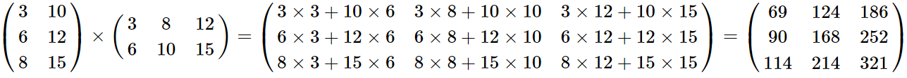

<style>
body {
text-align: justify}
</style>


```{r setup, include=FALSE}
knitr::opts_chunk$set(echo = TRUE)
```

## 0. Matrices in R

The matrices of classical linear algebra in R can be thought of as `data frames` containing only values of data type **numeric**. That is, they are like a `vector`, since they can also have elements of only one data type. Only they have two dimensions instead of one. Therefore, if we want to create a matrix manually in R, We have to create it with the `c()` function, but the result of such a function has to be broken into rows or columns using the `matrix()` function:

```{r}
matrix_values <- c(3, 6, 8, 10, 12, 15)

matrix1 <- matrix(matrix_values, ncol = 2) # split the elements of the vector to form 2 columns
matrix1

matrix2 <- matrix(matrix_values, nrow = 2) # split the elements of the vector to form 2 rows
matrix2
```

We can see that we can read the elements of our two matrices in the same way as if they were `data frames`. However, if we try the `str()` and `typeof()` functions on them, it is clear that in R's mind they are not `data frames` but objects of type `double` (as if I had put the `typeof()` function on a `vector` data type):

```{r}
matrix1[2,2]

matrix1[2,]

matrix2[,3]

str(matrix1)

typeof(matrix2)
```

We can transpose the matrices with the `t()` function:

```{r}
t(matrix2)
```

If we want to perform an operation (e.g. addition, multiplication) on matrices of the same dimension (i.e. the same number of rows and columns), we can do it with the basic operation symbols:

```{r}
matrix1 + t(matrix2) # transposing is necessary to matrix2 to become 3x2 as well

matrix1 * t(matrix2) # transposing is necessary to matrix2 to become 3x2 as well
```

On the other hand, for the classical algebraic matrix multiplication, a new operator, `%*%`, must be used!

Let's see how it works. If I take the matrix multiplication of my two example matrices *hand-by-hand*, it looks like this:

Since `matrix1` has dimension $3\times2$ and `matrix2` has dimension $2\times3$, the multiplication can be done and the result will be $3\times3$. A little [reminder](https://hu.wikipedia.org/wiki/M%C3%A1trix_(math)#M%C3%A1trixmultiplication%C3%A1s) about this property.

And the multiplication comes out as follows (*"row x column rule "*):

<center>
{width=100%}
</center>

In R we do this operation like this:

```{r}
matrix1 %*% matrix2
```

## 1. The FAT database

Now let's see where this breath of matrix algebra comes into our Statistical Modelling course!

Let's import the data table <a href="https://github.com/KoLa992/Statistical-Modelling-Lecture-Notes/blob/main/FAT_Data.xlsx" target="_blank">FAT_Data.xlsx</a>, which contains $15$ variables for $252$ American *men*.

- Fat: Fat tissue ratio (% of muscle tissue)
- Age: Age (years)
- Weight: weight (lbs)
- Height: Height (inch)
- BMI: Body mass index (kg/m2)
- Neck: Neck circumference (cm)
- Chest: Chest circ. (cm)
- Abdomen: Abdomen circ. (cm)
- Hip: Hip circ. (cm)
- Thigh: Thigh circ. (cm)
- Knee: Knee circ. (cm)
- Ankle: Ankle circ. (cm)
- Biceps: Bicep circ. (cm)
- Forearm: Forearm circ. (cm)
- Wrist: Wrist circ. (cm)

```{r}
library(readxl)
FAT <- read_excel("FAT_Data.xlsx")
str(FAT)
```

Let's build an OLS model, in which the fat tissue ratio is explained by all other variables in the `data frame`:

```{r}
model_1 <- lm(Fat ~ ., data = FAT)
summary(model_1)
```

We can see that the model is pretty good, $R^2=74.9\%$, but we are full of non-significant variables! And it is hard to believe that the effect of **BMI** on any common $\alpha$ is not significant on the fat tissue proportion.

## 2. Multicollinearity and the VIF Indicator

The answer lies in the fact that these explanatory variables are extremely correlated, i.e. we have a **harmful multicollinearity** in our model! After all, one of the standard (in my counting 3rd) model assumptions is that there is no exact multicollinearity between the explanatory variables of the model. Harmful multicollinearity does not violate this directly, but it does cause some problems in the model. The specific consequence of harmful multicollinearity will be that the **standard errors of the coefficients will be biased upwards**, i.e. they will be unrealistically large! And these large $SE$s are sitting in the denominator of the test function of the t-test, pushing the value of the test function more towards 0, thus making the p-value of the test unrealistically high! Exactly how much the *squared* standard error of a given coefficient increases is given by the $VIF_j$ indicator for the $X_j$ explanatory variable.

We can compute the $VIF_j$'s with the `vif()` function in the `car` package of R:

```{r eval=FALSE}
install.packages("car")
library(car) # Dont't mind the warning messages :)
```
```{r echo=FALSE}
library(car)
```
```{r}
vif(model_1)
```

The resulting $VIF_j$ indicator values show how many times the **squared standard error**, i.e. the variance of the coefficient estimate, of $X_j$ has increased just because of multicollinearity! E.g. the estimation variance of the `Weight` variable has increased by a factor of about 34 due to multicollinearity alone.

If we want to, with the formula $VIF_j=\frac{1}{1-R_j^2}$, we can also calculate  $R_j^2$, i.e. how much of the variance (%) of $X_j$, is explained by all the other explanatory variables: 

```{r}
# First let's look at the tolerance index: this is the percentage of the weight variable that is NOT shaped by the other explanatory variables
Tol_Weight <- 1/vif(model_1)[2] # The VIF of Weight is the 2nd element from the list generated by vif()

# R^2 from tolerance is easy:
1-Tol_Weight
```

So, the variance of **Weight** is 97% explained by the other explanatory variables. That's a really nasty multicollinearity! There are many different ways to determine the limit of harmful multicollinearity. Perhaps the most common is the $VIF_j>5$ or $VIF_j>10$ thresholds. With a quick calculation, we can figure that $VIF_j>5$ is equivalent to $R_j^2>80\%$, while $VIF_j>10$ is equivalent to $R_j^2>90\%$.

## 3. The Basics of Principal Component Analysis (PCA)

We can try to mitigate the harmful multicollinearity by starting to omit variables with high $VIF_j$. But looking back at the list, this would result in dropping the **Weight** and **BMI** variables from the model. Again, common sense would object to this. It is illogical that neither Weight nor BMI have significant marginal effect on the proportion of fat tissues in men.

So let's try to come up with a more intelligent solution: **"combine" the correlated explanatory variables into uncorrelated new latent (artificial) variables!** Statistically we're saying that we are **reducing dimensions**. These new latent variables will be our **principal components**!

The way to think of this is that if we have a `data frame` labeled $X$ with $n$ rows and $p$ columns. We make it into a `data frame` labeled $Y$ with the same $n$ rows but only $k\leq p$ columns, and these $k$ new columns are uncorrelated:

<center>
{width=100%}
</center>


Principal component analysis is one possible method of dimension reduction. **It is an important assumption that it is only applicable to numerical variables**, since it will generate new latent variables, i.e. principal components, based on the correlation matrix. So, the correlation between **variables in the original $X$ data table must be interpretable**!

### 3.1. Mathematics of PCA

In step 0 of principal component analysis, we transform our original variables to have **0 means and 1 standard deviation**. In English, we normalize them.

This is easy to do in R, just be careful not to include the outcome variable in the party! After all, we only want to include in PCA the explanatory variables that are correlated:

```{r}
norm_data <- scale(FAT[,2:15])

library(psych)
describe(norm_data)[,c("mean", "sd")]
```

Everything is great! All our variables have a 0 mean and standard deviation of 1! Now let's look at the **covariance matrix** of this data:

```{r}
CovMatrix_Norm <- cov(norm_data)
```

Note that this is nothing more than **the correlation matrix of the original data**:

```{r}
CorrMatrix_og_data <- cor(FAT[,2:15])
round(CovMatrix_Norm-CorrMatrix_og_data, 5)
```

Cool, the difference is zero to 5 decimal places everywhere. Now, **let's take this matrix, label it $R$, and take the eigenvalue-eigenvector decomposition**.

A little **reminder**: a square matrix of, say, $p\times p$ has $p$ eigenvalues and $p$ eigenvectors. Let's label the eigenvalues in decreasing order of magnitude like this: $\lambda_1 \geq \lambda_2 \geq... \geq \lambda_p$ and the corresponding eigenvectors $a_1, a_2, ...,a_p$. The eigenvectors always consist of $p$ elements.

Let $A$ be a $p\times p$ matrix, where the columns are the eigenvectors ($A$ is $p\times p$ because $p$ of vectors with $p$ elements are placed next to each other). And let $\Lambda=diag(\lambda_p)$, i.e. a matrix of $p\times p$ with eigenvalues in the principal diagonal and 0 values everywhere else.

Now, these eigenvalues and eigenvectors are chosen such that the equation $R=A \Lambda A^T$ holds. This is the **definition**, so **the eigenvalues and eigenvectors of the matrix $R$ are the vectors and values for which the equation $R=A \Lambda A^T$ holds!**

These eigenvalues and eigenvectors can be obtained in R by the function `eigen`:

```{r}
results <- eigen(CovMatrix_Norm)

eigenvalues <- results$values
eigenvectors <- results$vectors
```

Let's check that these values have indeed been chosen the way the definition suggests:

```{r}
ReconstructedCovMatrix <- eigenvectors %*% diag(eigenvalues) %*% t(eigenvectors)

round(CovMatrix_Norm-ReconstructedCovMatrix, 5)
```

The difference between the elements of the two matrices is zero to 5 decimal places everywhere again. So the eigenvalues and eigenvectors work exactly as their definition dictates!

Now let's see how we get principal components from eigenvectors. To calculate the $i$-th principal component ($PC_i$), the definition says: $PC_i=Xa_i$. So, the principal components are effectively linear combinations of the original variables. The coefficients in the linear combination (the $\beta$s, if you like) are just the eigenvectors $a_i$! Of course, this means that this whole operation can be solved by a matrix multiplication, so the `data frame` containing the principal components, marked $Y$, is simply the result of the matrix multiplication $Y=XA$.

It's just as simple in R:

```{r}
principal_components <- norm_data %*% eigenvectors
str(principal_components)
```

Okay...but if we look at the principal components, we see that this is an object with $n=252$ rows and $k=14$ columns, just like the original **norm_data** was. Where the heck is all this dimension reduction then?

Well, look at the mean and variance of our principal components:

```{r}
describe(principal_components)[,c("mean", "sd")]
```

The mean of all principal components is 0, as it was for the original normalized data, but the **principal component standard deviation is NOT 1 for all variables**! Let's just think through what happened! In the **normalized data set, there was 1 unit of information, i.e. standard deviation/variance, in each variable**. Now we have 3 **principal components with MORE than 1 unit of information (variance)**, and the remaining 11 components with LESS! So, **the first 3 components each have more information than 1 original variable!** So, we use these 3 components for dimension reduction, and thus compress the original $p=14$ into $k=3$ dimensions.

Interestingly, the squares of variance of the **principal components**, or **variances**, are **exactly the same as their associated eigenvalues**:

```{r}
describe(principal_components)[,c("sd")]^2
eigenvalues
```

We can easily measure the effectiveness of compression. The normalized data table had a variance (standard deviation) of $14 \times 1$, and the sum of the variances for the principal components is also $14$:

```{r}
sum(describe(principal_components)[,c("sd")]^2)
```

We then need to look at the sum of the variances of the first 3 principal components and see what percentage of the $14$ units of total information they represent:

```{r}
sum(describe(principal_components)[1:3,c("sd")]^2)/sum(describe(principal_components)[,c("sd")]^2)
```

So, about $81\%$ of the total variance (information) of the original 14 variables is preserved in the first 3 principal components! That's pretty cool! :)

**Caution**, because the sum of the principal component standard deviations is not 14, so there our percentage proportioning logic would fail for the preserved information calculation:

```{r}
sum(describe(principal_components)[,c("sd")])
```

It's worth noting that there is not only the *eigenvalue > 1* rule to determine the number of principal components preserved. Although, for now, we'll just take this one. In many cases, for example, the number of components is chosen based on the cumulative fraction of variance retained. There is actually no consensus on the best method to determine the number of principal components retained. [This link](https://stackoverflow.com/questions/12067446/how-many-principal-components-to-take) has an interesting discussion on the issue.

### 3.2. Principal Components with built-in R functions

Now, of course, you don't always have to go through this torture with eigenvalues and eigenvectors if you want to get principal components, since R has a built-in function for that, called `prcomp`! :) Be careful to set the `center` and `scale` parameters of the function to true, so that the original variables are normalized to 0 mean and 1 standard deviation by the machine spirit! If this is not done, then we cannot use the *st. deviation/variance > 1* principle to choose how many principal components to keep, because the original variables will not have 1 standard deviation!

How the function works in practice is as follows:

```{r}
full_pc_analysis <- prcomp(FAT[,2:15], center = TRUE, scale=TRUE)
str(full_pc_analysis)
```

You can see that the resulting `full_pc_analysis` object is a list. The `x` element of the list contains all 14 principal components. The element `sdev` contains the standard deviations of the principal components, i.e. the roots of the eigenvalues of the correlation matrix. But if you run the `summary` function on this `full_pc_analysis` object, you get more detailed information:

```{r}
summary(full_pc_analysis)
```

In addition to the standard deviations of the principal components, we can see what percentage of the total variance is explained by each principal component, and what percentage of the total variance is explained by the first $k$ principal components. In the **PC3** column we see the familiar number, $81%$, i.e. the cumulative retained information content: the first 3 principal components together retain $81%$ of the total variance of the 14 variables.

### 3.3. "Naming" the Principal Components

That's all well and good so far, but we should find out **which of the original explanatory variables the first 3 principal components contain**. We need this info to "*name*" our principal components, and to more easily interpret the $\beta$s of an OLS regression where the explanatory variables are our principal components.

The easiest way to find this out is to use the correlation between the principal components and the original variables. These correlations are called as **loadings** in the context of PCA.

To do this, we first add the first 3 principal components to the original **FAT** `data frame` using the `cbind` function:

```{r}
FAT <- cbind(FAT, full_pc_analysis$x[,1:3])
str(FAT)
```

Then we look at the relevant part of the correlation matrix (i.e. how the 3 PCs correlate with the original 14 explanatory variables) on a heat map:

```{r}
Corr <- cor(FAT[,2:ncol(FAT)])

library(corrplot)
corrplot(Corr, method="color")

```

We can immediately see that the 3 PCs do not correlate with each other. The 1st PC definitely contains **Weight** and other variables that describe a man's "size": **PC1** has a strong positive connection with **BMI**, **Abdomen** and **HIP** etc.<br>
However, with **PC2** and **PC3**, the situation is not so simple. Both principal components are at least moderately correlated with **Height** and **Age**. This makes it difficult to name these two principal components, because it is not clear which of the two principal components is correlated with which original variable.

If we look a little closer at this heat map from the correlation matrix, we can see that this is because the **Age** variable is not actually involved in the multicollinearity! It is not correlated with any other original explanatory variable, so it is not worth including it in the principal component analysis! Let's remove **Age** from the variables included in the principal component analysis and run all things again:

```{r}
# removing current PC1-3 from the data frame
FAT[,c("PC1", "PC2", "PC3")] <- NULL

# new PCs without Age
full_pc_analysis <- prcomp(FAT[,3:15], center = TRUE, scale=TRUE)
summary(full_pc_analysis)
```

We can see from the st. deviation of the principal components that only the first 2 principal components are worth keeping, which together preserve $77%$ of the total variance. Let's add these to **FAT** data frame and now look at the correlation matrix on a heatmap:

```{r}
FAT <- cbind(FAT, full_pc_analysis$x[,1:2])

Corr <- cor(FAT[,2:ncol(FAT)])
corrplot(Corr, method="color")
```

Now we have a clean view:

- Principal Component 1 is a set of variables describing the body "in terms of its width",
- Principal component 2 compresses the variable **Height** describing the body "lengthwise". Note that the sign of the correlation is **negative**!! So if **PC2** is increasing, it means a shorter person!

The variable height (**Height**) does not necessarily need to be omitted during principal component formation, because it outputs its own independent component. It does not cause interpretation problems like **Age** did.

## 4. Principal Components in OLS Regression

Let's run the OLS regression for the outcome variable **Fat** with the explanatory variables **Age** and the two new principal components (without **Age**):

```{r}
model_2 <- lm(Fat ~ Age + PC1 + PC2, data = FAT)
summary(model_2)
```

We can see that all of these explanatory variables are significant for all the common $\alpha$s! It is worth noting that **PC2 is significant with a positive sign**! This means, based on previous study of the correlation matrix, that if **PC2** increases ceteris paribus, then typically the height decreases, and thus we can expect the proportion of fat tissue to increase due to the positive $\beta_{PC_2}$! So it makes perfect sense: a taller man, with unchanged age and *body width (PC1)*, would be expected to have a lower proportion of fat tissues!

The strong significance of the explanatory variables suggests that **the increase in standard error due to harmful multicollinearity has been eliminated by using uncorrelated principal components**. But this can be checked via the $VIF_j$ indicators:

```{r}
vif(model_2)
```

Everything is pretty close to 1, so the (squared) squares of the standard errors are barely affected by multicollinearity. It can also be calculated that the variance of **PC_3**, for example, is influenced by the other two explanatory variables by only $1-\frac{1}{1.039}=0.0375=3.75\%$.

It is also worth observing that if we want to choose between **model_1** and **model_2** using the **Wald-test**, it will prefer the extended model ($H_1$) for each $\alpha$:

```{r}
anova(model_1, model_2)
```

The reason for this is that in the principal component analysis we lost $1-0.77=0.23=23\%$ of the variance (information) of the original 13 (Age is not counted here) explanatory variables. So **some of the out-of-sample explanatory power has been sacrificed by principal component formation for easier interpretation of the marginal effects of the explanatory variables**.